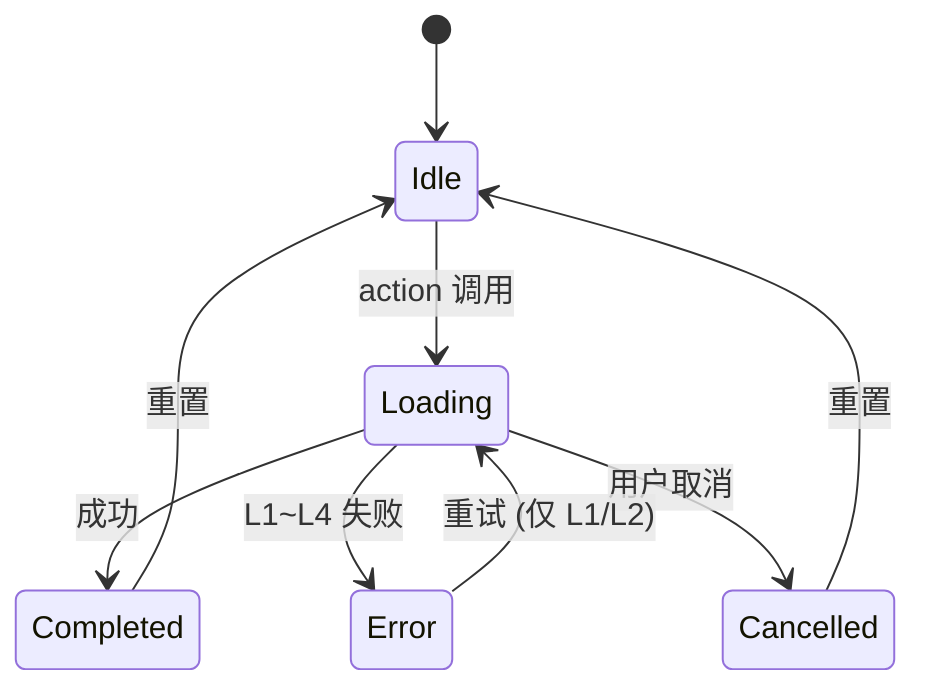

# Echo · 回响：Codex 协作开发规约 ([AGENTS.md](http://agents.md/))

**版本**：v4.6

**生效日期**：2026-06-16

**适用对象**：所有参与 Echo 项目开发的 AI Agent（Codex/Cursor/Claude）及人类开发者

**优先级**：本规约优先于任何 Agent 的默认行为。当本规约与 Agent 默认行为冲突时，以本规约为准。

**加载方式**：Agent 启动时自动加载根目录 `AGENTS.md`；子目录 `AGENTS.md` 叠加补充。

**对应规格**：Echo v4.6 全量用户故事与验收标准规格书

**架构基准**：Cognitive Pipeline + Observable ViewModel + Actor Isolation

------

## 1. 项目身份与核心约束

### 1.1 一句话定义

Echo 是一个 **本地优先、隐私可审计、完全离线可用** 的端侧 AI 记忆助手。用户的所有数据永不离开设备，所有 AI 推理在端侧完成，所有操作可追溯、可删除。

### 1.2 绝对红线（违反即阻断）

| 红线编号  | 规则                                                         | 验证方式                              | 后果    |
| --------- | ------------------------------------------------------------ | ------------------------------------- | ------- |
| **R-001** | **禁止任何数据上传云端**：所有处理必须在端侧完成             | CI 扫描网络请求 API                   | PR 阻断 |
| **R-002** | **禁止用户主动输入文本记忆**：所有文本记忆仅来自系统备忘录和语音备忘录转写 | UI 检查 + 单元测试                    | PR 阻断 |
| **R-003** | **原始文件级联删除不写入 ExcludedAssets**：仅用户主动“仅从 Echo 移除”才写入 | 单元测试 + 审计检查                   | PR 阻断 |
| **R-004** | **AI 输出语言仅限 zh-Hans/en-US**：响应语言必须匹配 UserPolicy.preferredLanguage | Language Aligner 运行时校验           | PR 阻断 |
| **R-005** | **模型加载无网络下载**：所有模型随 App 安装包分发，App 内不发起网络请求 | 网络拦截测试                          | PR 阻断 |
| **R-006** | **所有异步操作必须包含 PrivacyCheckpoint**：每个 Pipeline Actor 方法入口必须调用 | CI 静态扫描                           | PR 阻断 |
| **R-007** | **禁止使用 Combine / @unchecked Sendable / nonisolated(unsafe)** | SwiftLint + 编译器                    | PR 阻断 |
| **R-008** | **所有跨 Actor 调用必须 await**：禁止同步等待另一个 Actor    | 编译器 `-strict-concurrency=complete` | PR 阻断 |

### 1.3 语言策略

- **支持语言**：仅 `zh-Hans` 和 `en-US`
- **繁体/方言处理**：自动映射为 `zh-Hans`，首次启动提示一次
- **UI 语言**：String Catalog 仅包含 `zh-Hans` 和 `en-US` 两个版本
- **AI 输出语言**：由 `UserPolicy.preferredLanguage` 显式控制，Prompt 强制注入

### 1.4 数据主权契约

| 契约编号  | 规则                                                         | 验证方式                 |
| --------- | ------------------------------------------------------------ | ------------------------ |
| **D-001** | 所有记忆永不自动过期，无 TTL 定时任务                        | 代码审查 + 审计          |
| **D-002** | ExcludedAssets 写入条件：仅用户主动“仅从 Echo 移除”          | 单元测试覆盖所有写入路径 |
| **D-003** | 级联删除时同时清理 ExcludedAssets 无效记录                   | 文件系统模拟测试         |
| **D-004** | 重新授权数据源时提供一键恢复排除项选项                       | UI 测试                  |
| **D-005** | 删除操作事务性覆盖：向量、索引、缓存、元数据、审计日志、translationCache | 故障注入测试             |

------

## 2. 技术栈与工具链

### 2.1 强制技术栈

| 层级       | 技术选型                                     | 版本要求                            |
| ---------- | -------------------------------------------- | ----------------------------------- |
| 语言       | Swift 6                                      | 开启 `-strict-concurrency=complete` |
| UI 框架    | SwiftUI + `@Observable` (iOS 18 Observation) | 最低 iOS 18.0                       |
| 并发模型   | Swift Concurrency (Actor, Task, AsyncStream) | 禁止 GCD/Combine                    |
| 状态管理   | `@Observable` ViewModel                      | 禁止手动 `objectWillChange.send()`  |
| 向量数据库 | LanceDB Mobile                               | 随 App 打包                         |
| 关系数据库 | SQLite (通过 GRDB 或原生)                    | 表结构见规格书附录                  |
| 推理引擎   | Core ML (主力) + Whisper.cpp (ASR 专用)      | Core ML 模型随 App 打包             |
| 模型格式   | Core ML (.mlmodelc) + GGUF (Whisper)         | 禁止运行时转换                      |
| 依赖管理   | SPM (Swift Package Manager)                  | 仅白名单包                          |

### 2.2 严格禁止的依赖

```yaml
禁止清单:
  - 任何网络请求库 (Alamofire, URLSession 仅用于系统 API 且需审计)
  - 分析/崩溃上报 (Firebase Analytics, Crashlytics, Sentry)
  - 云端 AI API (OpenAI, Anthropic, Google AI) - 仅可在研究分支使用
  - 跨平台框架 (React Native, Flutter) - Echo 为 iOS 独占
  - TCA (Composable Architecture) - 已弃用，迁移至 @Observable
```

### 2.3 Agent 工具链

| 工具           | 用途           | 配置要求                                       |
| -------------- | -------------- | ---------------------------------------------- |
| Codex / Cursor | 代码生成与编辑 | 自动加载 `AGENTS.md`                           |
| SwiftLint      | 静态分析       | 配置文件与 [AGENTS.md](http://agents.md/) 同步 |
| GitHub Actions | CI/CD          | 运行测试、覆盖率检查、规约扫描                 |
| Notion         | 规格文档读取   | 通过 Codex 插件连接                            |

------

## 3. 核心架构原则

### 3.1 认知管线（Cognitive Pipeline）契约

所有认知处理流程必须遵循以下契约：

```yaml
Pipeline 契约:
  - 纯函数性: 相同输入必须产生相同输出，无隐式依赖
  - 无状态: Pipeline 节点本身不持有可变状态
  - 副作用隔离: 所有副作用通过 Actor 调用实现
  - 审计强制: 每个 execute() 方法入口必须调用 PrivacyCheckpoint
  - 错误分级: 所有 throws 必须映射到 L1~L4 统一错误矩阵
  - 进度报告: 长任务必须向 ProgressActor 报告进度
  - 可取消: 长任务必须支持 Task.isCancelled 检查
```

### 3.2 Actor 隔离契约

```yaml
Actor 契约:
  - 可变状态封装: 所有 SQLite/LanceDB 写操作封装在 Actor 中
  - 串行执行: 同一 Actor 的操作串行执行，无数据竞争
  - 仅值类型传递: 跨 Actor 传递参数必须为 Sendable 值类型
  - 禁止闭包传递: 跨 Actor 禁止传递闭包作为参数
  - 初始化同步: Actor 初始化器保持同步，异步初始化通过静态工厂
  - 跨 Actor 必须 await: 禁止同步等待其他 Actor
  - 禁止 nonisolated(unsafe): 全局禁用，CI 扫描拦截
```

### 3.3 长任务与队列契约

```yaml
TaskQueue 契约:
  - 串行执行: 索引构建与数据同步必须串行，通过 TaskQueueActor
  - 入队所有写入任务: 任何写入 LanceDB 的长任务必须入队
  - 支持暂停/取消: 任务实现 Cancellable 协议
  - 进度报告: 通过 ProgressActor 持久化到 SQLite TaskProgress 表
  - 完成后清理: 任务完成或失败后删除 TaskProgress 记录
  - 取消保留进度: 取消时保留进度，下次启动询问是否继续
```

### 3.4 错误分级契约（L1~L4）

| 等级            | 定义                                    | 系统行为                                                | 用户感知              |
| --------------- | --------------------------------------- | ------------------------------------------------------- | --------------------- |
| **L1 瞬态**     | 网络抖动、PHPhotoLibrary 繁忙、数据库锁 | 指数退避重试 3 次（1s/2s/4s），失败升级为 L2            | 无提示                |
| **L2 可恢复**   | 磁盘不足、权限临时拒绝                  | 写入 `PendingOperations` 表，仅用户手动重试，无自动重放 | Toast + 重试按钮      |
| **L3 阻断**     | 数据库损坏、模型加载失败                | 停止功能，引导用户跳转系统设置修复                      | 全屏引导页            |
| **L4 数据冲突** | 外部删除 + 本地编辑同时发生             | 标记 conflict，提供手动合并 UI                          | Banner + 解决冲突入口 |

### 3.5 断点续传契约

```yaml
断点续传契约:
  - 进度存储: 使用 SQLite TaskProgress 表 (独立于 LanceDB)
  - 存储内容: taskId, taskType, lastProcessedIndex, totalCount, resumeData
  - 原子写入: 使用事务确保进度不丢失
  - 自动清理: 任务完成后立即删除记录
  - 取消后询问: 再次启动时弹窗询问“是否继续”
  - 重新开始: 用户选择重新开始则删除旧进度
```

------

## 4. 数据持久化与存储契约

### 4.1 存储层次

| 存储类型                   | 用途                    | 封装 Actor            |
| -------------------------- | ----------------------- | --------------------- |
| LanceDB                    | 768 维向量存储与检索    | `VectorStoreActor`    |
| SQLite - ExcludedAssets    | 用户排除的资产 ID       | `ExcludedAssetsActor` |
| SQLite - FeedbackStore     | 点赞/点踩/Bad Case 反馈 | `FeedbackActor`       |
| SQLite - TaskProgress      | 断点续传进度            | `ProgressActor`       |
| SQLite - PendingOperations | L2 错误待重试队列       | `PendingOpsActor`     |
| SQLite - AuditLog          | 隐私审计日志            | `PrivacyActor`        |

### 4.2 ExcludedAssets 契约（核心）

```yaml
ExcludedAssets 写入条件（仅有三种）:
  1. 用户选择“仅从 Echo 移除” → 写入 (US-PRV-004)
  2. 重新授权时用户选择“一键恢复排除项” → 批量移除 (US-PRV-001)
  3. 用户从已排除项目界面手动恢复 → 移除 (US-SRC-008)

ExcludedAssets 禁止写入条件:
  - 系统自动删除旧记忆 (US-SRC-012) → 不写入
  - 原始文件级联删除 (US-PRV-007) → 不写入，但会清理无效记录

恢复校验:
  - 恢复前必须检查原始文件是否存在
  - 不存在则自动从 ExcludedAssets 移除并提示用户
```

### 4.3 反馈存储契约

```yaml
反馈重排契约:
  - 阈值: 仅当余弦相似度 ≥ 0.80 时应用反馈权重
  - 时间衰减:
      - 年龄 ≤ 90 天: decayFactor = 1.0
      - 90天 < 年龄 ≤ 180天: decayFactor = 0.5
      - 年龄 > 180天: 归档，不参与重排
  - 权重截断: adjustment = clamp(rawAdjustment, -0.5, 0.5)
  - 公式: finalScore = cosineSim + adjustment
  - 存储: 仅本地 SQLite，永不上传
```

### 4.4 审计日志契约

```yaml
审计日志契约:
  - 强制字段: eventType, timestamp, traceID, policyVersion, success
  - 可选字段: sourceType, affectedCount, excludedWritten, sourceLanguage, elapsedMs
  - 隐私保护: 仅记录哈希摘要，禁止原文
  - 保留期: 30 天，超期自动清理
  - 加密: NSFileProtectionComplete
  - 覆盖率: CI 强制 100% (所有 Pipeline 入口必须有 Checkpoint)
```

------

## 5. 跨语言与 i18n 契约

### 5.1 支持语言范围

- **仅支持 `zh-Hans` 和 `en-US`**
- 繁体中文、粤语、其他方言：映射为 `zh-Hans`，首次启动提示一次
- 所有 String Catalog 必须包含两个语言的完整条目

### 5.2 语言检测与处理

```yaml
语言检测契约:
  - 检测工具: NLTagger (iOS 18+)
  - 置信度阈值: ≥ 0.9
  - 低于阈值: 标记 .uncertain，按 Unicode 启发式推断
  - 输出: 仅输出 zh-Hans 或 en-US

AI 输出语言控制:
  - Prompt 显式注入: "You MUST respond in {preferredLanguage}"
  - Language Aligner 校验: NaturalLanguage 检测
  - 重试上限: 严格 1 次
  - 降级模板: 预定义多语言模板 (跟随 preferredLanguage)
```

### 5.3 术语表契约

- 存储格式：JSON `{ "term_key": { "zh-Hans": "...", "en-US": "..." } }`
- 展示层优先查术语表，未命中再调用 Apple Translation
- Prompt 中注入当前上下文术语表子集
- 术语表变更必须同步更新 String Catalog + Golden Dataset
- 覆盖率要求：Golden Dataset 术语测试 ≥ 90%

### 5.4 翻译触发条件（仅展示层）

| 场景          | 触发条件                              | 翻译目标 | 缓存策略       |
| ------------- | ------------------------------------- | -------- | -------------- |
| 记忆详情页    | 用户点击展开非 preferredLanguage 记忆 | 单条原文 | TTL=7d         |
| 搜索结果摘要  | 结果语言 ≠ preferredLanguage          | 摘要片段 | 不缓存         |
| AI 响应引用   | 引用片段语言 ≠ preferredLanguage      | 引用片段 | 随响应         |
| 错误/降级提示 | 系统消息语言 ≠ preferredLanguage      | 整条消息 | String Catalog |
| 导出文件      | 用户选择导出语言 ≠ 源语言             | 全部内容 | 一次性         |

------

## 6. 隐私校验与审计契约

### 6.1 PrivacyCheckpoint 强制注入

```swift
// 每个 Pipeline Actor 方法的第一个语句必须是：
let checkpoint = await PrivacyActor.shared.validate(
    operation: .search,  // 或 .ingest, .sync, .delete, .awakening, .feedback
    traceID: traceID
)
// 若返回 .denied，立即终止并返回 Denial Response
```

### 6.2 Trace ID 传递契约

- Trace ID 在 Pipeline 入口生成（UUID）
- 通过所有函数参数显式传递，禁止 TaskLocal/全局变量
- 审计日志、错误日志、性能监控均使用同一 Trace ID

### 6.3 审计事件完整清单

| 事件类型                          | 触发场景                 | 必填字段                                                  |
| --------------------------------- | ------------------------ | --------------------------------------------------------- |
| `.dataSourceConnected`            | 数据源首次接入           | sourceType, itemCount                                     |
| `.autoImportCompleted`            | 自动导入完成             | newItemCount, failedCount, excludedCount                  |
| `.scheduledScanCompleted`         | 定时扫描完成             | missedItemCount, excludedCount, userImportedCount         |
| `.personSynced`                   | 人物同步                 | personCount, newPersons                                   |
| `.deviceMigrationCompleted`       | 设备迁移完成             | fromDevice, toDevice, integrityCheckPassed, mergeStrategy |
| `.permissionChanged`              | 权限变更                 | sourceType, newScope                                      |
| `.excluded`                       | 排除操作                 | assetIds                                                  |
| `.excludedRestored`               | 恢复排除项               | assetIds                                                  |
| `.excludedBatchRestored`          | 一键恢复排除项           | sourceType, count                                         |
| `.excludedAutoCleaned`            | 级联清除清理无效排除记录 | assetId, userNotified                                     |
| `.dataSourceChangeSynced`         | 数据源变更同步           | changeType, sourceType, affectedCount, hashSkipped        |
| `.manualChangeDetectionCompleted` | 手动检测变更完成         | detectedChanges, userUpdatedCount, conflictCount          |
| `.memoryIngested`                 | 记忆摄入（无原文）       | inputHash, traceID                                        |
| `.imageIngested`                  | 图片摄入                 | privacyBlurApplied=false                                  |
| `.videoIngested`                  | 视频摄入                 | frameCount, audioTranscriptLength, hasAudio               |
| `.voiceIngested`                  | 语音转写摄入             | transcriptModelVersion                                    |
| `.memoryDeleted`                  | 记忆删除                 | preservedOriginal, excludedAssetWritten                   |
| `.cascadeDeleteFromOriginal`      | 原始文件级联清除         | assetId, memoryId, excludedAutoCleaned                    |
| `.memoryEdited`                   | 手动编辑记忆             | editedFields, reindexed, conflictResolvedWith             |
| `.feedbackReceived`               | 反馈收集                 | sentiment, decayFactor                                    |
| `.feedbackReset`                  | 清除所有反馈             | -                                                         |
| `.feedbackRevoked`                | 撤销单条反馈             | feedbackId                                                |
| `.modelLoadFailed`                | 模型加载失败             | modelName, error, recoveryMethod                          |
| `.modelLoadRetrySuccess`          | 手动重试成功             | modelName                                                 |
| `.backgroundTaskInterrupted`      | 后台任务中断             | action, resumePoint, userChoiceOnRestart                  |
| `.retryPending`                   | L2 手动重试待处理        | pendingId, retryCount                                     |
| `.syncConflict`                   | 数据冲突                 | memoryId, conflictType, resolution                        |
| `.reauthorized`                   | 重新授权数据源           | sourceType, excludedBatchRestored                         |

------

## 7. ViewModel 与 UI 契约

### 7.1 ViewModel 强制规范

```yaml
ViewModel 契约:
  - 全部标注 @MainActor
  - 使用 @Observable 宏，禁止手动 objectWillChange.send()
  - 状态使用 enum 管理: idle/loading/completed/error/cancelled
  - action 方法第一行必须设置状态为 .loading
  - 副作用仅通过 action 方法触发，禁止在状态更新回调中触发
  - 持有值类型副本，禁止持有可变引用
  - 订阅进度: 使用 Task 或 .task 修饰符，禁止 Task.detached
```

### 7.2 ViewModel 状态流



### 7.3 后台任务面板契约（US-SYS-001）

```yaml
后台任务面板契约:
  - 实时显示: 通过 AsyncStream<ProgressEvent> 订阅
  - 进度字段: taskId, taskType, processedCount, totalCount, status
  - 支持操作: 暂停 (挂起不释放资源), 取消 (保存进度)
  - 取消后恢复: 再次启动相同任务时弹窗询问“是否继续”
  - 自动隐藏: 无活跃任务时隐藏面板
  - 串行执行: 索引构建与数据同步通过 TaskQueueActor 串行
```

### 7.4 无障碍适配（P2，可延后）

- 所有交互元素有 `accessibilityLabel`
- 动态内容变化触发 `accessibilityAnnouncement`
- 支持 Dynamic Type
- 颜色对比度 ≥ 4.5:1

------

## 8. 测试与质量契约

### 8.1 测试层级与门禁

| 测试层级 | 覆盖内容                            | 工具            | 门禁阈值                  |
| -------- | ----------------------------------- | --------------- | ------------------------- |
| 单元测试 | Actor 方法、Pipeline 节点、公式计算 | Swift Testing   | 覆盖率 ≥ 95%              |
| 集成测试 | 端到端 Pipeline、跨语言检索         | XCTest + Golden | Recall@10 ≥ 85%           |
| UI 测试  | ViewModel 状态流转、卡片交互        | XCUITest        | P0 场景 100%              |
| 性能测试 | 检索延迟、内存峰值、存储            | Instruments     | P95 < 200ms, 内存 < 1.5GB |
| 审计测试 | PrivacyCheckpoint 覆盖率            | CI 静态扫描     | 100%                      |
| 合规测试 | PIPL、数据删除、排除表边界          | ComplianceTest  | 100%                      |

### 8.2 Golden Dataset 要求

- 跨语言用例：≥ 800 条（覆盖 zh-Hans/en-US × query/memory × 精确/模糊/情感/事实）
- 反馈测试用例：≥ 200 条（覆盖点赞/点踩/时间衰减/截断）
- 术语测试：≥ 100 条（术语表命中率 ≥ 90%）
- 每季度更新，纳入真实用户 Bad Case

### 8.3 CI 门禁清单

```yaml
PR 合并前必须通过:
  编译检查:
    - -strict-concurrency=complete 无警告
    - SwiftLint 0 违规
  测试检查:
    - 单元测试通过率 100%
    - 集成测试通过率 100%
    - 覆盖率 ≥ 95%
  审计检查:
    - PrivacyCheckpoint 覆盖率 100%
    - 无 nonisolated(unsafe)
    - 无 Combine 导入
  性能检查 (Nightly):
    - 检索 P95 < 200ms
    - 内存峰值 < 1.5GB
    - 跨语言 Recall@10 ≥ 85%
```

------

## 9. 模块目录结构与文件命名

### 9.1 强制目录结构

```
Echo/
├── App/
│   ├── EchoApp.swift
│   └── AppDelegate.swift (BGTask 注册)
├── Core/
│   ├── Actors/
│   │   ├── PrivacyActor.swift
│   │   ├── ExcludedAssetsActor.swift
│   │   ├── FeedbackActor.swift
│   │   ├── ProgressActor.swift
│   │   ├── PendingOpsActor.swift
│   │   └── TaskQueueActor.swift
│   ├── Pipelines/
│   │   ├── SearchPipeline.swift
│   │   ├── IngestPipeline.swift
│   │   ├── SyncPipeline.swift
│   │   ├── AwakeningPipeline.swift
│   │   └── FeedbackPipeline.swift
│   ├── Models/
│   │   ├── Memory.swift
│   │   ├── UserPolicy.swift
│   │   └── ErrorEnums.swift
│   ├── Services/
│   │   ├── VectorStore.swift
│   │   ├── ModelLoader.swift
│   │   ├── Embedder.swift
│   │   └── ASREngine.swift
│   └── Utils/
│       ├── ErrorHandler.swift
│       ├── PrivacyCheckpoint.swift
│       └── SystemMonitor.swift
├── UI/
│   ├── ViewModels/
│   │   ├── SearchViewModel.swift
│   │   ├── HomeViewModel.swift
│   │   ├── SettingsViewModel.swift
│   │   └── MemoryDetailViewModel.swift
│   └── Views/
│       ├── SearchView.swift
│       ├── HomeView.swift
│       └── SettingsView.swift
├── Resources/
│   ├── Models/ (SigLIP, MobileCLIP, GTE-Qwen2, Whisper)
│   ├── MusicOffline/ (热门歌曲 JSON)
│   └── StringCatalog/
├── Tests/
│   ├── UnitTests/
│   ├── IntegrationTests/
│   └── GoldenDataset/
└── AGENTS.md
```

### 9.2 文件命名规范

| 类型      | 命名规则                               | 示例                       |
| --------- | -------------------------------------- | -------------------------- |
| Actor     | `XxxActor.swift`                       | `PrivacyActor.swift`       |
| Pipeline  | `XxxPipeline.swift`                    | `SearchPipeline.swift`     |
| ViewModel | `XxxViewModel.swift`                   | `SearchViewModel.swift`    |
| View      | `XxxView.swift`                        | `SearchView.swift`         |
| Service   | `XxxService.swift`                     | `VectorStoreService.swift` |
| Model     | `Xxx.swift`                            | `Memory.swift`             |
| Utils     | `XxxUtils.swift` 或 `XxxHandler.swift` | `ErrorHandler.swift`       |

------

## 10. Codex / Agent 协作规约

### 10.1 [AGENTS.md](http://agents.md/) 加载机制

- Codex 启动时自动加载根目录 `AGENTS.md`
- 子目录 `AGENTS.md` 在进入对应目录时叠加加载
- 禁止 Agent 绕过 `AGENTS.md` 规则
- 如果 Agent 发现规则冲突，以更具体的子目录规则为准，并在日志中记录冲突

### 10.2 Agent 任务分配与自检

```yaml
Agent 开发流程:
  1. 任务分配: 在 PR 描述或 Issue 中标注任务类型
     - [Pipeline] 新增/修改 Cognitive Pipeline
     - [Actor] 新增/修改 Actor 服务
     - [ViewModel] 新增/修改 UI 状态管理
     - [Model] 新增/修改数据模型
     - [Test] 补充测试用例
  2. 代码生成: 必须基于 /docs/agent/templates/ 中的模板
  3. 自检清单: Agent 必须在 PR 描述中填写自检结果
  4. 人类复审: 关键决策 (模型更换、架构调整) 必须人类确认
```

### 10.3 Agent 自检清单（PR 描述必填）

```markdown
## Agent 自检清单

### 通用检查
- [ ] 所有新增 Actor 方法入口包含 PrivacyCheckpoint
- [ ] 无 `@unchecked Sendable`、`nonisolated(unsafe)`、Combine 业务代码
- [ ] 跨 Actor 传递均为 Sendable 值类型
- [ ] ViewModel action 方法首行设置加载态
- [ ] 无硬编码语言、配置、魔法数字
- [ ] 审计日志仅含哈希摘要，无原文
- [ ] 错误已按 L1~L4 分级，L2 写入 PendingOperations
- [ ] 长任务已通过 TaskQueueActor 入队，支持暂停/取消
- [ ] 断点续传进度已通过 ProgressActor 持久化
- [ ] 模型文件已在 Bundle 内，无网络下载代码

### 跨语言专项
- [ ] 向量模型变更附带跨语言 Recall@10 ≥85% 报告
- [ ] FTS5 未参与语义排序
- [ ] originalText 字段未被修改
- [ ] Language Aligner 重试 ≤1 次
- [ ] 术语表变更同步 String Catalog + Golden Dataset
- [ ] 展示层翻译未在管线内触发
- [ ] 反馈仅应用于余弦相似度 ≥0.80 的记忆
- [ ] UI 无“新建文本记忆”入口

### ExcludedAssets 专项
- [ ] 系统自动删除不写入 ExcludedAssets
- [ ] 级联删除时清理无效排除记录
- [ ] 重新授权数据源提供一键恢复排除项
- [ ] 已排除项目界面校验原始文件存在性 + 手动刷新

### 测试专项
- [ ] 单元测试覆盖率 ≥95%
- [ ] 集成测试包含跨语言 Golden 用例
- [ ] 边界场景测试 (磁盘满、模型损坏、权限拒绝)
- [ ] 错误注入测试 (L1~L4 全覆盖)
```

### 10.4 Agent 禁忌清单

| 行为                        | 后果               | 说明                     |
| --------------------------- | ------------------ | ------------------------ |
| 跳过 PrivacyCheckpoint      | PR 阻断            | 所有 Pipeline 入口必须   |
| 使用 `Task.detached`        | PR 阻断            | 使用 `.task` 或绑定 Task |
| 硬编码语言字符串            | PR 阻断            | 使用 String Catalog      |
| 使用 `print()` 或 `NSLog()` | PR 阻断            | 使用统一日志系统         |
| 引入未审批的第三方依赖      | PR 阻断            | 需通过 Privacy Reviewer  |
| 修改核心模板                | PR 阻断 + 团队通知 | 需 ADR 审批              |

------

## 11. Agent 工作流与溯源协议（Anti-Hallucination Directives）

> **核心原则**：Codex 是“翻译官”，不是“创作者”。任何代码实现必须能在 Notion 规格书中找到确切的原文依据。**无引用，不编码。**

### 11.1 强制溯源协议（Compulsory Traceability）

在编写任何业务代码（Core/Pipelines/ViewModels）之前，Agent 必须严格执行以下步骤，否则视为违规：

1. **锁定上下文**：调用 Notion MCP 插件，读取本次任务对应的用户故事页面。
2. **原文引用**：在回复中，**逐字粘贴**本次涉及的验收标准（AC）原文。
3. **禁止推断**：严禁使用“根据常规做法，我认为应该...”之类的推断。如果 AC 描述模糊，Agent 必须在此步骤停止编码，并向人类提出澄清问题。

### 11.2 TDD 契约协议（Test-First Contract）

为防止 Agent 写出无法验证的“黑盒代码”，必须强制实行测试先行：

1. **先写测试**：Agent 必须根据 13.1 中引用的 AC，首先生成对应的单元测试方法。测试方法命名必须包含 AC 编号（如 `test_AC1_ExcludedAssetsWriteCondition`）。
2. **后写实现**：只有在测试框架中确认测试用例失败（Red）后，Agent 才能开始编写实现代码。
3. **逐条覆盖**：一次仅实现一个测试用例。实现通过后，再重复循环处理下一条 AC。

### 11.3 “出生证明”水印协议（Provenance Watermark）

Agent 在创建或修改核心架构文件（`Core/Actors/*.swift`, `Core/Pipelines/*.swift`）时，**必须在文件头部注入强制性的溯源注释**。这将作为 CI 扫描的依据，防止“无证代码”混入。

**模板示例**：

```swift
// ==========================================
// 文件: [FileName]
// 对应规格: [Notion 页面标题 + 链接]
// AC 覆盖: AC-1, AC-3, AC-5
// 架构约束: 遵循 AGENTS.md §3.2 (Actor 隔离)
// 生成时间: [Date]
// ==========================================
```

> **CI 门禁**：若核心文件头部缺少 `对应规格` 或 `AC 覆盖` 字段，CI 将阻断 PR 合并。

### 11.4 自检交付物协议（Self-Correction Checklist）

Agent 在提交 PR 时，**必须**在 PR 描述中粘贴一份 `AC 覆盖对照表`，格式如下：

| AC 编号 | Notion 原文摘要                   | 对应测试文件                | 对应实现文件         | 状态     |
| ------- | --------------------------------- | --------------------------- | -------------------- | -------- |
| AC-1    | 系统自动删除不写入 ExcludedAssets | `ExcludedAssetsTests.swift` | `SyncPipeline.swift` | ✅ 已通过 |
| AC-2    | ...                               | ...                         | ...                  | ⏳ 进行中 |

**作用**：这份表格让人类审核者在 5 秒内判断 Agent 是否遗漏了功能，而不必去翻阅整个 Diff。

### 11.5 幻觉熔断机制（Hallucination Circuit Breaker）

当 Agent 不确定某个 API 是否存在（例如：不确定 iOS 18 是否有特定的 `@Observable` 行为）时：

1. **禁止猜测**：严禁编造 API 名称或类型。
2. **显式标注**：必须在代码中用 `// TODO: [架构师确认] 请确认 iOS 18 中 API [Name] 的行为` 进行标注。
3. **跳过并说明**：Agent 必须跳过该代码段的实现，并在 PR 描述中明确列出需要人工介入的决策点。

------

## 12. 决策记录模板 (ADR)

Agent 在遇到架构决策时，必须按以下格式记录：

```markdown
# ADR-XXX: 决策标题

**状态**: [提议中 / 已接受 / 已废弃]
**日期**: YYYY-MM-DD
**决策人**: [姓名/Agent ID]

## 背景
[为什么需要做这个决策]

## 决策
[选择了什么方案]

## 备选方案
[考虑过但未选择的其他方案及理由]

## 后果
[正面影响和负面影响]

## 参考
[相关规格书章节、ADR、外部文档]
```

ADR 存入 `docs/decisions/`，Agent 在遇到相关上下文时自动加载。

------

## 13. 版本与维护声明

本规约与 Echo v4.6 全量规格书、架构设计文档、避坑手册、工具指南同步维护。任何规约变更必须：

1. 更新本文档版本号
2. 更新对应规格书/文档
3. 更新 CI 规则（如有）
4. 更新 Agent 模板（如有）

**下次全面复审日期**：2026-07-16（与开发计划阶段1结束同步）

------

**版本历史**：

| 版本 | 日期       | 变更内容                                                     | 变更人    |
| ---- | ---------- | ------------------------------------------------------------ | --------- |
| v4.6 | 2026-06-16 | 初始版本，整合规格书 v4.6、架构设计、数据流、避坑手册、工具指南、AI Native 理念 | AI 架构师 |

------