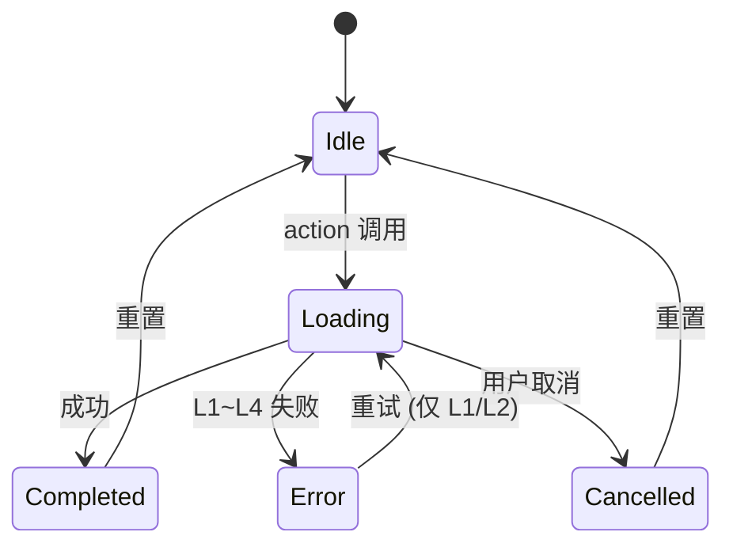
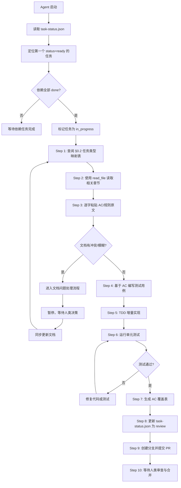
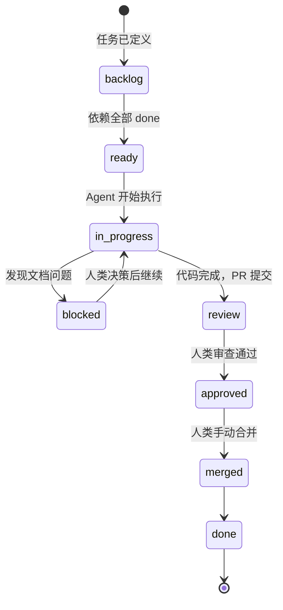
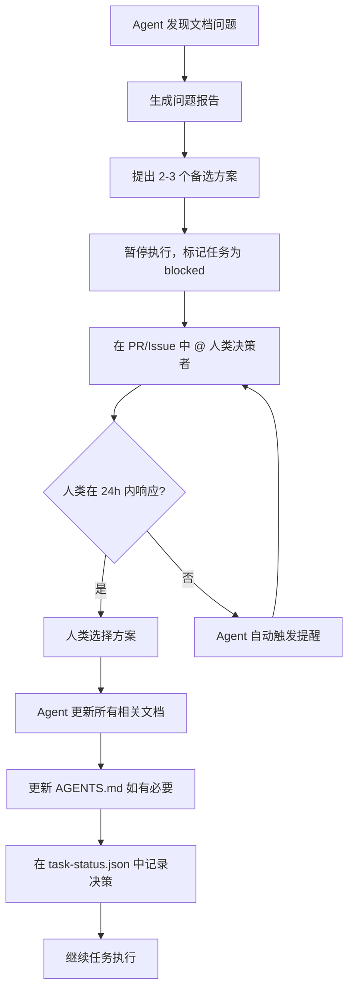

# Echo · 回响：OpenCode 协作开发规约

**版本**：v5.5  
**生效日期**：2026-06-30  
**适用对象**：所有参与 Echo 项目开发的 AI Agent（OpenCode 桌面版 / Codex / Cursor / Claude）及人类开发者  
**优先级**：本规约优先于任何 Agent 的默认行为。当本规约与 Agent 默认行为冲突时，以本规约为准。  
**加载方式**：Agent 启动时自动加载根目录 `AGENTS.md`；子目录 `AGENTS.md` 叠加补充。  
**对应规格**：Echo v4.6 全量用户故事与验收标准规格书  
**架构基准**：Cognitive Pipeline + Observable ViewModel + Actor Isolation  
**任务追踪**：`docs/05-planning/task-status.json` 记录所有任务执行状态  
**文档索引**：`docs/INDEX.md` 提供文档摘要与模块速查  
**GitHub 自动化**：OpenCode 桌面版通过 GitHub API 自动创建 PR、添加评论、管理标签，合并操作需人类审批

---

## 0. 项目文档与快速索引

所有项目规格、架构、实现规范、AI Native 开发指南及计划均存放于项目根目录下的 `docs/` 文件夹中。Agent 在执行任何编码任务前，**必须**先查阅相关文档并引用原文。

### 0.1 文档目录

| 文档类别               | 文件路径                                               | 用途                                       |
| ---------------------- | ------------------------------------------------------ | ------------------------------------------ |
| **文档索引**           | `docs/INDEX.md`                                        | 文档摘要索引，Agent 启动时优先读取         |
| **规格与需求**         | `docs/01-spec/用户故事与验收标准规格书.md`             | 所有用户故事与 AC 的唯一来源               |
| **架构设计**           | `docs/02-architecture/架构设计文档.md`                 | Cognitive Pipeline + Actor 架构详细设计    |
| **技术选型**           | `docs/02-architecture/技术选型文档.md`                 | 模型、数据库、推理框架选型决策             |
| **数据流**             | `docs/02-architecture/数据流全链路技术说明文档.md`     | 数据在系统中各环节的流转细节               |
| **双语言实现**         | `docs/03-implementation/双语言实现说明文档.md`         | 跨语言检索、翻译、术语表等实现规范         |
| **开发避坑手册**       | `docs/03-implementation/开发避坑与关键注意点手册.md`   | 禁止事项、陷阱与防御性检查清单             |
| **AI Native 开发理念** | `docs/04-ai-native/AI Native开发理念与实战技巧手册.md` | AI Native 方法论、工具与实战技巧           |
| **产品创新工具**       | `docs/04-ai-native/产品创新工具全景指南.md`            | 前沿创新工具介绍及融入 Echo 的方案         |
| **开发计划**           | `docs/05-planning/开发计划安排文档.md`                 | 里程碑、时间线及资源安排                   |
| **任务状态**           | `docs/05-planning/task-status.json`                    | 每个任务的执行状态、依赖关系、测试文件映射 |

### 0.2 任务类型 → 文档快速索引（Agent 必读）

**使用方式**：收到任务后，先判断任务类型，按下表确定应读取的文档和章节，使用 `read_file` 工具**只读取相关章节**（而非整篇文档）。如果发现信息不足，再按需扩展读取范围。

| 任务类型                  | 应读取的文档                                           | 重点章节/关键词                                    |
| ------------------------- | ------------------------------------------------------ | -------------------------------------------------- |
| **初次启动/建立全局认知** | `docs/INDEX.md`                                        | 全文阅读，建立文档地图                             |
| **查阅文档索引**          | `docs/INDEX.md`                                        | 按模块快速定位，查看故事概览                       |
| **实现新 Actor**          | `docs/02-architecture/架构设计文档.md`                 | §3.2 Actor 隔离契约                                |
|                           | `docs/03-implementation/开发避坑与关键注意点手册.md`   | §2 Actor 隔离避坑                                  |
| **实现新 Pipeline**       | `docs/02-architecture/架构设计文档.md`                 | §3.1 认知管线契约                                  |
|                           | `docs/02-architecture/数据流全链路技术说明文档.md`     | §2~4 对应 Pipeline 流程                            |
|                           | `docs/03-implementation/开发避坑与关键注意点手册.md`   | §4 Pipeline 避坑                                   |
| **实现用户故事 US-XXX**   | `docs/01-spec/用户故事与验收标准规格书.md`             | 定位到具体故事（如 `US-PRV-001`）                  |
|                           | `docs/02-architecture/数据流全链路技术说明文档.md`     | 对应业务流程章节                                   |
| **实现跨语言检索**        | `docs/03-implementation/双语言实现说明文档.md`         | §4 跨语言检索管线                                  |
|                           | `docs/01-spec/用户故事与验收标准规格书.md`             | US-RET-001~008                                     |
| **实现反馈学习**          | `docs/01-spec/用户故事与验收标准规格书.md`             | US-FBK-001~003                                     |
|                           | `docs/02-architecture/数据流全链路技术说明文档.md`     | §6 反馈学习数据流                                  |
| **调试/避坑**             | `docs/03-implementation/开发避坑与关键注意点手册.md`   | 按问题类型查找（Actor / Pipeline / 跨语言 / 存储） |
| **技术选型决策**          | `docs/02-architecture/技术选型文档.md`                 | 对应章节                                           |
| **了解 AI Native 理念**   | `docs/04-ai-native/AI Native开发理念与实战技巧手册.md` | 相关章节                                           |
| **创新工具集成**          | `docs/04-ai-native/产品创新工具全景指南.md`            | 对应工具章节                                       |
| **查阅开发计划/任务**     | `docs/05-planning/开发计划安排文档.md`                 | 里程碑、时间线                                     |
|                           | `docs/05-planning/task-status.json`                    | 当前任务状态、依赖关系                             |

### 0.3 Agent 文档读取规范

1. **启动时**：Agent 自动加载本文件（`AGENTS.md`），并**必须**读取 `docs/INDEX.md` 以建立全局文档认知，同时读取 `docs/05-planning/task-status.json` 以确认当前任务状态。
2. **执行任务时**：根据 §0.2 的映射表确定需要读取的文档和章节，使用 `read_file` 工具的 `offset` 和 `limit` 参数精准读取。
3. **引用原文**：在回复中必须**逐字粘贴**相关 AC 原文或架构约束原文。
4. **禁止推断**：严禁使用“根据常规做法，我认为应该...”之类的推断。如果文档描述模糊，Agent 必须停止编码并向人类提出澄清问题。

---

## 1. 项目身份与核心约束

### 1.1 一句话定义

Echo 是一个 **本地优先、隐私可审计、完全离线可用** 的端侧 AI 记忆助手。用户的所有数据永不离开设备，所有 AI 推理在端侧完成，所有操作可追溯、可删除。

### 1.2 绝对红线（违反即阻断）

| 红线编号  | 规则                                                         | 验证方式                              | 后果    |
| --------- | ------------------------------------------------------------ | ------------------------------------- | ------- |
| **R-001** | **禁止任何数据上传云端**：所有处理必须在端侧完成             | CI 扫描网络请求 API                   | PR 阻断 |
| **R-002** | **禁止用户主动输入文本记忆**：所有文本记忆仅来自系统备忘录和语音备忘录转写 | UI 检查 + 单元测试                    | PR 阻断 |
| **R-003** | **原始文件级联删除不写入 ExcludedAssets**：仅用户主动“仅从 Echo 移除”才写入 | 单元测试 + 审计检查                   | PR 阻断 |
| **R-004** | **AI 输出语言仅限 zh-Hans/en-US**：响应语言必须匹配 UserPolicy.preferredLanguage | Language Aligner 运行时校验           | PR 阻断 |
| **R-005** | **模型加载无网络下载**：所有模型随 App 安装包分发，App 内不发起网络请求 | 网络拦截测试                          | PR 阻断 |
| **R-006** | **所有异步操作必须包含 PrivacyCheckpoint**：每个 Pipeline Actor 方法入口必须调用 | CI 静态扫描                           | PR 阻断 |
| **R-007** | **禁止使用 Combine / @unchecked Sendable / nonisolated(unsafe)** | SwiftLint + 编译器                    | PR 阻断 |
| **R-008** | **所有跨 Actor 调用必须 await**：禁止同步等待另一个 Actor    | 编译器 `-strict-concurrency=complete` | PR 阻断 |

### 1.3 语言策略

- **支持语言**：仅 `zh-Hans` 和 `en-US`
- **繁体/方言处理**：自动映射为 `zh-Hans`，首次启动提示一次
- **UI 语言**：String Catalog 仅包含 `zh-Hans` 和 `en-US` 两个版本
- **AI 输出语言**：由 `UserPolicy.preferredLanguage` 显式控制，Prompt 强制注入

### 1.4 数据主权契约

| 契约编号  | 规则                                                         | 验证方式                 |
| --------- | ------------------------------------------------------------ | ------------------------ |
| **D-001** | 所有记忆永不自动过期，无 TTL 定时任务                        | 代码审查 + 审计          |
| **D-002** | ExcludedAssets 写入条件：仅用户主动“仅从 Echo 移除”          | 单元测试覆盖所有写入路径 |
| **D-003** | 级联删除时同时清理 ExcludedAssets 无效记录                   | 文件系统模拟测试         |
| **D-004** | 重新授权数据源时提供一键恢复排除项选项                       | UI 测试                  |
| **D-005** | 删除操作事务性覆盖：向量、索引、缓存、元数据、审计日志、translationCache | 故障注入测试             |

---

## 2. 技术栈与工具链

### 2.1 强制技术栈

| 层级       | 技术选型                                     | 版本要求                            |
| ---------- | -------------------------------------------- | ----------------------------------- |
| 语言       | Swift 6                                      | 开启 `-strict-concurrency=complete` |
| UI 框架    | SwiftUI + `@Observable` (iOS 18 Observation) | 最低 iOS 18.0                       |
| 并发模型   | Swift Concurrency (Actor, Task, AsyncStream) | 禁止 GCD/Combine                    |
| 状态管理   | `@Observable` ViewModel                      | 禁止手动 `objectWillChange.send()`  |
| 向量数据库 | LanceDB Mobile                               | 随 App 打包                         |
| 关系数据库 | SQLite (通过 GRDB 或原生)                    | 表结构见规格书附录                  |
| 推理引擎   | Core ML (主力) + Whisper.cpp (ASR 专用)      | Core ML 模型随 App 打包             |
| 模型格式   | Core ML (.mlmodelc) + GGUF (Whisper)         | 禁止运行时转换                      |
| 依赖管理   | SPM (Swift Package Manager)                  | 仅白名单包                          |

### 2.2 严格禁止的依赖

```yaml
禁止清单:
  - 任何网络请求库 (Alamofire, URLSession 仅用于系统 API 且需审计)
  - 分析/崩溃上报 (Firebase Analytics, Crashlytics, Sentry)
  - 云端 AI API (OpenAI, Anthropic, Google AI) - 仅可在研究分支使用
  - 跨平台框架 (React Native, Flutter) - Echo 为 iOS 独占
  - TCA (Composable Architecture) - 已弃用，迁移至 @Observable
```

### 2.3 Agent 工具链

| 工具                               | 用途                | 配置要求                            |
| ---------------------------------- | ------------------- | ----------------------------------- |
| OpenCode 桌面版 / Codex / Cursor   | 代码生成与编辑      | 自动加载 `AGENTS.md`                |
| SwiftLint                          | 静态分析            | 配置文件与 AGENTS.md 同步           |
| GitHub API（通过 OpenCode 桌面版） | PR 管理、评论、标签 | OpenCode 桌面版 GitHub OAuth 登录   |
| 本地文档（`docs/`）                | 规格读取            | Agent 通过 `read_file` 工具直接读取 |

---

## 3. Git 协作规范

### 3.1 分支命名规范

所有分支名称必须遵循以下格式：

```
{type}/{description}-US-XXX
```

**Type 类型**：

| Type       | 说明                   | 示例                                    |
| ---------- | ---------------------- | --------------------------------------- |
| `feature`  | 新功能开发             | `feature/search-pipeline-US-RET-001`    |
| `fix`      | Bug 修复               | `fix/excludedassets-cascade-US-PRV-007` |
| `docs`     | 文档更新               | `docs/update-agents-md`                 |
| `refactor` | 代码重构（不改变功能） | `refactor/actor-isolation`              |
| `test`     | 测试补充或修复         | `test/golden-dataset-expand`            |
| `chore`    | 构建/工具/依赖更新     | `chore/upgrade-spm-deps`                |

**Description 命名规则**：
- 使用小写字母和连字符（`-`）连接
- 应使用**英文**，简洁描述分支目的
- **必须**包含关联的用户故事编号（`US-XXX`）

**正确示例**：
- `feature/search-pipeline-US-RET-001`
- `fix/excludedassets-write-condition-US-PRV-007`
- `docs/update-agents-md`

**错误示例**：
- `my-branch`（缺少 type 和 US 编号）
- `feature/修复搜索`（使用了中文）
- `feature/search`（未关联用户故事）

### 3.2 Commit Message 规范

所有 Commit Message 必须遵循以下格式：

```
{type}({scope}): {subject}

{body}

{footer}
```

**Type 类型**：

| Type       | 说明           |
| ---------- | -------------- |
| `feat`     | 新功能         |
| `fix`      | Bug 修复       |
| `docs`     | 文档更新       |
| `refactor` | 代码重构       |
| `test`     | 测试相关       |
| `chore`    | 构建/工具/依赖 |

**Scope 范围**（必填）：

| Scope       | 对应模块             |
| ----------- | -------------------- |
| `actor`     | Core/Actors/ 目录    |
| `pipeline`  | Core/Pipelines/ 目录 |
| `viewmodel` | UI/ViewModels/ 目录  |
| `view`      | UI/Views/ 目录       |
| `service`   | Core/Services/ 目录  |
| `model`     | Core/Models/ 目录    |
| `utils`     | Core/Utils/ 目录     |
| `docs`      | docs/ 目录           |
| `config`    | 配置文件             |

**Subject 规则**：
- 使用**英文**，不超过 50 个字符
- 使用**祈使句**（如 `add`, `fix`, `update`, `remove`）
- 首字母小写，末尾不加句号

**Body 规则**（可选，但强烈建议包含）：
- 说明“为什么”做这个变更，而非“做了什么”
- 每行不超过 72 个字符
- **必须包含关联的用户故事编号**（如 `Related: US-PRV-001`）

**Footer 规则**（可选）：
- 关联 Issue：`Closes #123`

**正确示例**：
```
feat(actor): add ExcludedAssetsActor with cascade cleanup

- Implements write conditions per US-PRV-004
- Adds cascade cleanup for invalid records per US-PRV-007
- Includes unit tests covering all write paths

Related: US-PRV-004, US-PRV-007
```

**错误示例**：
```
fixed bug                    # 缺少 type/scope，描述不清晰
feat(search): 增加向量检索   # 使用了中文
refactor(actor): fixed things  # subject 不是祈使句
```

### 3.3 Pull Request 规范

**PR 标题格式**：

```
{type}({scope}): {description} [US-XXX]
```

**PR 描述模板**（Agent 与人类开发者通用）：

```markdown
## 📋 概述
[简要描述这个 PR 实现的功能或修复的问题]

## 🔗 关联规格
- 用户故事: US-PRV-001
- 文档路径: docs/01-spec/用户故事与验收标准规格书.md
- 任务 ID: [如 2.1]

## ✅ AC 覆盖对照表
| AC 编号 | 规格原文摘要 | 测试文件 | 实现文件 | 状态 |
| --- | --- | --- | --- | --- |
| AC-1 | ... | ... | ... | ✅ |
| AC-2 | ... | ... | ... | ✅ |

## 🧪 测试
- [ ] 单元测试通过，覆盖率 ≥95%
- [ ] 集成测试通过（含跨语言 Golden 用例）
- [ ] 无并发警告（-strict-concurrency=complete）

## 🔍 自检清单
- [ ] 所有新增 Actor 方法入口包含 PrivacyCheckpoint
- [ ] 无 @unchecked Sendable / nonisolated(unsafe) / Combine
- [ ] 无硬编码语言字符串
- [ ] 错误已按 L1~L4 分级，L2 写入 PendingOperations
- [ ] 长任务已通过 TaskQueueActor 入队

## 📝 Agent 备注
[如有需要特别说明的实现决策，在此记录]
```

### 3.4 Agent 提交前的强制自检

在 Agent 执行 `git commit` 或发起 PR 之前，必须完成以下检查：

1. **运行 SwiftLint**：确保 0 违规
2. **运行单元测试**：确保全部通过
3. **检查 Commit Message 格式**：符合上述规范
4. **检查 PR 描述**：包含 AC 覆盖对照表
5. **检查文件头部**：核心文件包含“出生证明”水印（见 §12.3）
6. **更新任务状态**：在 `docs/05-planning/task-status.json` 中标记任务为 `review`，并记录 `pr` 信息

若任何检查失败，Agent **必须**修复后再提交。

---

## 4. 核心架构原则

### 4.1 认知管线（Cognitive Pipeline）契约

所有认知处理流程必须遵循以下契约：

```yaml
Pipeline 契约:
  - 纯函数性: 相同输入必须产生相同输出，无隐式依赖
  - 无状态: Pipeline 节点本身不持有可变状态
  - 副作用隔离: 所有副作用通过 Actor 调用实现
  - 审计强制: 每个 execute() 方法入口必须调用 PrivacyCheckpoint
  - 错误分级: 所有 throws 必须映射到 L1~L4 统一错误矩阵
  - 进度报告: 长任务必须向 ProgressActor 报告进度
  - 可取消: 长任务必须支持 Task.isCancelled 检查
```

### 4.2 Actor 隔离契约

```yaml
Actor 契约:
  - 可变状态封装: 所有 SQLite/LanceDB 写操作封装在 Actor 中
  - 串行执行: 同一 Actor 的操作串行执行，无数据竞争
  - 仅值类型传递: 跨 Actor 传递参数必须为 Sendable 值类型
  - 禁止闭包传递: 跨 Actor 禁止传递闭包作为参数
  - 初始化同步: Actor 初始化器保持同步，异步初始化通过静态工厂
  - 跨 Actor 必须 await: 禁止同步等待其他 Actor
  - 禁止 nonisolated(unsafe): 全局禁用，CI 扫描拦截
```

### 4.3 长任务与队列契约

```yaml
TaskQueue 契约:
  - 串行执行: 索引构建与数据同步必须串行，通过 TaskQueueActor
  - 入队所有写入任务: 任何写入 LanceDB 的长任务必须入队
  - 支持暂停/取消: 任务实现 Cancellable 协议
  - 进度报告: 通过 ProgressActor 持久化到 SQLite TaskProgress 表
  - 完成后清理: 任务完成或失败后删除 TaskProgress 记录
  - 取消保留进度: 取消时保留进度，下次启动询问是否继续
```

### 4.4 错误分级契约（L1~L4）

| 等级            | 定义                                    | 系统行为                                                | 用户感知              |
| --------------- | --------------------------------------- | ------------------------------------------------------- | --------------------- |
| **L1 瞬态**     | 网络抖动、PHPhotoLibrary 繁忙、数据库锁 | 指数退避重试 3 次（1s/2s/4s），失败升级为 L2            | 无提示                |
| **L2 可恢复**   | 磁盘不足、权限临时拒绝                  | 写入 `PendingOperations` 表，仅用户手动重试，无自动重放 | Toast + 重试按钮      |
| **L3 阻断**     | 数据库损坏、模型加载失败                | 停止功能，引导用户跳转系统设置修复                      | 全屏引导页            |
| **L4 数据冲突** | 外部删除 + 本地编辑同时发生             | 标记 conflict，提供手动合并 UI                          | Banner + 解决冲突入口 |

### 4.5 断点续传契约

```yaml
断点续传契约:
  - 进度存储: 使用 SQLite TaskProgress 表 (独立于 LanceDB)
  - 存储内容: taskId, taskType, lastProcessedIndex, totalCount, resumeData
  - 原子写入: 使用事务确保进度不丢失
  - 自动清理: 任务完成后立即删除记录
  - 取消后询问: 再次启动时弹窗询问“是否继续”
  - 重新开始: 用户选择重新开始则删除旧进度
```

---

## 5. 数据持久化与存储契约

### 5.1 存储层次

| 存储类型                   | 用途                    | 封装 Actor            |
| -------------------------- | ----------------------- | --------------------- |
| LanceDB                    | 768 维向量存储与检索    | `VectorStoreActor`    |
| SQLite - ExcludedAssets    | 用户排除的资产 ID       | `ExcludedAssetsActor` |
| SQLite - FeedbackStore     | 点赞/点踩/Bad Case 反馈 | `FeedbackActor`       |
| SQLite - TaskProgress      | 断点续传进度            | `ProgressActor`       |
| SQLite - PendingOperations | L2 错误待重试队列       | `PendingOpsActor`     |
| SQLite - AuditLog          | 隐私审计日志            | `PrivacyActor`        |

### 5.2 ExcludedAssets 契约（核心）

```yaml
ExcludedAssets 写入条件（仅有三种）:
  1. 用户选择“仅从 Echo 移除” → 写入 (US-PRV-004)
  2. 重新授权时用户选择“一键恢复排除项” → 批量移除 (US-PRV-001)
  3. 用户从已排除项目界面手动恢复 → 移除 (US-SRC-008)

ExcludedAssets 禁止写入条件:
  - 系统自动删除旧记忆 (US-SRC-012) → 不写入
  - 原始文件级联删除 (US-PRV-007) → 不写入，但会清理无效记录

恢复校验:
  - 恢复前必须检查原始文件是否存在
  - 不存在则自动从 ExcludedAssets 移除并提示用户
```

### 5.3 反馈存储契约

```yaml
反馈重排契约:
  - 阈值: 仅当余弦相似度 ≥ 0.80 时应用反馈权重
  - 时间衰减: 
      - 年龄 ≤ 90 天: decayFactor = 1.0
      - 90天 < 年龄 ≤ 180天: decayFactor = 0.5
      - 年龄 > 180天: 归档，不参与重排
  - 权重截断: adjustment = clamp(rawAdjustment, -0.5, 0.5)
  - 公式: finalScore = cosineSim + adjustment
  - 存储: 仅本地 SQLite，永不上传
```

### 5.4 审计日志契约

```yaml
审计日志契约:
  - 强制字段: eventType, timestamp, traceID, policyVersion, success
  - 可选字段: sourceType, affectedCount, excludedWritten, sourceLanguage, elapsedMs
  - 隐私保护: 仅记录哈希摘要，禁止原文
  - 保留期: 30 天，超期自动清理
  - 加密: NSFileProtectionComplete
  - 覆盖率: CI 强制 100% (所有 Pipeline 入口必须有 Checkpoint)
```

---

## 6. 跨语言与 i18n 契约

### 6.1 支持语言范围

- **仅支持 `zh-Hans` 和 `en-US`**
- 繁体中文、粤语、其他方言：映射为 `zh-Hans`，首次启动提示一次
- 所有 String Catalog 必须包含两个语言的完整条目

### 6.2 语言检测与处理

```yaml
语言检测契约:
  - 检测工具: NLTagger (iOS 18+)
  - 置信度阈值: ≥ 0.9
  - 低于阈值: 标记 .uncertain，按 Unicode 启发式推断
  - 输出: 仅输出 zh-Hans 或 en-US

AI 输出语言控制:
  - Prompt 显式注入: "You MUST respond in {preferredLanguage}"
  - Language Aligner 校验: NaturalLanguage 检测
  - 重试上限: 严格 1 次
  - 降级模板: 预定义多语言模板 (跟随 preferredLanguage)
```

### 6.3 术语表契约

- 存储格式：JSON `{ "term_key": { "zh-Hans": "...", "en-US": "..." } }`
- 展示层优先查术语表，未命中再调用 Apple Translation
- Prompt 中注入当前上下文术语表子集
- 术语表变更必须同步更新 String Catalog + Golden Dataset
- 覆盖率要求：Golden Dataset 术语测试 ≥ 90%

### 6.4 翻译触发条件（仅展示层）

| 场景          | 触发条件                              | 翻译目标 | 缓存策略       |
| ------------- | ------------------------------------- | -------- | -------------- |
| 记忆详情页    | 用户点击展开非 preferredLanguage 记忆 | 单条原文 | TTL=7d         |
| 搜索结果摘要  | 结果语言 ≠ preferredLanguage          | 摘要片段 | 不缓存         |
| AI 响应引用   | 引用片段语言 ≠ preferredLanguage      | 引用片段 | 随响应         |
| 错误/降级提示 | 系统消息语言 ≠ preferredLanguage      | 整条消息 | String Catalog |
| 导出文件      | 用户选择导出语言 ≠ 源语言             | 全部内容 | 一次性         |

---

## 7. 隐私校验与审计契约

### 7.1 PrivacyCheckpoint 强制注入

```swift
// 每个 Pipeline Actor 方法的第一个语句必须是：
let checkpoint = await PrivacyActor.shared.validate(
    operation: .search,  // 或 .ingest, .sync, .delete, .awakening, .feedback
    traceID: traceID
)
// 若返回 .denied，立即终止并返回 Denial Response
```

### 7.2 Trace ID 传递契约

- Trace ID 在 Pipeline 入口生成（UUID）
- 通过所有函数参数显式传递，禁止 TaskLocal/全局变量
- 审计日志、错误日志、性能监控均使用同一 Trace ID

### 7.3 审计事件完整清单

| 事件类型                          | 触发场景                 | 必填字段                                                  |
| --------------------------------- | ------------------------ | --------------------------------------------------------- |
| `.dataSourceConnected`            | 数据源首次接入           | sourceType, itemCount                                     |
| `.autoImportCompleted`            | 自动导入完成             | newItemCount, failedCount, excludedCount                  |
| `.scheduledScanCompleted`         | 定时扫描完成             | missedItemCount, excludedCount, userImportedCount         |
| `.personSynced`                   | 人物同步                 | personCount, newPersons                                   |
| `.deviceMigrationCompleted`       | 设备迁移完成             | fromDevice, toDevice, integrityCheckPassed, mergeStrategy |
| `.permissionChanged`              | 权限变更                 | sourceType, newScope                                      |
| `.excluded`                       | 排除操作                 | assetIds                                                  |
| `.excludedRestored`               | 恢复排除项               | assetIds                                                  |
| `.excludedBatchRestored`          | 一键恢复排除项           | sourceType, count                                         |
| `.excludedAutoCleaned`            | 级联清除清理无效排除记录 | assetId, userNotified                                     |
| `.dataSourceChangeSynced`         | 数据源变更同步           | changeType, sourceType, affectedCount, hashSkipped        |
| `.manualChangeDetectionCompleted` | 手动检测变更完成         | detectedChanges, userUpdatedCount, conflictCount          |
| `.memoryIngested`                 | 记忆摄入（无原文）       | inputHash, traceID                                        |
| `.imageIngested`                  | 图片摄入                 | privacyBlurApplied=false                                  |
| `.videoIngested`                  | 视频摄入                 | frameCount, audioTranscriptLength, hasAudio               |
| `.voiceIngested`                  | 语音转写摄入             | transcriptModelVersion                                    |
| `.memoryDeleted`                  | 记忆删除                 | preservedOriginal, excludedAssetWritten                   |
| `.cascadeDeleteFromOriginal`      | 原始文件级联清除         | assetId, memoryId, excludedAutoCleaned                    |
| `.memoryEdited`                   | 手动编辑记忆             | editedFields, reindexed, conflictResolvedWith             |
| `.feedbackReceived`               | 反馈收集                 | sentiment, decayFactor                                    |
| `.feedbackReset`                  | 清除所有反馈             | -                                                         |
| `.feedbackRevoked`                | 撤销单条反馈             | feedbackId                                                |
| `.modelLoadFailed`                | 模型加载失败             | modelName, error, recoveryMethod                          |
| `.modelLoadRetrySuccess`          | 手动重试成功             | modelName                                                 |
| `.backgroundTaskInterrupted`      | 后台任务中断             | action, resumePoint, userChoiceOnRestart                  |
| `.retryPending`                   | L2 手动重试待处理        | pendingId, retryCount                                     |
| `.syncConflict`                   | 数据冲突                 | memoryId, conflictType, resolution                        |
| `.reauthorized`                   | 重新授权数据源           | sourceType, excludedBatchRestored                         |

---

## 8. ViewModel 与 UI 契约

### 8.1 ViewModel 强制规范

```yaml
ViewModel 契约:
  - 全部标注 @MainActor
  - 使用 @Observable 宏，禁止手动 objectWillChange.send()
  - 状态使用 enum 管理: idle/loading/completed/error/cancelled
  - action 方法第一行必须设置状态为 .loading
  - 副作用仅通过 action 方法触发，禁止在状态更新回调中触发
  - 持有值类型副本，禁止持有可变引用
  - 订阅进度: 使用 Task 或 .task 修饰符，禁止 Task.detached
```

### 8.2 ViewModel 状态流



### 8.3 后台任务面板契约（US-SYS-001）

```yaml
后台任务面板契约:
  - 实时显示: 通过 AsyncStream<ProgressEvent> 订阅
  - 进度字段: taskId, taskType, processedCount, totalCount, status
  - 支持操作: 暂停 (挂起不释放资源), 取消 (保存进度)
  - 取消后恢复: 再次启动相同任务时弹窗询问“是否继续”
  - 自动隐藏: 无活跃任务时隐藏面板
  - 串行执行: 索引构建与数据同步通过 TaskQueueActor 串行
```

### 8.4 无障碍适配（P2，可延后）

- 所有交互元素有 `accessibilityLabel`
- 动态内容变化触发 `accessibilityAnnouncement`
- 支持 Dynamic Type
- 颜色对比度 ≥ 4.5:1

---

## 9. 测试与质量契约

### 9.1 测试层级与门禁

| 测试层级 | 覆盖内容                            | 工具            | 门禁阈值                  |
| -------- | ----------------------------------- | --------------- | ------------------------- |
| 单元测试 | Actor 方法、Pipeline 节点、公式计算 | Swift Testing   | 覆盖率 ≥ 95%              |
| 集成测试 | 端到端 Pipeline、跨语言检索         | XCTest + Golden | Recall@10 ≥ 85%           |
| UI 测试  | ViewModel 状态流转、卡片交互        | XCUITest        | P0 场景 100%              |
| 性能测试 | 检索延迟、内存峰值、存储            | Instruments     | P95 < 200ms, 内存 < 1.5GB |
| 审计测试 | PrivacyCheckpoint 覆盖率            | CI 静态扫描     | 100%                      |
| 合规测试 | PIPL、数据删除、排除表边界          | ComplianceTest  | 100%                      |

### 9.2 Golden Dataset 要求

- 跨语言用例：≥ 800 条（覆盖 zh-Hans/en-US × query/memory × 精确/模糊/情感/事实）
- 反馈测试用例：≥ 200 条（覆盖点赞/点踩/时间衰减/截断）
- 术语测试：≥ 100 条（术语表命中率 ≥ 90%）
- 每季度更新，纳入真实用户 Bad Case

### 9.3 CI 门禁清单

```yaml
PR 合并前必须通过:
  编译检查:
    - -strict-concurrency=complete 无警告
    - SwiftLint 0 违规
  测试检查:
    - 单元测试通过率 100%
    - 集成测试通过率 100%
    - 覆盖率 ≥ 95%
  审计检查:
    - PrivacyCheckpoint 覆盖率 100%
    - 无 nonisolated(unsafe)
    - 无 Combine 导入
  性能检查 (Nightly):
    - 检索 P95 < 200ms
    - 内存峰值 < 1.5GB
    - 跨语言 Recall@10 ≥ 85%
```

---

## 10. 模块目录结构与文件命名

### 10.1 强制目录结构

```
Echo/
├── App/
│   ├── EchoApp.swift
│   └── AppDelegate.swift (BGTask 注册)
├── Core/
│   ├── Actors/
│   │   ├── PrivacyActor.swift
│   │   ├── ExcludedAssetsActor.swift
│   │   ├── FeedbackActor.swift
│   │   ├── ProgressActor.swift
│   │   ├── PendingOpsActor.swift
│   │   └── TaskQueueActor.swift
│   ├── Pipelines/
│   │   ├── SearchPipeline.swift
│   │   ├── IngestPipeline.swift
│   │   ├── SyncPipeline.swift
│   │   ├── AwakeningPipeline.swift
│   │   └── FeedbackPipeline.swift
│   ├── Models/
│   │   ├── Memory.swift
│   │   ├── UserPolicy.swift
│   │   └── ErrorEnums.swift
│   ├── Services/
│   │   ├── VectorStore.swift
│   │   ├── ModelLoader.swift
│   │   ├── Embedder.swift
│   │   └── ASREngine.swift
│   └── Utils/
│       ├── ErrorHandler.swift
│       ├── PrivacyCheckpoint.swift
│       └── SystemMonitor.swift
├── UI/
│   ├── ViewModels/
│   │   ├── SearchViewModel.swift
│   │   ├── HomeViewModel.swift
│   │   ├── SettingsViewModel.swift
│   │   └── MemoryDetailViewModel.swift
│   └── Views/
│       ├── SearchView.swift
│       ├── HomeView.swift
│       └── SettingsView.swift
├── Resources/
│   ├── Models/ (SigLIP, MobileCLIP, GTE-Qwen2, Whisper)
│   ├── MusicOffline/ (热门歌曲 JSON)
│   └── StringCatalog/
├── Tests/
│   ├── UnitTests/
│   ├── IntegrationTests/
│   └── GoldenDataset/
├── docs/                        # 📚 项目文档中心（详见第0章）
│   ├── INDEX.md                 # 文档摘要索引
│   ├── 01-spec/
│   ├── 02-architecture/
│   ├── 03-implementation/
│   ├── 04-ai-native/
│   └── 05-planning/
│       ├── 开发计划安排文档.md
│       └── task-status.json    # 任务状态追踪
└── AGENTS.md
```

### 10.2 文件命名规范

| 类型      | 命名规则                               | 示例                       |
| --------- | -------------------------------------- | -------------------------- |
| Actor     | `XxxActor.swift`                       | `PrivacyActor.swift`       |
| Pipeline  | `XxxPipeline.swift`                    | `SearchPipeline.swift`     |
| ViewModel | `XxxViewModel.swift`                   | `SearchViewModel.swift`    |
| View      | `XxxView.swift`                        | `SearchView.swift`         |
| Service   | `XxxService.swift`                     | `VectorStoreService.swift` |
| Model     | `Xxx.swift`                            | `Memory.swift`             |
| Utils     | `XxxUtils.swift` 或 `XxxHandler.swift` | `ErrorHandler.swift`       |

---

## 11. Agent 协作规约

### 11.1 AGENTS.md 加载机制

- Agent 启动时自动加载根目录 `AGENTS.md`
- 子目录 `AGENTS.md` 在进入对应目录时叠加加载
- 禁止 Agent 绕过 `AGENTS.md` 规则
- 如果 Agent 发现规则冲突，以更具体的子目录规则为准，并在日志中记录冲突

### 11.2 Agent 任务执行标准流程（基于 task-status.json）



### 11.3 Agent 自检清单（PR 描述必填）

```markdown
## Agent 自检清单

### 通用检查
- [ ] 所有新增 Actor 方法入口包含 PrivacyCheckpoint
- [ ] 无 `@unchecked Sendable`、`nonisolated(unsafe)`、Combine 业务代码
- [ ] 跨 Actor 传递均为 Sendable 值类型
- [ ] ViewModel action 方法首行设置加载态
- [ ] 无硬编码语言、配置、魔法数字
- [ ] 审计日志仅含哈希摘要，无原文
- [ ] 错误已按 L1~L4 分级，L2 写入 PendingOperations
- [ ] 长任务已通过 TaskQueueActor 入队，支持暂停/取消
- [ ] 断点续传进度已通过 ProgressActor 持久化
- [ ] 模型文件已在 Bundle 内，无网络下载代码

### Git 规范检查
- [ ] 分支命名符合 `{type}/{description}-US-XXX` 格式
- [ ] Commit Message 符合 `{type}({scope}): {subject}` 格式
- [ ] PR 标题包含关联的用户故事编号

### 文档引用检查
- [ ] 已根据 §0.2 任务映射表读取相关文档章节
- [ ] 已逐字粘贴相关 AC/规则原文
- [ ] 核心文件头部包含“出生证明”水印（见 §12.3）

### 任务状态检查
- [ ] task-status.json 中该任务已标记为 in_progress/review
- [ ] 所有依赖任务已确认完成
- [ ] PR 链接已记录到 task-status.json

### 跨语言专项
- [ ] 向量模型变更附带跨语言 Recall@10 ≥85% 报告
- [ ] FTS5 未参与语义排序
- [ ] originalText 字段未被修改
- [ ] Language Aligner 重试 ≤1 次
- [ ] 术语表变更同步 String Catalog + Golden Dataset
- [ ] 展示层翻译未在管线内触发
- [ ] 反馈仅应用于余弦相似度 ≥0.80 的记忆
- [ ] UI 无“新建文本记忆”入口

### ExcludedAssets 专项
- [ ] 系统自动删除不写入 ExcludedAssets
- [ ] 级联删除时清理无效排除记录
- [ ] 重新授权数据源提供一键恢复排除项
- [ ] 已排除项目界面校验原始文件存在性 + 手动刷新

### 测试专项
- [ ] 单元测试覆盖率 ≥95%
- [ ] 集成测试包含跨语言 Golden 用例
- [ ] 边界场景测试 (磁盘满、模型损坏、权限拒绝)
- [ ] 错误注入测试 (L1~L4 全覆盖)

### GitHub 自动化检查
- [ ] OpenCode 桌面版已登录 GitHub
- [ ] PR 已自动请求指定 reviewer
- [ ] 所有 CI 检查已触发并等待结果
```

### 11.4 Agent 禁忌清单

| 行为                        | 后果               | 说明                          |
| --------------------------- | ------------------ | ----------------------------- |
| 跳过 PrivacyCheckpoint      | PR 阻断            | 所有 Pipeline 入口必须        |
| 使用 `Task.detached`        | PR 阻断            | 使用 `.task` 或绑定 Task      |
| 硬编码语言字符串            | PR 阻断            | 使用 String Catalog           |
| 使用 `print()` 或 `NSLog()` | PR 阻断            | 使用统一日志系统              |
| 引入未审批的第三方依赖      | PR 阻断            | 需通过 Privacy Reviewer       |
| 修改核心模板                | PR 阻断 + 团队通知 | 需 ADR 审批                   |
| 违反 Git 提交规范           | PR 阻断            | CI 会检查 Commit 格式         |
| 未按 §0.2 读取文档就编码    | PR 阻断            | 强制溯源，防止幻觉            |
| 跳过任务状态更新            | PR 阻断            | task-status.json 必须同步更新 |
| **Agent 自动合并 PR**       | PR 阻断            | 合并必须由人类手动执行        |

---

## 12. 任务执行流程规范（基于开发计划）

> **核心原则**：严格遵循 `docs/05-planning/开发计划安排文档.md` 和 `docs/05-planning/task-status.json` 的编排。Agent 不得跳跃执行、并行执行（除非明确允许）或自行决定任务顺序。

### 12.1 任务状态管理

所有任务状态记录在 `docs/05-planning/task-status.json` 中，包含以下状态流转：



**状态说明**：

| 状态          | 含义                  | 谁可以变更        |
| ------------- | --------------------- | ----------------- |
| `backlog`     | 任务已定义，尚未就绪  | 人类              |
| `ready`       | 依赖已满足，等待执行  | Agent 自动        |
| `in_progress` | Agent 正在执行        | Agent 自动        |
| `blocked`     | 等待人类决策          | Agent 自动 + 人类 |
| `review`      | PR 已提交，等待审查   | Agent 自动        |
| `approved`    | PR 已获批准，等待合并 | 人类              |
| `merged`      | PR 已合并             | 人类              |
| `done`        | 任务完成              | 人类              |

### 12.2 Agent 启动时的强制检查

每次 Agent 会话启动时，必须执行：

1. **读取 `docs/INDEX.md`**：建立全局文档认知，了解文档全貌和模块分布
2. **读取 `task-status.json`**：确认当前阶段（`current_phase`）和状态
3. **确认当前任务**：找到该阶段中第一个 `status: ready` 的任务
4. **检查依赖**：确认该任务的所有 `dependencies` 均已标记为 `done`
5. **输出任务信息**：
   ```
   当前阶段：Phase X - [阶段名称]
   当前任务：[任务ID] - [任务标题]
   关联用户故事：[US-XXX]
   依赖状态：全部已完成 ✅
   ```

### 12.3 任务执行九步法（含 GitHub 自动化）

#### 第 1 步：查阅文档并引用原文

根据任务类型查询 §0.2 映射表，使用 `read_file` 读取相关文档章节，在回复中**逐字粘贴**相关 AC 或规则原文。

**若发现文档问题**（矛盾、模糊、不可测、依赖缺失、技术过时），Agent **必须暂停**并执行 §12.4 文档问题处理流程。

#### 第 2 步：编写测试用例

使用 `write_to_file` 在 `Tests/UnitTests/` 中创建测试文件，命名格式：`[任务ID]_[功能名]Tests.swift`，测试方法命名含 AC 编号（如 `test_AC1_ExcludedAssetsWriteCondition`）。

#### 第 3 步：TDD 增量实现

- 一次实现一个测试用例 → 运行测试 → 通过后继续下一个
- 实现文件必须包含“出生证明”水印（见 §12.5）

#### 第 4 步：运行单元测试

执行 `swift test --filter [任务ID]`，测试通过才进入下一步。

#### 第 5 步：更新任务状态为 review

修改 `task-status.json`：
- 将任务 `status` 从 `in_progress` 改为 `review`
- 更新 `last_updated` 时间戳
- 准备填写 `pr` 信息

#### 第 6 步：创建分支并提交代码

```bash
git checkout -b {type}/{description}-US-XXX
git add .
git commit -m "{type}({scope}): {subject}

{body}

Related: US-XXX"
git push origin {branch_name}
```

#### 第 7 步：自动创建 PR（OpenCode 桌面版自动化）

OpenCode 桌面版自动执行以下操作：

1. 使用 GitHub API 创建 PR，标题和描述遵循 §3.3 规范
2. 自动请求配置的 reviewer（在桌面版设置中配置）
3. 在 PR 描述中插入 AC 覆盖对照表
4. 自动添加标签（如 `status:review`, `US-XXX`）
5. 在 PR 中添加评论，包含：
   - 任务 ID 和用户故事编号
   - 测试结果摘要
   - 文档变更摘要（如有）
6. 更新 `task-status.json` 中的 `pr` 字段

#### 第 8 步：等待人类审查

Agent **必须等待**人类 reviewer 的批准。在等待期间：

- Agent 不自动合并 PR
- Agent 可以响应 PR 中的评论
- Agent 可以在测试失败时自动推送修复（在桌面版中手动重新执行任务）

#### 第 9 步：人类合并后更新状态

PR 合并后，人类（或人类触发的 GitHub Actions）更新 `task-status.json`：
- 将任务 `status` 从 `review` 改为 `done`
- 记录 `merged_at` 时间戳
- 更新 `last_updated` 时间戳

### 12.4 文档问题处理流程



**问题报告模板**：

```markdown
## 📋 文档问题报告

**任务**: [任务ID] - [任务标题]
**关联用户故事**: [US-XXX]
**发现时间**: [时间戳]

### 问题描述
[具体描述文档中的冲突、模糊或缺失之处]

### 涉及文档
- docs/01-spec/用户故事与验收标准规格书.md §US-XXX
- docs/02-architecture/架构设计文档.md §X.X

### 备选方案

#### 方案 A：[方案名称]
- 描述：[具体做法]
- 影响：[对已有代码/文档的影响]
- 优点：[列出优点]
- 缺点：[列出缺点]

#### 方案 B：[方案名称]
- ...

#### 方案 C：[方案名称]
- ...

### Agent 建议
[推荐的方案及理由]

### 等待决策
请选择方案 A/B/C，或提供其他指示。
```

### 12.5 “出生证明”水印协议

Agent 在创建或修改核心架构文件时，**必须在文件头部注入溯源注释**：

```swift
// ==========================================
// 文件: PrivacyActor.swift
// 对应规格: docs/01-spec/用户故事与验收标准规格书.md → US-PRV-001
// 任务: 2.1 - PrivacyActor + UserPolicy 实现
// AC 覆盖: AC-1 (授权校验), AC-5 (重新授权不清除排除表)
// 架构约束: 遵循 AGENTS.md §4.2 (Actor 隔离)
// 生成时间: 2026-06-28
// ==========================================
```

### 12.6 阶段集成测试

当 Agent 检测到当前阶段所有任务状态均为 `done` 时，自动触发阶段验收：

> 当前阶段所有任务已完成，开始执行阶段集成测试。
>
> 运行：`swift test --filter IntegrationTests.Phase[阶段ID]*`
>
> 结果：X 个测试通过，0 个失败。
>
> 阶段 [阶段名称] 集成测试通过。已更新 `task-status.json` 中该阶段 `integration_test` 为 `passed`。准备进入下一阶段。
>
> 下一阶段第一个 ready 任务是：[任务ID] - [任务标题]。

---

## 13. Agent 工作流与溯源协议（Anti-Hallucination Directives）

> **核心原则**：Agent 是“翻译官”，不是“创作者”。任何代码实现必须能在本地规格文档中找到确切的原文依据。**无引用，不编码。**

### 13.1 强制溯源协议（Compulsory Traceability）

在编写任何业务代码之前，Agent 必须严格执行以下步骤：

1. **查阅映射表**：根据任务类型查阅 §0.2 的任务类型 → 文档快速索引
2. **读取原文**：使用 `read_file` 工具读取对应文档章节
3. **原文引用**：在回复中**逐字粘贴**本次涉及的 AC 原文或架构约束原文
4. **禁止推断**：严禁使用“根据常规做法，我认为应该...”之类的推断

### 13.2 TDD 契约协议（Test-First Contract）

1. **先写测试**：首先生成对应的单元测试方法，命名包含 AC 编号
2. **后写实现**：只有在测试确认失败（Red）后，才能编写实现代码
3. **逐条覆盖**：一次实现一个测试用例，通过后再处理下一条

### 13.3 AC 覆盖对照表（PR 必附）

| AC 编号 | 规格文档原文摘要 | 对应测试文件 | 对应实现文件 | 状态 |
| ------- | ---------------- | ------------ | ------------ | ---- |
| AC-1    | ...              | ...          | ...          | ✅    |

### 13.4 幻觉熔断机制

当 Agent 不确定某个 API 是否存在时：

1. **禁止猜测**：严禁编造 API 名称或类型
2. **显式标注**：用 `// TODO: [架构师确认] 请确认 iOS 18 中 API [Name] 的行为` 标注
3. **跳过并说明**：跳过该代码段，在 PR 描述中列出需要人工介入的决策点

---

## 14. 决策记录模板 (ADR)

Agent 在遇到架构决策时，必须按以下格式记录：

```markdown
# ADR-XXX: 决策标题

**状态**: [提议中 / 已接受 / 已废弃]
**日期**: YYYY-MM-DD
**决策人**: [姓名/Agent ID]

## 背景
[为什么需要做这个决策]

## 决策
[选择了什么方案]

## 备选方案
[考虑过但未选择的其他方案及理由]

## 后果
[正面影响和负面影响]

## 参考
[相关规格书章节、ADR、外部文档]
```

ADR 存入 `docs/decisions/`，Agent 在遇到相关上下文时自动加载。

---

## 15. GitHub 自动化操作规约（OpenCode 桌面版专用）

> **核心原则**：OpenCode 桌面版通过 GitHub API 自动化执行常规 GitHub 操作以提升效率，但**合并操作必须由人类手动执行**，确保代码质量和安全性。

### 15.1 操作权限矩阵

| 操作             | 触发条件                   | 是否需要人类审批 | 说明                                    |
| ---------------- | -------------------------- | ---------------- | --------------------------------------- |
| **创建分支**     | 任务状态变为 `in_progress` | ❌ 自动           | 分支命名遵循 §3.1 规范                  |
| **提交代码**     | 任务状态变为 `review`      | ❌ 自动           | Commit message 遵循 §3.2 规范           |
| **创建 PR**      | 任务状态变为 `review`      | ❌ 自动           | PR 标题和描述遵循 §3.3 规范             |
| **添加 PR 评论** | 任务状态变更 / CI 完成     | ❌ 自动           | 用于通知、状态更新、测试结果            |
| **请求 PR 审查** | PR 创建后                  | ❌ 自动           | 自动请求桌面版设置中配置的 reviewer     |
| **添加 PR 标签** | PR 创建 / 状态变更         | ❌ 自动           | 如 `status:review`, `US-XXX`, `phase-2` |
| **更新 PR 描述** | 文档/代码变更后            | ❌ 自动           | 同步更新 AC 覆盖表                      |
| **更新任务状态** | PR 事件触发                | ❌ 自动           | 同步更新 task-status.json               |
| **通过 PR 审查** | —                          | ✅ **必须**       | 必须由人类完成                          |
| **合并 PR**      | 所有检查通过 + 人类批准    | ✅ **必须**       | 需要人类手动点击“合并”按钮              |
| **关闭 PR**      | PR 被拒绝或任务取消        | ✅ **必须**       | 需要人类确认                            |

### 15.2 合并前强制门禁

OpenCode 桌面版**在任何情况下都不得自动合并 PR**。人类执行合并前，必须确认以下所有条件：

1. ✅ 所有 CI 检查通过（单元测试、集成测试、SwiftLint、覆盖率）
2. ✅ 获得至少 1 名人类 Reviewer 的批准
3. ✅ `task-status.json` 中对应任务状态为 `review`
4. ✅ 无未解决的对话线程
5. ✅ 分支与目标分支（main）无冲突

### 15.3 自动化评论规范

- **PR 创建时**：自动添加评论，包含：
  - 关联的任务 ID 和用户故事编号
  - AC 覆盖对照表
  - 测试结果摘要
  - 文档变更摘要（如有）
- **任务状态变更时**：自动在 PR 中添加状态更新评论
- **文档同步完成时**：自动在 PR 中添加“文档已同步”评论
- **CI 完成时**：自动更新 PR 中的检查状态（桌面版需手动刷新或触发）

### 15.4 异常处理

| 异常场景            | OpenCode 桌面版行为            | 人类介入方式                     |
| ------------------- | ------------------------------ | -------------------------------- |
| **CI 失败**         | 在 PR 中评论失败原因，等待修复 | 查看失败日志，指导修复           |
| **合并冲突**        | 在 PR 中标记冲突，不自动解决   | 手动解决冲突或指示 Agent 处理    |
| **权限不足**        | 记录错误，通知人类             | 检查 GitHub OAuth 登录状态和权限 |
| **reviewer 未响应** | 24 小时后自动提醒              | 手动联系 reviewer 或更换         |
| **PR 长时间未合并** | 每周提醒一次                   | 评估是否合并或关闭               |

---

## 16. 版本与维护声明

本规约与 Echo v4.6 全量规格书、架构设计文档、避坑手册、工具指南同步维护。任何规约变更必须：

1. 更新本文档版本号
2. 更新对应规格书/文档
3. 更新 CI 规则（如有）
4. 更新 Agent 模板（如有）

**下次全面复审日期**：2026-07-16（与开发计划阶段1结束同步）

---

**版本历史**：

| 版本 | 日期       | 变更内容                                                     | 变更人    |
| ---- | ---------- | ------------------------------------------------------------ | --------- |
| v4.6 | 2026-06-16 | 初始版本                                                     | AI 架构师 |
| v4.7 | 2026-06-27 | 移除 Notion 引用，改用本地 `docs/` 文档索引                  | AI 架构师 |
| v4.8 | 2026-06-27 | 新增 Git 协作规范                                            | AI 架构师 |
| v4.9 | 2026-06-27 | 新增任务类型 → 文档快速索引                                  | AI 架构师 |
| v5.0 | 2026-06-28 | 新增第 12 章“任务执行流程规范”                               | AI 架构师 |
| v5.1 | 2026-06-28 | 新增第 15 章“GitHub 自动化操作规约”                          | AI 架构师 |
| v5.2 | 2026-06-29 | 适配 OpenCode 桌面版                                         | AI 架构师 |
| v5.3 | 2026-06-29 | 移除 `.opencode/pr-template.md` 相关引用                     | AI 架构师 |
| v5.4 | 2026-06-29 | 移除 `.opencode/config.toml` 相关引用                        | AI 架构师 |
| v5.5 | 2026-06-30 | 新增 `docs/INDEX.md` 配合：更新 §0.1 文档目录新增 INDEX.md 条目；更新 §0.2 任务映射表新增“初次启动/建立全局认知”和“查阅文档索引”两行；更新 §0.3 Agent 文档读取规范，启动时必须读取 INDEX.md；更新 §12.2 Agent 启动强制检查，新增读取 INDEX.md 步骤；更新头部文档索引说明 | AI 架构师 |
