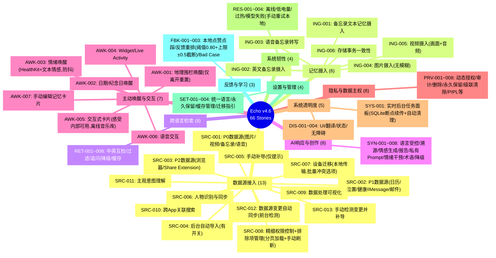

# Echo · 回响：全量用户故事与验收标准规格书

**版本**：v4.6

**生效日期**：2026-06-10

**文档定位**：研发交付、质量验收与 Agent 工程化的唯一执行基准

**变更摘要**：基于 v4.5 修复逻辑漏洞与模糊点，优化排除表清理提示、手动刷新、情绪分析防抖、哈希策略判断时机、注销冷却期提醒、感受删除后 Prompt 更新、相册设置跳转、移除 ODR、音乐推荐离线库、断点续传清理、反馈公式截断、迁移冲突批量选项、策略版本号定义等。

------

## 1. 文档契约与全景索引

### 1.1 核心原则（v4.6）

- **本地优先，信任用户**：所有数据处理在端侧完成，不主动模糊/删除用户媒体内容，隐私控制权完全归属用户。
- **主动智能，情境感知**：从被动检索升级为“地理围栏唤醒 + 情绪干预 + 创作生成”三位一体的主动回忆引擎（去时间条件，围栏重置仅基于离开再进入）。
- **多源融合，跨域关联**：支持 P0/P1/P2 三级数据源分层接入，实现跨 App、跨模态、跨时间的语义关联。
- **透明可控，反馈闭环**：后台任务、数据处理、权限控制全程可视；用户反馈纯本地记录，应用时间衰减及手动重置/撤销。
- **数据主权绝对化**：所有记忆永不自动过期；删除路径强制用户确认；排除项恢复需显式操作；原始文件删除级联清除所有副本（不写入 ExcludedAssets，但会清理无效排除记录）。
- **模型策略封闭化**：禁止用户切换模型；唯一索引与内置模型强绑定；加载失败仅提供手动重试（重试本地已有模型），App 内不主动发起网络下载。
- **语言策略明确**：仅支持简体中文（zh-Hans）和英文（en-US），不支持繁体中文及方言。
- **ExcludedAssets 写入规则**：仅用户主动选择“仅从 Echo 移除”时写入；系统自动删除（如变更同步中的旧记忆删除）**不写入**；原始文件级联清除**不写入**但会清理对应排除记录并提示用户；重新授权后提供一键恢复排除项选项（仅限当前数据源）。
- **反馈阈值策略**：仅当查询与记忆的余弦相似度 ≥0.80 时应用反馈权重，确保学习效果集中在高度相关场景。单条记忆的反馈权重调整上限为 ±0.5（截断）。
- **低电量模式行为**：提供独立开关，开启后自动暂停后台任务以省电；关闭时即使系统低电量模式也不暂停（用户可选择优先性能）。

### 1.2 优先级与发布门禁

| 优先级 | 定义                                                       | 发布门禁                 | 延期策略          |
| ------ | ---------------------------------------------------------- | ------------------------ | ----------------- |
| P0     | MVP 核心体验 / 合规底线 / 数据安全 / 数据主权基石          | 阻断发布                 | 不可延期          |
| P1     | 主动智能引擎 / 跨域关联 / 创作生成 / 系统透明度 / 数据同步 | P0 完成后可酌情延 1 迭代 | 需产品负责人签字  |
| P2     | 纯本地反馈学习 / 高级可视化 / 无障碍适配                   | 不阻断发布               | 纳入 Backlog 排序 |

### 1.3 用户故事地图全景（v4.6，共 66 个故事）



------

## 2. 数据源接入模块（13 Stories）

### US-SRC-001：P0 数据源接入（图片+视频+备忘录+语音备忘录）

- **优先级**：P0

- **用户故事**：作为用户，我希望 Echo 能自动接入我主动创作的图片、视频、备忘录和语音备忘录，作为第一人称叙事的核心数据源。

- 验收标准

  ：

  1. 使用 PHAsset 读取图片/视频，MKMapItem 读取备忘录，AVAudioSession 读取语音备忘录。
  2. 所有数据源摄入均在端侧完成，不上传云端。
  3. 权限请求文案清晰说明用途，支持“仅授权部分相册”。
  4. 首次授权后触发全量后台索引，进度可在实时后台任务面板（US-SYS-001）中查看。
  5. 审计记录 `.dataSourceConnected`，含 `sourceType`、`itemCount`。
  6. 仅处理已下载到本地的资源（使用 `PHImageManager` 的 `requestImageData` 且 `options.isNetworkAccessAllowed = false`，若返回 nil 则表示未下载；家庭共享相册同理，不区分来源）。**在首次授权相册时，增加提示**：“为了完整记忆，建议将 iCloud 照片设置为‘下载并保留原件’或在使用 Echo 前手动下载。已优化存储的照片可能无法被 Echo 识别。” 提示中增加“前往设置”按钮，使用 `UIApplication.openSettingsURLString` 跳转到系统设置（如照片权限设置）。若无法跳转，兜底仅提供文本说明。
  7. 用户可以通过编辑记忆卡片（US-AWK-007）为图片/视频补充文字描述，这些描述将参与向量化。

### US-SRC-002：P1 数据源接入（日历+位置+HealthKit+iMessage+邮件）

- **优先级**：P1

- **用户故事**：作为用户，我希望 Echo 能接入日历、位置、健康、短信和邮件数据，为静态记忆提供时空-生理-社交情境层。

- 验收标准

  ：

  1. 使用 EventKit 读取日历/提醒，CoreLocation 读取位置，HealthKit 读取健康数据（仅用于情境触发，不存储原始数值），MessageUI 读取 iMessage，MailCore 读取邮件。
  2. 每项数据源独立授权开关，支持按时间范围/内容类型精细控制。
  3. iMessage/邮件仅读取用户明确授权的会话/文件夹。
  4. 审计记录 `.contextSourceConnected`，含 `sourceType`、`authorizationStatus`。

### US-SRC-003：P2 数据源接入（浏览器+第三方 App Share Extension）

- **优先级**：P2

- **用户故事**：作为用户，我希望通过 Share Extension 手动将浏览器内容或第三方 App（微信/小红书等）内容导入 Echo，永不自动抓取。

- 验收标准

  ：

  1. Share Extension 支持文本/图片/链接/文件。
  2. 导入前预览确认，用户可选择标签/备注。
  3. 第三方数据标记 `source=thirdParty`，不参与自动情境触发。
  4. 审计记录 `.shareExtensionImported`，含 `appBundleId`、`contentType`。

### US-SRC-004：后台自动导入控制（有开关）

- **优先级**：P1

- **用户故事**：作为用户，我希望可以控制是否允许系统在后台静默导入新数据。

- 验收标准

  ：

  1. 设置页提供“后台自动同步新数据”开关，默认开启。
  2. 开关关闭时，仅在 App 处于前台时触发增量同步。
  3. 导入前必须校验 `ExcludedAssets` 表，跳过所有已排除资源。
  4. 后台导入任务遵循 iOS Background Tasks 规范，可被系统随时挂起。
  5. App 前台时通过“实时后台任务面板”显示导入进度及状态。
  6. 审计记录 `.autoImportCompleted`，含 `newItemCount`、`failedCount`、`excludedCount`。

### US-SRC-005：未导入数据检测与手动补导

- **优先级**：P1

- **用户故事**：作为用户，我希望可以控制定时检测开关，并可手动触发检测；检测结果仅展示，由我决定是否导入。

- 验收标准

  ：

  1. 设置页提供“定期扫描遗漏数据”开关（默认关闭）及“立即扫描”按钮。
  2. 扫描结果页以列表形式展示未导入项，支持全选/单选。
  3. 提供“导入选中项”按钮，**绝不自动执行导入操作**。
  4. 扫描过程校验 `ExcludedAssets` 表，已排除资源不出现在结果列表中。
  5. 审计记录 `.scheduledScanCompleted`，含 `missedItemCount`、`excludedCount`、`userImportedCount`。

### US-SRC-006：人物识别与相册人物同步

- **优先级**：P0

- **用户故事**：作为用户，我希望 Echo 能识别照片中的人物，并自动同步我在系统相册中添加的人物标签，用于按人检索。

- 验收标准

  ：

  1. 使用 Vision.framework VNDetectFaceCaptureQualityRequest 提取人脸特征。
  2. 读取 PHAssetCollection subtype=.albumRegular 中用户命名的人物。
  3. 新增人物自动同步，无需手动重新索引。
  4. 人物元数据仅存本地特征向量+名称，不存人脸原图。
  5. 审计记录 `.personSynced`，含 `personCount`、`newPersons`。

### US-SRC-007：设备迁移（仅支持本地设备间直接传输，增加批量冲突选项）

- **优先级**：P1

- **用户故事**：当我换新 iPhone 时，我希望 Echo 的记忆数据、设置、人物标签能通过本地设备间直接传输（如 AirDrop 或加密备份恢复）完整迁移，无需重新索引；如果目标设备已有数据，应提示我选择覆盖或合并，并在冲突时提供批量处理选项。

- 验收标准

  ：

  1. 迁移方式仅限：AirDrop 直接传输 / Finder/iTunes 加密本地备份恢复；**不使用 iCloud CloudKit 同步**。
  2. `ExcludedAssets` 表不参与 CloudKit 同步，仅随本地备份迁移。
  3. iCloud 照片同步：只有当用户将云端照片显式下载到本地后，Echo 才触发新增数据源的同步逻辑。
  4. 迁移前检测目标设备是否有 Echo 数据：
     - 若无数据，直接恢复。
     - 若有数据，弹窗提示用户选择“**覆盖**”（删除目标设备原有数据，替换为源设备数据）或“**合并**”（保留两边独有的记忆）。对于相同记忆 ID 的冲突项，提供冲突解决界面，显示冲突总数，并允许用户选择“批量应用”：全部使用源设备版本 / 全部使用目标设备版本 / 两者都保留。同时支持逐项自定义。
  5. 迁移后首次启动自动校验数据完整性，缺失项触发补导。
  6. 不提供“导出全部原始记忆数据”功能。
  7. 审计记录 `.deviceMigrationCompleted`，含 `fromDevice`、`toDevice`、`integrityCheckPassed`、`method=airdrop/localBackup`、`mergeStrategy`、`conflictResolutions`（含批量策略）。

### US-SRC-008：精细化数据源权限控制（含排除项恢复与变更监测，分页加载，手动刷新）

- **优先级**：P1

- **用户故事**：作为用户，我希望支持按相册/文件夹批量排除，以及在关键页面单条快捷排除；对于已排除的项目，提供入口允许我重新加入记忆；同时能监测到已排除内容的变更，并提示我决定是否重新导入。

- 验收标准

  ：

  1. 设置页提供按相册/文件夹粒度的导入开关。

  2. 导入预览页、搜索结果页提供单条资源“不再导入”快捷操作。

  3. 所有排除操作统一写入本地 `ExcludedAssets` 表。

  4. `ExcludedAssets` 表中的条目不会被任何自动导入、定时检测或后台同步流程重新导入。

  5. 设置页提供“已排除项目”管理入口，支持查看列表及

     恢复导入

     （恢复时从 

     ```
     ExcludedAssets
     ```

      移除，并触发重新导入）。恢复前必须校验原始文件是否仍存在于系统相册/文件管理中：

     - 若原始文件存在 → 正常恢复导入。
     - 若原始文件已被删除 → 自动从 `ExcludedAssets` 中移除该记录，并提示用户“原始文件已删除，无法恢复”。

  6. 对于曾关闭授权的数据源，当用户重新授权后，系统**不会自动清除 `ExcludedAssets`**。而是在设置页或“已排除项目”界面显示提示：“检测到您重新授权了 [数据源名称]，之前排除的项目仍保持排除。是否一键恢复所有排除项？” 提供“一键恢复”和“稍后手动处理”两个按钮。若用户选择一键恢复，则将该数据源对应的所有 `ExcludedAssets` 记录移除并触发重新导入。

  7. 在“已排除项目”管理界面，系统应在用户**每次打开该界面时**（非实时后台）主动查询每个排除项对应的原始文件变更状态（基于修改时间戳）。若有变更，显示提示“该内容已更新，点击查看变更并决定是否重新导入”。用户点击后可预览差异，并选择“恢复”或“保持排除”。**界面采用分页懒加载**：首次加载前 50 条，滚动时异步加载后续条目，避免性能问题。界面顶部提供“**手动刷新**”按钮，用户点击后重新查询当前已加载条目的变更状态（并可选重新加载整个列表）。不自动轮询。

  8. 审计记录 `.permissionChanged`、`.excluded`、`.excludedRestored`、`.excludedChangeDetected`、`.excludedRestoreFailedFileMissing`、`.excludedBatchRestored`。

### US-SRC-009：数据处理可视化

- **优先级**：P2

- **用户故事**：作为用户，我希望看到已索引的照片数、视频数、备忘录数、向量库大小、模型运行状态等统计信息。

- 验收标准

  ：

  1. 设置页“数据概览”展示各数据源条目数、存储占用、向量维度。
  2. 模型状态显示“就绪/加载中/降级/不可用”。
  3. 数据实时更新（≤5s 延迟）。
  4. 支持导出统计报告（JSON）。
  5. 审计记录 `.dataOverviewAccessed`。

### US-SRC-010：跨 App 数据关联搜索

- **优先级**：P1

- **用户故事**：作为用户，我希望搜索“上次失眠时写的日记”或“心率超 120 时的运动照片”，系统能关联 HealthKit + 备忘录 + 图片返回结果。

- 验收标准

  ：

  1. Intent Parser 识别跨域查询意图（health+memory, location+photo 等）。
  2. Privacy Gate 校验所有涉及数据源的授权状态。
  3. Retriever 执行多源联合检索，按时间对齐结果。
  4. 结果标注数据来源图标（❤️📝📷）。
  5. 审计记录 `.crossAppSearch`，含 `sources=[health,memory,photo]`。

### US-SRC-011：主观/模糊意图理解

- **优先级**：P1

- **用户故事**：作为用户，我希望搜索“适合做头像的构图”、“有氛围感的夜景”等主观描述时，系统能理解并返回相关照片。

- 验收标准

  ：

  1. CLIP 模型对主观形容词有语义响应（cosine >0.6）。
  2. 结果按主观匹配度排序，而非仅客观标签。
  3. 低置信度主观结果标记 `.subjectiveMatch`。
  4. 支持用户对主观结果反馈“准确/不准确”以优化（仅本地学习）。
  5. Golden Dataset 包含 ≥200 条主观查询用例。

### US-SRC-012：数据源内容变更的自动同步（前台检测，优化哈希跳过条件，策略仅开始判断）

- **优先级**：P1

- **用户故事**：当我在系统相册中编辑照片、修改备忘录内容、更新日历事件等时，我希望 Echo 能自动同步这些变更，保持记忆最新；对于已变更的内容，应删除旧记忆并创建新记忆（或整体替换），同时我可以控制是否开启此功能。

- 验收标准

  ：

  1. 监听系统通知：`PHPhotoLibraryChangeObserver`、备忘录更新（`lastUsedDate` 变化后强制全量哈希对比）、日历变更（**改为在 App 前台时对比日历库的 `lastModified` 时间戳**，`EKEventStoreChangedNotification` 仅作为辅助加速刷新）。
  2. 检测优化：对备忘录等先检查 `lastUsedDate`，若改变则进行全量哈希对比，确认真实修改后才触发同步。**在同步开始时判断一次**：若备忘录内容超过 **100KB** 或设备**可用内存低于 300MB** 或设备总内存 ≤2GB，则使用“修改时间戳 + 文件大小”组合判断跳过哈希对比，并在审计记录中标记 `.hasHashSkippedDueToConstraints`。同步过程中不因内存变化而切换策略。
  3. 设置页提供“后台自动同步数据源变更”开关，默认开启。
  4. 开关开启时，检测到变更后触发后台 `BGAppRefreshTask` **增量替换**：先删除旧记忆（包括向量、索引、缓存、元数据），再重新摄入新内容，保持记忆 ID 不变或建立新关联。**系统自动删除旧记忆时不写入 `ExcludedAssets` 表**。
  5. 增量更新必须校验 `ExcludedAssets` 表，跳过已排除资源。
  6. 冲突处理：若后台同步过程中用户尝试手动编辑同一条记忆（US-AWK-007），应**阻止用户保存**，并显示提示“该记忆正在同步更新中，请稍后再编辑”，参考统一错误响应矩阵 L4 数据冲突级别。
  7. 变更同步进度通过“实时后台任务面板”展示。
  8. 开关关闭时，仅在 App 前台手动触发检测（见 US-SRC-013）。
  9. 审计记录 `.dataSourceChangeSynced`，含 `changeType`、`sourceType`、`affectedCount`、`replacedFlag=true`、`excludedNotWritten=true`、`hashSkipped`。

### US-SRC-013：手动检测数据源内容变更并补导

- **优先级**：P1

- **用户故事**：作为用户，我希望可以手动触发对数据源变更的检测，并选择性地更新记忆，而不依赖自动后台同步。

- 验收标准

  ：

  1. 设置页提供“立即检测数据源变更”按钮。
  2. 点击后扫描所有已授权数据源，对比本地 Echo 记忆的最后修改时间戳/哈希与系统实际状态。
  3. 检测结果页以列表形式展示变更项（新增/修改/删除），支持全选/单选。
  4. 提供“更新选中项”按钮，**绝不自动执行更新操作**。
  5. 对于已删除的原始文件，按照 US-PRV-007 级联清除逻辑处理。
  6. 对于修改的内容，**删除旧记忆并重新摄入**，保留原有记忆 ID 以维护关联关系（若可能）。
  7. 冲突处理：若待更新的记忆正在被用户手动编辑（US-AWK-007 未保存），则标记为 `conflict`，不自动覆盖，在检测结果页提示“存在用户编辑，请手动解决冲突”。
  8. 审计记录 `.manualChangeDetectionCompleted`，含 `detectedChanges`、`userUpdatedCount`、`conflictCount`。

------

## 3. 记忆摄入模块（6 Stories）

### US-ING-001：备忘录文本记忆摄入（中文）

- **优先级**：P0

- **用户故事**：作为用户，我在系统备忘录中写下的中文内容，应被 Echo 自动摄入并生成跨语言向量，以便未来用英文也能检索到。

- 验收标准

  ：

  1. 从系统备忘录（MKMapItem / NoteStore）读取文本，`sourceLanguage=zh-Hans`，置信度 ≥0.9。
  2. `originalText` 与备忘录内容逐字节一致，未被修改。
  3. 768 维 CLIP 向量写入 LanceDB 成功。
  4. 等价英文查询 Recall@10 ≥85%，`crossLanguageMatch=true`。
  5. PrivacyCheckpoint `.memoryIngested` 含 `inputHash`、`traceID`，无原文。
  6. FTS5 仅索引标准化文本与元数据。

### US-ING-002：备忘录文本记忆摄入（英文）

- **优先级**：P0
- **用户故事**：作为英语用户，我在系统备忘录中写下的英文内容，应被 Echo 自动摄入，并支持中文检索。
- **验收标准**：（同 US-ING-001，语言方向为 en-US）

### US-ING-003：语音备忘录转写摄入

- **优先级**：P0

- **用户故事**：作为用户，我的语音备忘录应被转写为文本，并按文本流程摄入为记忆，原始音频不持久化。

- 验收标准

  ：

  1. 从系统语音备忘录读取音频，使用 SFSpeechRecognizer 实时预览 + Whisper.cpp 离线精转。
  2. 转写文本经标准化后走 US-ING-001/002 流程（视为外部数据源）。
  3. 音频原始文件不持久化，仅保留转写文本。
  4. 转写置信度 <0.7 时标记 `.uncertainTranscript`。
  5. 审计记录 `.voiceIngested`，含转写模型版本。

### US-ING-004：图片记忆摄入（无模糊，保留原始内容）

- **优先级**：P0

- **用户故事**：作为用户，我希望上传的照片保持原始内容，不模糊人脸/车牌等任何内容，因为这是我和家人朋友的珍贵回忆，且所有处理都在本地完成。

- 验收标准

  ：

  1. **禁止**任何人脸/车牌等敏感区域模糊处理。
  2. EXIF 元数据完整保留（GPS 按 UserPolicy 决定）。
  3. 图片生成 CLIP 向量，与文本向量空间对齐。
  4. 原始图片文件直接引用 PHAsset，不复制存储。
  5. 审计记录 `.imageIngested`，含 `privacyBlurApplied=false`（固定值）。

### US-ING-005：视频记忆摄入（画面+音频双通道）

- **优先级**：P0

- **用户故事**：作为用户，我希望视频不仅提取关键帧，还能转录音频内容，让对话/环境音也成为可检索的记忆。

- 验收标准

  ：

  1. 每秒采样 ≤2 帧，总帧数 ≤20，经 CLIP 向量化。
  2. Whisper.cpp 离线转录音频轨道，文本经标准化后向量化。
  3. 画面向量与音频向量关联同一 `memoryGroupId`。
  4. 视频原文件引用 PHAsset，不复制存储。
  5. 审计记录 `.videoIngested`，含 `frameCount`、`audioTranscriptLength`、`hasAudio=true`。

### US-ING-006：存储事务一致性保障

- **优先级**：P0

- **用户故事**：作为用户，我不希望出现“向量存在但原文丢失”或“原文存在但无法检索”的数据不一致情况。

- 验收标准

  ：

  1. 向量写入与原文/元数据写入在同一数据库事务中（允许使用两阶段提交或补偿回滚，最终保证一致性）。
  2. 任一写入失败则整体回滚，无残留数据。
  3. FTS5 索引更新与主事务同步提交。
  4. 故障注入测试验证回滚正确性。
  5. 审计记录 `.ingestTransaction`，含 `rolledBack=true/false`。

------

## 4. 跨语言检索模块（8 Stories）

### US-RET-001：英文查询匹配中文记忆

- **优先级**：P0

- **用户故事**：作为英语用户，我希望用英文提问能从中文记忆中检索到相关内容。

- 验收标准

  ：

  1. 查询向量与中文记忆向量余弦相似度 ≥0.7。
  2. Cross-Encoder 精排后进入 Top-K。
  3. 结果标记 `crossLanguageMatch=true`、`sourceLanguage=zh-Hans`。
  4. 审计记录 `queryLanguage=en-US`、`resultLanguages=[zh-Hans]`。
  5. Recall@10 ≥85%（Golden Dataset）。

### US-RET-002：中文查询匹配英文记忆

- **优先级**：P0
- **用户故事**：作为中文用户，我希望用中文提问能从英文记忆中检索到相关内容。
- **验收标准**：同 US-RET-001，语言方向相反；中文分词不影响向量生成质量。

### US-RET-003：混合语言查询处理

- **优先级**：P1

- **用户故事**：作为双语用户，我希望用中英混合的句子提问，系统能正确理解并检索。

- 验收标准

  ：

  1. 语言检测标记为 `mixed`，不强制归类单一语言。
  2. 混合查询向量仍位于 CLIP 空间，与纯语言向量可比。
  3. 检索结果包含中英文记忆，按语义相关性排序。
  4. 审计记录 `queryLanguage=mixed`。

### US-RET-004：多维元数据过滤（时间/标签/地点/人物）

- **优先级**：P0

- **用户故事**：作为用户，我希望通过时间、标签、地点范围、人物等多维度缩小检索范围，提高精准度。

- 验收标准

  ：

  1. FTS5 预过滤候选集，支持 `timeRange`、`tags`、`geoRadius(lat,lon,km)`、`personIds[]`。
  2. 人物过滤使用 US-SRC-006 同步的人物 ID。
  3. 地点过滤使用 CoreLocation geohash 索引。
  4. 过滤后 ANN 检索 P95 延迟降低 ≥30%。
  5. 审计记录 `.retrieval` 含 `filterApplied=true`、`filterDimensions=[time,person,geo]`。

### US-RET-005：多轮追问

- **优先级**：P1

- **用户故事**：作为用户，我希望基于上一次搜索结果继续提问（如“那天的天气怎么样？”“还有谁在场？”），系统能理解上下文。

- 验收标准

  ：

  1. 对话历史 ≤10 轮，超出按 FIFO 截断。
  2. 追问查询自动注入上轮结果的 `memoryIds` 作为隐式过滤。
  3. LLM 生成追问改写查询，再送入 Retriever。
  4. 审计记录 `.followUpQuery`，含 `parentTraceId`、`rewrittenQuery`。
  5. 新会话清空历史，不跨会话泄漏。

### US-RET-006：跨语言低置信度透明降级

- **优先级**：P1

- **用户故事**：当跨语言匹配不确定时，我希望系统明确提示而非静默返回低质结果。

- 验收标准

  ：

  1. Cross-Encoder 分数 <0.6 标记 `.lowConfidence`。
  2. UI 显示置信度提示文案，统一为：“以下结果相关性较低，建议优化关键词或尝试不同表述。”（本地化 zh-Hans/en-US）。
  3. 结果仍返回，不被过滤。
  4. 提供“不准确”反馈按钮（仅本地学习）。
  5. 审计记录 `alignmentScore`、`fallbackReason`。

### US-RET-007：检索结果缓存与策略感知失效

- **优先级**：P1

- **用户故事**：作为用户，我希望重复查询能快速返回，但隐私策略变更后缓存立即失效。

- 验收标准

  ：

  1. 相同查询+相同策略版本命中缓存，P95 <100ms。
  2. UserPolicy 版本号变更，旧缓存自动失效。
  3. 缓存 TTL 由 UserPolicy 定义，默认 1h。
  4. 缓存键包含 `policyVersion`、`modelVersion`、`queryHash`。
  5. 审计记录 `.cacheHit=true/false`。

### US-RET-008：检索超时与部分结果返回

- **优先级**：P1

- **用户故事**：当检索耗时过长时，我希望先看到部分结果，而非无限等待。

- 验收标准

  ：

  1. ANN 检索超时阈值 =2s，超时返回已获取结果。
  2. UI 显示“结果可能不完整”提示。
  3. 超时结果标记 `.partialResults=true`。
  4. 审计记录 `.retrievalTimeout`，含 `returnedCount`、`elapsedMs`。
  5. 超时阈值可由 UserPolicy 配置。

------

## 5. AI 响应与创作模块（8 Stories）

### US-SYN-001：首选语言受控输出（与 UI 语言统一，仅支持简中/英文）

- **优先级**：P0

- **用户故事**：作为用户，我希望 AI 响应语言始终与 App UI 语言一致，无需单独设置；系统仅支持简体中文和英文。

- 验收标准

  ：

  1. `preferredLanguage` 自动同步自 `Locale.current.languageCode`，只允许 `zh-Hans` 或 `en-US`。
  2. 若系统语言为繁体中文或其他方言，默认映射为 `zh-Hans`，并在**首次启动时提示一次**“Echo 当前仅支持简体中文和英文，将使用简体中文显示”，之后不再提示。
  3. Prompt 显式注入当前 UI 语言。
  4. Language Aligner 检测响应语言，首次匹配率 ≥99%。
  5. 不匹配时重试 1 次，重试成功率 ≥95%（引用统一错误矩阵 L1）。
  6. 审计记录 `outputLanguage`、`uiLanguage`、`languageRetryCount`。

### US-SYN-002：溯源锚点展示（杜绝幻觉）

- **优先级**：P0

- **用户故事**：作为用户，我希望 AI 回答中每条事实都附带可点击的原始数据链接（照片/视频/备忘录/健康数据/…），确保有据可查。

- 验收标准

  ：

  1. 每个事实陈述旁渲染 `[🔗 MemoryID:xxx]` 锚点。
  2. 点击锚点跳转至原始数据详情页。
  3. 无来源的陈述标记 `[⚠️ NoSource]` 并置灰。
  4. 锚点样式与正文区分，支持长按预览。
  5. 审计记录 `.synthesis` 含 `citationCount`、`noSourceCount`。

### US-SYN-003：情感内容生成（事实依据+创作）并保存到备忘录

- **优先级**：P1

- **用户故事**：作为用户，我希望基于过去多年的日记和照片，生成“给未来孩子的信”或“年度焦虑与治愈报告”等有事实依据的情感内容，并可一键保存至 Apple Notes（仅支持 Apple Notes，不承诺跨设备同步）。

- 验收标准

  ：

  1. 支持预设创作模板（信件/报告/诗歌/时间线）。
  2. 生成内容严格引用检索结果，每段附溯源锚点。
  3. 支持文字预览、复制、导出为 PDF/Markdown。
  4. 生成结果页提供“保存到备忘录”按钮，点击后调用 NoteStore 创建新笔记，内容为 AI 生成文本。
  5. 保存成功后显示 Toast 提示，并提供跳转至该笔记的链接；保存失败时按统一错误矩阵 L2 处理（Toast + 重试按钮）。
  6. 审计记录 `.creativeGeneration`，含 `templateType`、`sourceMemoryCount`、`exportFormat`、`savedToNotes`。

### US-SYN-004：月度/年度叙事报告自动生成并保存到备忘录

- **优先级**：P1

- **用户故事**：作为用户，我希望 Echo 每月/每年自动生成结构化叙事报告，关联事件、情绪曲线、关键人物与生理状态，并可一键保存至 Apple Notes。

- 验收标准

  ：

  1. 每月 1 日 / 每年 1 月 1 日自动生成（可关闭）。
  2. 报告包含：事件链、情绪曲线图、Top5 人物、HealthKit 摘要。
  3. 所有数据点附溯源锚点。
  4. 支持分享/导出/打印。
  5. 报告生成页提供“保存到备忘录”按钮，保存逻辑与 US-SYN-003 一致，标题自动包含报告周期。
  6. 审计记录 `.narrativeReportGenerated`，含 `periodType`、`dataSourcesUsed`、`savedToNotes`。

### US-SYN-005：私有 Prompt 模板（滑动窗口，分析范围包括查询和感受，感受删除后下次更新体现）

- **优先级**：P2

- **用户故事**：作为用户，我希望 Echo 根据我**近期**的语言风格和关注点，自动生成个性化的系统提示词，让 AI 更懂我；且我可以控制分析的时间窗口。

- 验收标准

  ：

  1. 分析范围包括：**用户的所有查询字符串、用户对卡片记录的感受（US-AWK-005）**。不包括备忘录原文。分析最近 **N 天**（默认 N=30）内的上述数据，提取风格关键词与高频主题。超过窗口的老数据不参与个性化，但不会被删除。所有分析均在本地完成，原始数据不离开设备。
  2. 分析频率：每日凌晨触发一次，或用户调整窗口时立即触发。每次分析最多处理最近 500 条记录。
  3. 设置页允许用户调整窗口大小（可选值：7/14/30/60 天），调整后立即重新生成 Prompt。
  4. 生成个性化 System Prompt 草稿，用户可编辑确认。
  5. 确认后注入后续所有合成请求。
  6. 支持重置为默认 Prompt。
  7. **当用户删除某条感受时，个性化分析将在下一次定时任务（每日凌晨）或用户手动重置 Prompt / 调整窗口时体现，不立即更新。**
  8. 若用户使用时间不足窗口天数，则分析所有可用数据。
  9. 审计记录 `.personalPromptUpdated`，含 `windowDays`、`styleKeywords`、`userEdited`、`analyzedRecordCount`。

### US-SYN-006：情绪干预模式

- **优先级**：P1

- **用户故事**：当检测到负面语义时，AI 应主动切换为倾听与安抚模式，而非单纯信息检索。

- 验收标准

  ：

  1. Intent Parser 识别负面情绪意图（sadness/anxiety/grief 等）。
  2. 触发 `.emotionalSupport` 模式，Prompt 切换为共情模板。
  3. 响应优先推送正向回忆卡片（US-AWK-003）。
  4. 不提供未经请求的建议，以倾听为主。
  5. 审计记录 `.emotionalInterventionTriggered`，含 `detectedEmotion`。

### US-SYN-007：领域术语一致性

- **优先级**：P1

- **用户故事**：作为用户，我希望 AI 提到的功能名称与界面文字完全一致。

- 验收标准

  ：

  1. Prompt 注入上下文相关术语表子集。
  2. AI 响应中术语与术语表匹配率 ≥90%。
  3. 展示层翻译优先查术语表。
  4. 未命中时回退 Apple Translation，记录 `.termTableMiss`。
  5. Golden Dataset 术语覆盖率测试通过。

### US-SYN-008：合成失败模板降级

- **优先级**：P0

- **用户故事**：当 LLM 调用失败时，我希望看到友好的模板回复而非错误码。

- 验收标准

  ：

  1. LLM 超时/崩溃/拒绝时触发降级（参考统一错误矩阵 L2/L3）。
  2. 模板回复语言 = UI 语言。
  3. 模板内容固定，不含 LLM 生成成分。
  4. 提供“重试”按钮。
  5. 审计记录 `.synthesisFallback`，含 `failureReason`。

------

## 6. 主动唤醒与交互模块（7 Stories）

### US-AWK-001：基于地理围栏的情境记忆唤醒（仅离开重置，永不重复推送）

- **优先级**：P1

- **用户故事**：当我走进大学附近时，Echo 主动推送相关记忆；同一围栏的推送间隔基于离开并再次进入重置，若从未离开则永不重复推送。

- 验收标准

  ：

  1. 触发条件仅为单一地理围栏**进入事件**（收到 `CLRegion.didEnter` 回调）。
  2. 同一围栏的推送重置规则：
     - 当用户收到 `CLRegion.didExit` 回调时，视为离开。再次收到 `didEnter` 时，重置计时，可触发新推送。（不额外要求持续离开时间）
     - **若用户一直停留在围栏内（从未离开），则永不重复推送同一围栏的记忆**（即推送一次后不再推送，直到用户离开后重新进入）。
  3. 推送内容与该地理位置关联的记忆匹配度 ≥0.7。
  4. 生成交互式回忆卡片（US-AWK-005）。
  5. 用户关闭定位权限或关闭定位服务时，该功能静默禁用且不报错。重新开启定位后，若用户已在围栏内，不会立即触发推送（避免打扰），等待下一次进入事件。
  6. 审计记录 `.contextualAwakening`，含 `triggerType=geofenceOnly`、`memoryIds`、`resetByExit`。

### US-AWK-002：日期/纪念日唤醒

- **优先级**：P1

- **用户故事**：当今天是 6 月 7 日时，Echo 推送各年前同时间的回忆照片视频，附文案。

- 验收标准

  ：

  1. 每日 9:00 检查“往年今日”+ 用户自定义纪念日。
  2. 检索匹配 dateMonthDay 的记忆。
  3. 生成交互式回忆卡片。
  4. 无匹配时不推送。
  5. 审计记录 `.dateAwakening`，含 `triggerType=anniversary`、`yearsAgo=[1,3,5]`。

### US-AWK-003：情绪感知记忆唤醒（缓存有效期24小时，防抖）

- **优先级**：P1

- **用户故事**：当系统检测到我处于负面情绪时，Echo 主动推送往日快乐高光时刻；如果 HealthKit 无数据，则通过我近期的查询和记录感受进行情感分析来触发。

- 验收标准

  ：

  1. 优先使用 HealthKit（心率变异性等）推断情绪状态。
  2. 若 HealthKit 无数据或权限未授权，则分析用户最近 **7 天**内的**查询字符串**和**记录的感受（US-AWK-005）**，使用本地情感分类模型（positive/negative/neutral）。该窗口固定为 7 天，不可配置。每天分析一次并缓存结果，**缓存有效期为 24 小时**。同时，用户每次新增查询或感受时，可触发异步更新缓存，**但需使用防抖机制**：在已有异步分析任务未完成时，不启动新的分析；或者采用延迟执行（如最后一次触发后延迟 30 秒再执行），避免频繁计算。
  3. 负面情绪（negative）→ 检索 positiveEmotion 标签记忆；中性（neutral）或平静状态 → 检索 reflective/introspective 标签记忆；积极情绪（positive）→ 不触发额外推送（避免过度打扰）。
  4. 生成交互式回忆卡片，文案温和不评判。
  5. 审计记录 `.emotionalAwakening`，含 `detectedMood`、`source=healthKit|textSentiment`、`cachedResultUsed`。

### US-AWK-004：Widget / Live Activity

- **优先级**：P1

- **用户故事**：作为用户，我希望在桌面小组件或锁屏看到“今日回忆”或“记忆洞察摘要”。

- 验收标准

  ：

  1. WidgetKit 支持 Small/Medium/Large 尺寸。
  2. 内容每日自动刷新，点击跳转 App 对应页面。
  3. Live Activity 在主动唤醒时显示于锁屏。
  4. Widget 不显示敏感内容（按 UserPolicy 过滤）。
  5. 审计记录 `.widgetDisplayed`，含 `widgetFamily`、`contentId`。

### US-AWK-005：交互式回忆卡片（感受内部可用，音乐推荐使用离线库）

- **优先级**：P0

- **用户故事**：推送内容包含文案+照片+背景音乐建议，支持“下一张”、“记录此刻感受”，点击可跳转原始数据。

- 验收标准

  ：

  1. 卡片包含：文案、1-3 张照片/视频缩略图、若 Apple Music 已授权则显示音乐建议（推荐逻辑优先基于记忆的时间、地点、标签等元数据推荐相关歌单；**备选方案**：使用内置离线热门歌曲库，按年份分类，每年 20 首，随 App 版本更新，不依赖网络），否则显示“需要 Apple Music 授权”提示。若 API 限流则静默降级，不显示音乐建议。
  2. 支持左滑“下一张”、右滑“记录感受”（弹出文本框）。
  3. 点击照片 → 照片详情页；点击文案 → 备忘录原文；点击语音 → 播放页。
  4. **“记录感受”内容不作为独立的新记忆摄入**，而是作为原记忆的扩展属性存储。具体结构：`userFeelings` 数组，每个元素包含 `text`、`timestamp`、`feelingId`。该字段**不支持用户面向的检索（即用户不能通过搜索框查找感受内容）**，但系统内部可用于个性化分析（如私有 Prompt、情绪分析），且分析结果不对外暴露原始感受。后续用户右滑同一卡片或进入记忆详情页时可查看所有历史感受，支持编辑/删除。**当用户删除某条感受时，个性化分析将在下一次定时任务（每日凌晨）或用户手动重置 Prompt 时体现**（参考 US-SYN-005）。
  5. 审计记录 `.cardInteraction`，含 `action=next/record/jump`，`feelingAssociatedToSource`。

### US-AWK-006：语音交互（Siri Shortcuts / App Intents）

- **优先级**：P1

- **用户故事**：作为用户，我希望通过“Hey Siri，问 Echo…”全局唤起语音交互。

- 验收标准

  ：

  1. 注册 App Intents：SearchMemory、CreateMemory、GetTodayRecall。
  2. Siri 语音输入转写后走正常管线。
  3. 支持语音播报响应（AVSpeechSynthesizer）。
  4. 快捷指令可添加到主屏幕。
  5. 审计记录 `.siriInvocation`，含 `intentName`、`transcriptHash`。

### US-AWK-007：手动编辑记忆卡片（允许补充描述）

- **优先级**：P1

- **用户故事**：作为用户，我希望在回忆卡片上直接编辑记忆的标题、描述、自定义标签，甚至覆盖时间戳，让记忆更符合我的主观感受。修改后重新向量化，旧元数据删除。

- 验收标准

  ：

  1. 记忆详情页提供“编辑”入口，允许修改：标题、描述（富文本）、自定义标签列表、覆盖时间戳（用户可自定义日期时间）。用户可以为原本无文本的图片/视频添加描述文字，这些描述将参与向量化。
  2. 保存时触发重新向量化：删除旧的向量/索引/缓存，基于新文本生成新向量，更新元数据中的 `userEdited=true` 和 `originalTimestamp`（保留原始时间戳作为备份）。
  3. 若编辑时该记忆正被后台同步任务更新，则**阻止保存**，并显示提示：“该记忆正在同步更新中，请稍后再编辑”（引用统一错误矩阵 L4）。
  4. 若用户已在编辑界面而外部数据源发生变更，系统不应自动覆盖。而是将该记忆标记为 `conflict`，并在用户下次打开编辑时弹窗“**内容冲突**：外部数据源已被修改，您的编辑尚未保存。请选择：保留您的编辑 / 使用外部新版本 / 查看差异并合并”。需提供差异对比 UI（并排显示）。用户选择“保留您的编辑”后，该记忆的冲突标记被清除，且后续自动同步**永久跳过**该记忆（除非用户手动触发“重新同步”或恢复为外部版本）。同时将该记忆的 `userLocked=true` 标记，表示用户选择手工维护。
  5. 编辑后的人工记忆仍关联原始数据源（如有），但检索时可优先展示人工编辑版本。
  6. 当用户覆盖时间戳后，检索时使用**覆盖后的时间戳**作为主索引。原始拍摄/创建时间戳保存为 `originalTimestamp` 字段，仅在详情页展示，不参与时间范围检索。
  7. 审计记录 `.memoryEdited`，含 `editedFields`、`reindexed`、`conflictResolvedWith=userEdit` 等。

------

## 7. 隐私与数据主权模块（8 Stories）

### US-PRV-001：动态授权即时生效（重新授权后提供一键恢复排除项，仅限当前数据源）

- **优先级**：P0

- **用户故事**：当我关闭某类数据授权后，后续检索立即排除该类数据；当我重新开启授权后，系统应允许我重新导入该类数据，并提供一键恢复之前排除的项目的选项（仅限该数据源）。

- 验收标准

  ：

  1. UserPolicy 更新后，**下一次检索调用前**生效。
  2. 被拒数据不进入 Retriever。
  3. 仅依赖被拒数据时返回 Denial Response。
  4. 相关缓存自动失效。
  5. 当用户将某个数据源从“拒绝”改为“授权”时，系统**不自动清除 `ExcludedAssets` 表中的相关条目**，但在设置页或弹窗显示提示：“检测到您重新授权了 [数据源名称]，之前排除的项目仍保持排除。是否一键恢复所有排除项？（仅限当前数据源）” 提供“一键恢复”和“稍后手动处理”两个按钮。若用户选择一键恢复，则将该数据源对应的所有 `ExcludedAssets` 记录移除并触发重新导入。
  6. 审计记录 `decision=.denied`、`policyVersion`；重新授权时记录 `.reauthorized`，含 `sourceType`、`excludedBatchRestored`。

### US-PRV-002：审计日志查看

- **优先级**：P1

- **用户故事**：作为用户，我希望在 App 内查看最近 30 天的隐私操作记录。

- 验收标准

  ：

  1. 按时间倒序展示，含操作类型、决策结果。
  2. 详情含 Trace ID、哈希、策略版本、耗时。
  3. 无任何原始用户数据。
  4. 超 30 天记录不可见。
  5. 列表加载 P95 <500ms。

### US-PRV-003：审计日志导出

- **优先级**：P1

- **用户故事**：作为用户，我希望导出审计日志用于个人存档或合规审查。

- 验收标准

  ：

  1. JSON 格式，结构与 App 内展示一致。
  2. 导出文件 NSFileProtectionComplete 加密。
  3. 导出过程不阻塞 UI。
  4. 审计记录 `.auditExported`。
  5. 导出文件大小 ≤5MB。

### US-PRV-004：记忆删除时的原始文件处置确认

- **优先级**：P0

- **用户故事**：用户删除某条记忆时，系统必须询问是否同时删除原始媒体文件，并根据选择正确处理数据授权状态。

- 验收标准

  ：

  1. 删除操作触发弹窗，提供两个选项：“仅从 Echo 移除” / “同时删除原始文件”。
  2. 选择“仅从 Echo 移除”时，将该 Asset ID 写入本地 `ExcludedAssets` 表，且事务性清除该记忆的所有副本（向量、索引、缓存、元数据）。
  3. 选择“同时删除原始文件”时，调用系统 API 删除原始文件，并级联清除 Echo 内所有关联数据，**不写入 `ExcludedAssets`**（因为原始文件已不存在）。
  4. `ExcludedAssets` 表中的条目不会被任何自动导入或定时检测流程重新导入，但用户可以通过“已排除项目”管理界面（US-SRC-008）手动恢复。
  5. 对应审计日志条目标记 `.memoryDeleted`，含 `preservedOriginal`、`excludedAssetWritten`（当选择仅移除时）。

### US-PRV-005：全部数据删除与账户注销（冷却期内每3小时提醒）

- **优先级**：P0

- **用户故事**：作为用户，我希望彻底删除 Echo 中的所有索引、向量、设置，但保留系统相册中的原始文件。

- 验收标准

  ：

  1. 二次确认 + 冷却期 24h。
  2. 用户发起注销后，立即显示明确提示：“**冷却期 24 小时内新增或修改的数据将在注销后永久删除。**” 并且在冷却期内每次启动 App 时都提示剩余时间和后果。**此外，在冷却期内，若 App 处于前台状态，每 3 小时显示一次非侵入式提醒**：“您仍在注销冷却期中，剩余 X 小时，数据将在冷却期结束后被删除。”
  3. 冷却期内，Echo 数据仍正常可见，用户可正常使用所有功能（检索、编辑、新增等）。所有新产生的数据继续正常存储。
  4. 冷却期内用户可以撤销注销，撤销后所有数据原样保留（不丢失冷却期内新增的数据）。
  5. 冷却期结束后，异步擦除所有 Echo 数据（包括冷却期内新增的数据）。擦除完成后，App 进入首次启动状态，需重新授权数据源。
  6. **不删除**系统相册/备忘录/健康等原始数据。
  7. 擦除完成后审计数据库自身擦除。

### US-PRV-006：所有记忆永久保留（永不自动过期）

- **优先级**：P0

- **用户故事**：作为用户，我希望所有类型的记忆（媒体、文本、AI 创作等）均不设自动过期/删除机制，仅通过手动删除或原始文件级联清除移除。

- 验收标准

  ：

  1. 系统中不存在任何 TTL、保留周期或自动清理定时任务。
  2. 设置页中无“记忆保留周期”相关选项。
  3. 媒体类型记忆（image/video/audio）不受任何保留策略影响。
  4. 文本类型记忆（note/transcript）同样永不自动过期。
  5. 记忆仅可通过用户手动删除（US-PRV-004）或原始文件删除级联清除（US-PRV-007）两种路径移除。
  6. 审计记录 `.retentionPolicyEvaluated`，含 `mediaExempt=true`、`textExempt=true`、`autoExpiry=false`。

### US-PRV-007：原始媒体文件删除级联清除（同时清理 ExcludedAssets 无效记录，并提示用户）

- **优先级**：P0

- **用户故事**：当用户在系统相册/文件管理中删除原始媒体文件时，Echo 自动清除该文件对应的所有数据副本，并清理 `ExcludedAssets` 中对应的无效记录，同时提示用户。

- 验收标准

  ：

  1. 监听 `PHPhotoLibraryChangeObserver` 及文件系统删除事件。
  2. 检测到删除事件后，在 5 秒内完成对应记忆的向量、索引、缓存、元数据的事务性清除，**不向 `ExcludedAssets` 写入任何记录**，但**同时检查 `ExcludedAssets` 表，如果存在该 Asset ID 的记录则自动删除**（因为原始文件已消失，排除项无意义）。**若清理了排除记录，且用户后续打开“已排除项目”管理界面，应显示一条系统提示**：“部分已排除的原始文件已被删除，已自动从排除列表中移除。”（仅在首次进入时显示一次，或设计为通知横幅）
  3. 清除失败时记录本地错误日志，并在下次启动时重试（引用统一错误矩阵 L1）。
  4. 级联清除过程不阻塞主线程，不影响 App 正常交互。
  5. 审计记录 `.cascadeDeleteFromOriginal`，含 `assetId`、`memoryId`、`success`，`excludedAssetWritten=false`，若清理了排除记录则附加 `excludedAutoCleaned=true`、`userNotified=true`。

### US-PRV-008：PIPL 个人信息处理告知

- **优先级**：P0

- **用户故事**：作为中国用户，我希望在首次使用时清晰了解数据处理方式，并可随时撤回同意。

- 验收标准

  ：

  1. 首次启动展示隐私政策摘要，非全文链接。
  2. 摘要包含处理目的、方式、种类、保留期限、本地处理声明。
  3. 同意按钮与拒绝按钮同等醒目。
  4. 设置页提供“撤回同意”入口。
  5. 撤回同意后等同于 US-PRV-005 注销流程。

------

## 8. 系统透明度模块（5 Stories）

### US-DIS-001：UI 双语统一（语言设置合并，仅简中/英文）

- **优先级**：P0

- **用户故事**：作为用户，我希望 App 语言设置同时控制 UI 文字和 AI 响应语言，无需分别设置。

- 验收标准

  ：

  1. 设置页仅提供一个“App 语言”选项（`zh-Hans` 或 `en-US`）。
  2. 切换后 UI 字符串与 AI preferredLanguage 同步更新。
  3. 支持跟随系统或手动选择，若系统语言非简中/英文则默认 `zh-Hans`。
  4. 切换后立即生效，无需重启。
  5. 审计记录 `.languageUnified`，含 `newLanguage`。

### US-DIS-002：记忆详情按需翻译

- **优先级**：P1

- **用户故事**：当我点开非首选语言记忆时，按需显示翻译，不提前浪费资源。

- 验收标准

  ：

  1. 仅在展开详情时触发。
  2. 优先查 `translationCache`，未命中调 Apple Translation。
  3. 置信度 <0.7 保留原文 + 语言标签。
  4. 提供原文/译文切换按钮。
  5. 翻译成功后写入缓存，TTL=7d。

### US-DIS-003：空态/错误态/加载态本地化

- **优先级**：P0

- **用户故事**：作为用户，我希望所有状态提示都是我的首选语言，包括异常情况。

- 验收标准

  ：

  1. 所有状态文案纳入 String Catalog。
  2. 错误码映射为用户友好文案。
  3. 加载态动画与文化适配。
  4. 网络错误、权限错误、超时错误均有本地化文案。
  5. 状态切换动画流畅，无闪烁。

### US-DIS-004：无障碍适配

- **优先级**：P2

- **用户故事**：作为视障用户，我希望通过 VoiceOver 完整使用 Echo 所有功能。

- 验收标准

  ：

  1. 所有交互元素有 accessibilityLabel。
  2. 动态内容变化触发 accessibilityAnnouncement。
  3. 支持 Dynamic Type，布局不错乱。
  4. 颜色对比度 ≥4.5:1。
  5. VoiceOver 导航顺序符合逻辑。

### US-SYS-001：实时后台任务状态面板（支持暂停/取消/断点续传，使用 SQLite，取消后询问，自动清理进度）

- **优先级**：P0

- **用户故事**：作为用户，我希望在 App 前台时实时了解当前正在进行的后台任务，并能够干预；长任务支持断点续传。

- 验收标准

  ：

  1. App 前台时，在顶部状态栏或设置页实时显示活跃任务列表（如“正在同步新照片 32/128”、“正在构建向量索引”）。
  2. 每个任务显示进度百分比或计数。
  3. 支持对单个任务执行“暂停”或“取消”操作：
     - **暂停**：任务进入挂起状态，不释放已占用的资源，可随时恢复继续。
     - **取消**：任务完全终止，但记录已处理进度（如已处理到第 50 张图片）。下次用户再次启动相同任务时，弹窗询问“检测到未完成的进度，是否继续？” 用户可选择“继续”或“重新开始”。
  4. 断点续传的进度存储在本地 SQLite 数据库（表 `TaskProgress`）中，采用事务写入。取消任务时保存 `lastProcessedIndex` / `lastProcessedId`；重新开始任务时读取该记录，并根据用户选择恢复或重置。**任务完成（成功或最终失败）后，立即删除对应的 `TaskProgress` 记录**，避免表无限增长。
  5. 无活跃任务时，状态面板自动隐藏。
  6. 任务队列策略：索引构建与数据同步串行执行，避免资源争抢。
  7. 审计记录 `.backgroundTaskUIAccessed`、`.backgroundTaskInterrupted`（含 action=pause/cancel, resumePoint, userChoiceOnRestart）。

------

## 9. 系统韧性模块（4 Stories）

### US-RES-001：离线可用

- **优先级**：P0

- **用户故事**：作为用户，我希望在无网络时仍能检索已有记忆并获得 AI 响应。

- 验收标准

  ：

  1. 端侧模型（Embedder、LLM）离线可用。
  2. 向量检索完全本地。
  3. UI 显示“离线模式”标识。
  4. 联网后自动同步离线期间的摄入。
  5. 审计记录 `.offlineMode=true`。

### US-RES-002：低电量模式降级与警告（可停后台任务）

- **优先级**：P1

- **用户故事**：当设备进入低电量模式时降低检索精度，并向用户显示明确警告；同时自动暂停所有非用户触发的后台任务（用户可选）。

- 验收标准

  ：

  1. 检测到 `isLowPowerModeEnabled == true` 时，自动切换至轻量检索模式（视觉 Embedder 切换 MobileCLIP-B，向量空间兼容，Recall@10 ≥80%）。

  2. 顶部显示非侵入式 Banner：“省电模式已启用，记忆检索精度可能降低”。

  3. 设置页提供“

     低电量时自动暂停后台任务

     ”开关，默认开启。

     - 开关开启 → 低电量模式下自动暂停所有非用户触发的后台任务（自动导入、变更同步、索引构建等）。
     - 开关关闭 → 低电量模式下**不暂停**后台任务（用户选择优先性能）。
     - 设置页需附加说明：“关闭后，低电量模式下后台任务仍会运行，可能增加耗电。”

  4. 退出低电量模式后，Banner 自动消失并恢复完整检索能力；若开关开启，后台任务按原队列继续。

  5. 审计记录 `batteryLevel`、`modelVersion`、`degradationWarningShown`、`backgroundTasksPaused`。

### US-RES-003：设备过热降级与警告

- **优先级**：P1

- **用户故事**：当设备温度过高时简化功能，并向用户显示明确警告。

- 验收标准

  ：

  1. 监听 `ProcessInfo.ThermalState`，达到 `.serious` 或以上时触发降级（切换轻量模型 + 禁用精排）。
  2. 顶部显示非侵入式 Banner：“设备温度较高，部分功能已临时简化”。
  3. 热状态恢复正常后，Banner 自动消失并恢复完整功能。
  4. 进行中请求不中断。
  5. 审计记录 `deviceThermalState`、`degradationActive`、`warningShown`。

### US-RES-004：模型加载失败处理（移除 ODR，仅手动重试本地模型）

- **优先级**：P0

- **用户故事**：模型加载失败时，App 内不主动发起网络下载，不提供模型切换选项。用户只能手动重试加载本地已有的模型文件。

- 验收标准

  ：

  1. 模型文件随 App 安装包分发，不依赖网络下载。
  2. 模型加载失败（文件损坏、权限问题等）时，引导用户前往“设置 > 通用 > iPhone 存储空间 > Echo”进行修复（重新安装 App 或重置）。同时 App 内提供“重试加载”按钮，**仅尝试重新加载本地已有的模型文件**，不发起任何网络下载请求。
  3. 用户必须手动点击“重试加载”按钮；**无任何形式的定时自动重试**。
  4. 重试加载时，若检测到设备无网络，可提示“重试不需要网络，但仍需确保 App 文件完整”。（实际不需要网络）
  5. 离线状态下模型损坏时，仅提供 FTS5 关键词检索作为兜底，不阻断基础浏览功能。
  6. 不提供“切换其他模型”作为替代方案。
  7. UI 提示“功能受限”，并提供“修复”入口（跳转系统设置）和“重试加载”按钮。
  8. 审计记录 `.modelLoadFailed`，含 `modelName`、`error`、`recoveryMethod=systemSettings`，以及 `.modelLoadRetrySuccess`（用户手动重试成功）。

------

## 10. 设置与管理模块（4 Stories）

### US-SET-001：统一语言设置

- **优先级**：P0
- **用户故事**：作为用户，我希望一个语言设置同时控制 UI 和 AI 响应（仅简中/英文）。
- **验收标准**：（同 US-DIS-001）

### US-SET-002：记忆永久保留策略（无自动过期）

- **优先级**：P0

- **用户故事**：设置页反映“永不自动删除”策略，无任何保留周期选项。

- 验收标准

  ：

  1. 设置页中无任何记忆保留周期、TTL、自动清理相关选项。
  2. 仅提供手动删除入口（US-PRV-004）及已排除项目管理入口（US-SRC-008）。
  3. 删除策略栏位仅说明“所有记忆永久保留，仅可手动删除或随原始文件删除”。
  4. 审计记录 `.retentionPolicyDisplayed`，含 `policyType=permanent`。

### US-SET-003：缓存管理与存储概览（禁止模型切换）

- **优先级**：P2

- **用户故事**：允许用户清理非必要缓存以释放空间；展示存储占用；**禁止模型切换**。

- 验收标准

  ：

  1. 提供“清理缓存”按钮，清理范围仅限：翻译缓存、检索结果缓存、缩略图缓存。
  2. 缓存清理**明确排除**向量索引与原始媒体数据。
  3. 展示当前各类数据（原始文件引用、向量索引、缓存）的存储占用大小。
  4. **不存在**任何模型切换、索引重建、多索引管理相关的 UI 或逻辑。
  5. 向量索引与 App 内置默认模型强绑定，随 App Store 版本更新，运行时不可切换。
  6. 审计记录 `.cacheCleared`、`.storageOverviewAccessed`，无模型切换记录。

### US-SET-004：数据迁移指引（本地设备间传输）

- **优先级**：P2

- **用户故事**：引导用户通过苹果官方渠道完成数据迁移（本地传输）。

- 验收标准

  ：

  1. 迁移说明页明确列出 AirDrop 传输步骤及 Finder/iTunes 加密备份恢复步骤。
  2. 不提供任何“导出完整数据包用于迁移”的功能入口。
  3. 设置页无“导出全部原始记忆数据”按钮。
  4. 支持导出审计日志（JSON 格式）和 AI 创作文本（Markdown/TXT 格式）。
  5. 审计记录 `.migrationGuideAccessed`、`.auditExported`。

------

## 11. 反馈与学习模块（3 Stories）

### US-FBK-001：本地反馈收集（点赞/点踩）

- **优先级**：P2

- **用户故事**：用户对检索结果的点赞/点踩存入本地，用于个性化重排，**永不上传**。

- 验收标准

  ：

  1. 检索结果项提供 👍 / 👎 按钮。
  2. 反馈数据存入本地 SQLite（`FeedbackStore`），**永不上传至任何服务器**。
  3. 反馈操作即时生效，UI 状态持久化。
  4. 反馈数据关联 memoryId + queryEmbedding。
  5. 审计记录 `.feedbackReceived`，含 `sentiment`，不包含原始数据。

### US-FBK-002：本地反馈驱动重排（阈值 0.80，时间衰减，单条记忆权重上限 ±0.5 截断，支持重置/撤销）

- **优先级**：P2

- **用户故事**：Retriever 利用本地反馈数据动态调整检索结果排序，采用固定余弦相似度阈值（0.80）与时间衰减策略，避免旧偏好永久影响；单条记忆的反馈累积权重设有上限；用户可重置所有反馈或撤销单条反馈。

- 验收标准

  ：

  1. 反馈匹配策略：检索时，对比查询向量与记忆向量的余弦相似度，**仅当相似度 ≥ 0.80** 时才应用反馈权重，低于此阈值的反馈不参与重排。
  2. 时间衰减：每条反馈记录独立计算衰减系数，根据该条反馈的年龄（从记录创建时间到当前检索时间的天数）：
     - 年龄 ≤ 90 天：衰减系数 = 1.0
     - 90 天 < 年龄 ≤ 180 天：衰减系数 = 0.5
     - 年龄 > 180 天：自动归档，不参与重排（相当于忽略）。
  3. 重排公式：先计算原始调整值 `rawAdjustment = Σ(点赞权重_i * decayFactor_i) - Σ(点踩权重_j * decayFactor_j)`，然后截断至 [-0.5, 0.5] 范围：`adjustment = max(-0.5, min(0.5, rawAdjustment))`，最终 `finalScore = cosineSim + adjustment`。
  4. 反馈数据存储在本地 SQLite 数据库（`FeedbackStore`），**永不上传**。
  5. 设置页提供“清除所有反馈学习数据”按钮，点击后清空 `FeedbackStore` 中的反馈记录表（包括归档记录），所有重排权重恢复默认，需要二次确认。
  6. 在“我的反馈记录”页面（US-FBK-003），每条反馈（包括已归档但不参与重排的记录）旁提供“撤销”按钮，点击后从 `FeedbackStore` 中物理删除该条记录。删除后即时生效，下一次检索即反映变更。
  7. 审计记录 `.feedbackReceived`（含 `decayFactor`）、`.feedbackReset`、`.feedbackRevoked`。

### US-FBK-003：本地 Bad Case 标记（支持撤销）

- **优先级**：P2

- **用户故事**：用户可标记检索结果为 Bad Case，存于本地供个人回顾，并支持撤销。

- 验收标准

  ：

  1. 检索结果项提供“标记问题”入口（可置于点踩后二级菜单）。
  2. Bad Case 记录包含查询词、返回结果、标记时间、可选原因及补充文字，存入本地 SQLite（`FeedbackStore`）。
  3. 设置页提供“我的反馈记录”查看入口，支持删除记录。
  4. 在“我的反馈记录”页面，每个 Bad Case 旁提供“撤销”按钮，删除该记录。
  5. **不涉及**服务端 Golden Dataset 更新或 A/B 实验分组。
  6. 审计记录 `.badCaseMarked`、`.badCaseRevoked`，含 `localStore=true`。

------

## 12. 已删除/合并故事清单

| 原编号        | 处理方式              | 原因                                                         |
| ------------- | --------------------- | ------------------------------------------------------------ |
| US-RES-006    | **删除**              | 第三方记忆 API 无明确场景，违背极简本地原则                  |
| US-FBK-004    | **删除**              | 纯本地产品无服务端 A/B 实验能力，P2 阶段无需此复杂度         |
| US-DIS-004    | **合并** → US-SYS-001 | 升级为实时后台任务面板，原故事废弃                           |
| US-SRC-009    | **合并** → US-SYS-001 | 同上                                                         |
| 全局 PRD 索引 | **移除**              | 本文档为唯一执行基准，消除版本漂移风险；所有 PRD 索引字段及附录表格已删除 |

------

## 13. 技术契约备忘（v4.6）

1. **ExcludedAssets 写入规则**：仅用户主动“仅从 Echo 移除”写入；系统自动删除旧记忆、原始文件级联删除均不写入，但级联删除会清理无效排除记录并提示用户。重新授权时提供一键恢复选项（仅限当前数据源）。
2. **重新授权行为**：提供一键恢复排除项选项（仅当前数据源）。
3. **反馈阈值**：余弦相似度 ≥0.80 才应用反馈，单条记忆权重调整上限 ±0.5（截断）。
4. **低电量开关**：独立控制是否暂停后台任务，默认开启。
5. **冲突解决 UI**：提供差异对比与合并选项；用户选择“保留编辑”后自动锁定该记忆，永久跳过自动同步。迁移冲突支持批量应用。
6. **感受存储**：`userFeelings` 数组，不支持用户检索，但系统内部可用于分析。删除感受后，个性化分析在下一次定时任务或手动重置时体现。
7. **断点续传**：使用 SQLite 表 `TaskProgress` 存储进度，取消后再次启动时询问是否继续；任务完成后自动删除进度记录。
8. **统一错误响应矩阵**（见第 14 章），所有故事引用此矩阵处理重试与冲突。L2 仅支持手动重试，无自动重放。
9. **PendingOperations 表清理**：最大条目数 1000，超出时丢弃最旧记录并记录审计。无自动重放，仅用户手动重试。
10. **日历变更检测**：前台对比 `lastModified` 时间戳为主，通知仅辅助。
11. **模型加载失败**：无网络下载，仅提供手动重试按钮（重试本地已有模型）。移除 ODR。
12. **注销冷却期**：期内每 3 小时提醒一次，数据正常使用，撤销后完全恢复。
13. **已排除项目界面**：分页懒加载，首次 50 条，提供手动刷新按钮。
14. **备忘录哈希跳过阈值**：100KB 或可用内存 <300MB 或总内存 ≤2GB，仅在同步开始时判断一次。
15. **音乐推荐**：内置离线热门歌曲库（按年份分类，每年 20 首），随 App 版本更新，不依赖网络。
16. **相册 iCloud 提示**：增加跳转设置按钮，兜底文本。
17. **策略版本号**：`policyVersion` 为一个递增整数，每次用户通过设置页修改任何隐私相关选项（授权、排除、保留策略等）时递增。App 升级时保持原版本号（因为策略未变）。初始版本为 1。
18. **原子性清除**：不要求跨存储事务，允许使用两阶段提交或补偿回滚，最终保证一致性。

------

## 14. 统一错误响应矩阵（v4.6，仅支持手动重试）

| 错误等级          | 触发条件示例                                                 | 用户感知                                         | 系统行为                                                     | 审计记录                            |
| ----------------- | ------------------------------------------------------------ | ------------------------------------------------ | ------------------------------------------------------------ | ----------------------------------- |
| **L1 - 瞬态**     | 网络抖动、PHPhotoLibrary 繁忙、Apple Music 限流、内部数据库锁、索引构建临时失败 | 无 Toast；后台静默重试                           | 指数退避重试（1s→2s→4s），最多 3 次；若 3 次后仍失败，**升级为 L2**，写入 `PendingOperations` 表 | `.retrySuccess` / `.retryEscalated` |
| **L2 - 可恢复**   | 备忘录保存失败、权限临时拒绝、磁盘空间不足、L1 升级后        | Toast + “重试”按钮                               | 写入 `PendingOperations` 表，**无自动重放**，仅用户点击重试按钮时执行。`PendingOperations` 表最大 1000 条，超出丢弃最旧记录 | `.retryPending`                     |
| **L3 - 阻断**     | 永久权限拒绝、API 废弃、数据库损坏、模型加载失败、`PendingOperations` 条目过多 | 全屏引导页 / 设置页红点 + 跳转系统设置           | 停止相关功能；不自动重试；引导用户修复                       | `.fatalError`                       |
| **L4 - 数据冲突** | 资产被外部删除、备忘录被用户手动修改、后台同步与手动编辑同时发生 | 非破坏性提示（Banner/Toast），提供“解决冲突”入口 | 保留本地副本/用户编辑内容；标记 `conflict`；不自动覆盖，提供手动合并界面；用户选择保留编辑后锁定 | `.syncConflict`                     |

------

## 15. 附录：审计日志字段规范

所有审计记录需包含以下基础字段（每个事件类型可扩展特定字段）：

| 字段名            | 类型               | 描述                                            | 示例                                   |
| ----------------- | ------------------ | ----------------------------------------------- | -------------------------------------- |
| `eventType`       | String             | 事件类型，使用点分隔命名（如 `.memoryDeleted`） | `memoryDeleted`                        |
| `timestamp`       | ISO8601 String     | 事件发生时间（UTC）                             | `2026-06-10T10:30:00Z`                 |
| `traceID`         | UUID String        | 全链路追踪 ID，关联同一操作链                   | `550e8400-e29b-41d4-a716-446655440000` |
| `policyVersion`   | String             | 当前用户策略版本号（递增整数，初始为 1）        | `5`                                    |
| `sourceType`      | String (optional)  | 数据源类型（如 `photo`、`note`、`calendar`）    | `photo`                                |
| `success`         | Boolean            | 操作是否成功                                    | `true`                                 |
| `error`           | String (optional)  | 失败时的错误码或描述                            | `diskFull`                             |
| `affectedCount`   | Int (optional)     | 影响的对象数量                                  | `5`                                    |
| `excludedWritten` | Boolean (optional) | 是否写入了 ExcludedAssets 表                    | `false`                                |
| `sourceLanguage`  | String (optional)  | 语言代码（如 `zh-Hans`）                        | `zh-Hans`                              |
| `elapsedMs`       | Int (optional)     | 操作耗时（毫秒）                                | `120`                                  |

### 常用事件类型列表（新增部分字段）：

| 事件类型                          | 必填扩展字段                                                 | 说明                       |
| --------------------------------- | ------------------------------------------------------------ | -------------------------- |
| `.dataSourceConnected`            | `sourceType`, `itemCount`                                    | 数据源首次接入             |
| `.autoImportCompleted`            | `newItemCount`, `failedCount`, `excludedCount`               | 自动导入完成               |
| `.scheduledScanCompleted`         | `missedItemCount`, `excludedCount`, `userImportedCount`      | 定时扫描完成               |
| `.personSynced`                   | `personCount`, `newPersons`                                  | 人物同步                   |
| `.deviceMigrationCompleted`       | `fromDevice`, `toDevice`, `integrityCheckPassed`, `method`, `mergeStrategy`, `batchConflictApplied` | 设备迁移完成               |
| `.permissionChanged`              | `sourceType`, `newScope`                                     | 权限变更                   |
| `.excluded`                       | `assetIds`                                                   | 排除操作                   |
| `.excludedRestored`               | `assetIds`                                                   | 恢复排除项                 |
| `.excludedBatchRestored`          | `sourceType`, `count`                                        | 一键恢复排除项             |
| `.excludedAutoCleaned`            | `assetId`, `userNotified`                                    | 级联清除时清理无效排除记录 |
| `.dataSourceChangeSynced`         | `changeType`, `sourceType`, `affectedCount`, `hashSkipped`   | 数据源变更同步             |
| `.manualChangeDetectionCompleted` | `detectedChanges`, `userUpdatedCount`, `conflictCount`       | 手动检测变更完成           |
| `.memoryIngested`                 | `inputHash`, `traceID`                                       | 记忆摄入（无原文）         |
| `.imageIngested`                  | `privacyBlurApplied`（固定 false）                           | 图片摄入                   |
| `.videoIngested`                  | `frameCount`, `audioTranscriptLength`, `hasAudio`            | 视频摄入                   |
| `.voiceIngested`                  | `transcriptModelVersion`                                     | 语音转写摄入               |
| `.memoryDeleted`                  | `preservedOriginal`, `excludedAssetWritten`                  | 记忆删除                   |
| `.cascadeDeleteFromOriginal`      | `assetId`, `memoryId`, `excludedAutoCleaned`                 | 原始文件级联清除           |
| `.memoryEdited`                   | `editedFields`, `reindexed`, `conflictResolvedWith`          | 手动编辑记忆               |
| `.feedbackReceived`               | `sentiment`, `decayFactor`                                   | 反馈收集                   |
| `.feedbackReset`                  | -                                                            | 清除所有反馈               |
| `.feedbackRevoked`                | `feedbackId`                                                 | 撤销单条反馈               |
| `.modelLoadFailed`                | `modelName`, `error`, `recoveryMethod`                       | 模型加载失败               |
| `.modelLoadRetrySuccess`          | `modelName`                                                  | 手动重试成功               |
| `.backgroundTaskInterrupted`      | `action`, `resumePoint`, `userChoiceOnRestart`               | 后台任务中断               |
| `.retryPending`                   | `pendingId`, `retryCount`                                    | L2 手动重试待处理          |
| `.syncConflict`                   | `memoryId`, `conflictType`, `resolution`                     | 数据冲突                   |
| `.reauthorized`                   | `sourceType`, `excludedBatchRestored`                        | 重新授权数据源             |

------

## 16. 验收自动化映射与 Agent 集成（关键测试层级）

| AC 类别                                | 自动化层级 | 工具                           | 频率 | 阻断 |
| -------------------------------------- | ---------- | ------------------------------ | ---- | ---- |
| ExcludedAssets 恢复时文件存在性校验    | 单元+集成  | Swift Testing + MockFileSystem | PR   | ✅    |
| 重新授权一键恢复排除项（仅当前数据源） | 集成       | XCTest + MockAuthorization     | PR   | ✅    |
| 反馈阈值 0.80 及权重上限截断           | 单元+集成  | Swift Testing + Golden         | PR   | ✅    |
| 地理围栏仅离开重置，永不重复           | 集成       | MockLocation                   | PR   | ✅ P1 |
| SQLite 断点续传（自动清理）            | 单元       | Swift Testing + SQLite         | PR   | ✅    |
| 级联清除清理 ExcludedAssets 并提示     | 集成       | XCTest + MockFileSystem        | PR   | ✅ P1 |
| 已排除项目分页懒加载+手动刷新          | UI         | XCUITest                       | PR   | ✅ P1 |
| 注销冷却期每3小时提醒                  | UI         | XCUITest + MockDate            | PR   | ✅ P0 |
| 模型加载仅手动重试（无 ODR）           | 故障注入   | DegradationTest                | PR   | ✅ P0 |
| 情绪分析防抖                           | 单元       | Swift Testing + Timer          | PR   | ✅ P1 |

------

**文档维护声明**

本规格书 v4.6 是 Echo 研发交付的唯一验收基准。新增/修改用户故事须经产品、研发、测试、合规四方评审，并同步更新自动化测试桩与 Agent 模板。下次全面复审：2026-07-10。