# Echo · 回响：数据流全链路技术说明文档

**版本**：v1.0

**生效日期**：2026-06-10

**适用架构**：Cognitive Pipeline + Observable ViewModel + Actor Isolation

**对应规格**：Echo v4.6 全量用户故事与验收标准规格书

本文档详细描述数据在 Echo 各组件间的流动路径，涵盖用户交互、后台任务、错误处理、断点续传等全链路行为。所有流程均遵循 **本地优先、隐私可审计、任务可中断/续传** 的原则。

------

## 1. 整体数据流架构

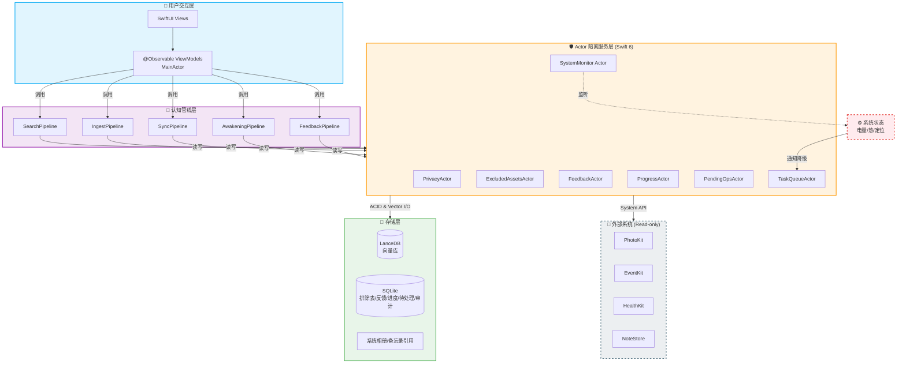

**数据流特点**：

- **单向数据流**：UI → ViewModel → Pipeline → Actor → 存储。结果通过 `AsyncStream` 反向传递至 ViewModel，驱动 UI 更新。
- **Actor 隔离**：所有可变状态（数据库、队列、排除表）由 Actor 独占，避免数据竞争。
- **串行化保证**：`TaskQueueActor` 确保索引构建与数据同步互斥执行。

------

## 2. 用户发起检索数据流（SearchPipeline）

### 2.1 流程时序图

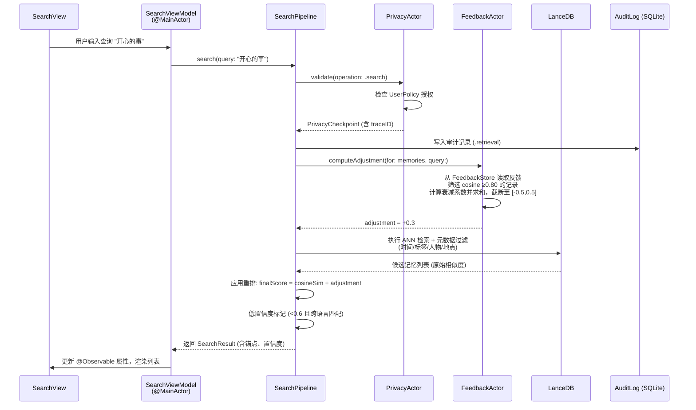

### 2.2 关键节点说明

| 节点            | 职责                                               | 错误处理                                       |
| --------------- | -------------------------------------------------- | ---------------------------------------------- |
| `PrivacyActor`  | 验证当前操作是否违反用户授权（如检索排除的数据源） | 若拒绝，直接返回 `.denied` 空结果，审计标记    |
| `FeedbackActor` | 读取所有反馈记录，计算调整值                       | 读取失败时返回 0，记录 L2 错误至 `PendingOps`  |
| `LanceDB`       | 向量检索 + 标量过滤                                | 超时 (2s) 返回部分结果，标记 `.partialResults` |
| **输出**        | 包含记忆 ID、原始文本/媒体、溯源锚点、置信度提示   | 低置信度时 UI 显示预设文案                     |

------

## 3. 数据源接入与记忆摄入数据流（IngestPipeline）

### 3.1 流程时序图（以图片为例）

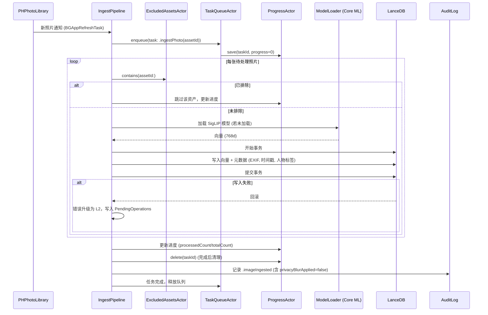

### 3.2 特殊流程：视频摄入

视频摄入分为画面关键帧 + 音频轨道两步：

1. **关键帧向量化**：每秒 ≤2 帧，每帧同图片流程。
2. **音频转写**：调用 `ASREngine` (Whisper.cpp) 转写文本，然后走文本记忆摄入流程（与备忘录相同）。
3. **关联**：画面向量与音频文本向量通过 `memoryGroupId` 关联。

### 3.3 错误与重试

- **L1 瞬态**（如 PHPhotoLibrary 繁忙）：指数退避重试 3 次。
- **L2 可恢复**（如磁盘不足）：写入 `PendingOperations` 表，等待用户手动重试。
- **模型加载失败**：`ModelLoader` 抛出 L3 阻断，停止摄入并引导用户修复。

------

## 4. 数据源变更自动同步数据流（SyncPipeline）

### 4.1 触发方式

| 数据源           | 检测方式                                                     | 降级策略                         |
| ---------------- | ------------------------------------------------------------ | -------------------------------- |
| 相册 (照片/视频) | `PHPhotoLibraryChangeObserver`                               | 无降级                           |
| 备忘录           | 前台对比 `lastUsedDate` + 哈希（若 >100KB 或内存低则仅对比时间戳+大小） | 哈希跳过时标记 `.hasHashSkipped` |
| 日历             | 前台对比 `lastModified` 时间戳，`EKEventStoreChangedNotification` 仅辅助 | 无                               |

### 4.2 流程时序图

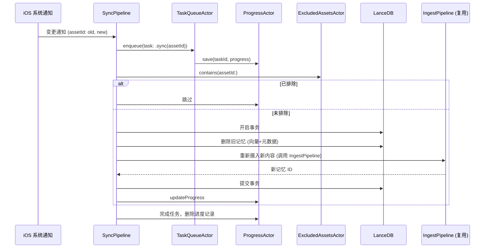

### 4.3 冲突处理（L4）

当后台同步过程中用户正在手动编辑同一条记忆时，`SyncPipeline` 会收到 `userLocked` 标记：

- 阻止删除操作，将该记忆标记为 `conflict`。
- 保留用户编辑的副本。
- 在用户下次打开编辑时弹窗，提供合并界面。

------

## 5. 主动唤醒数据流（AwakeningPipeline）

### 5.1 地理围栏唤醒

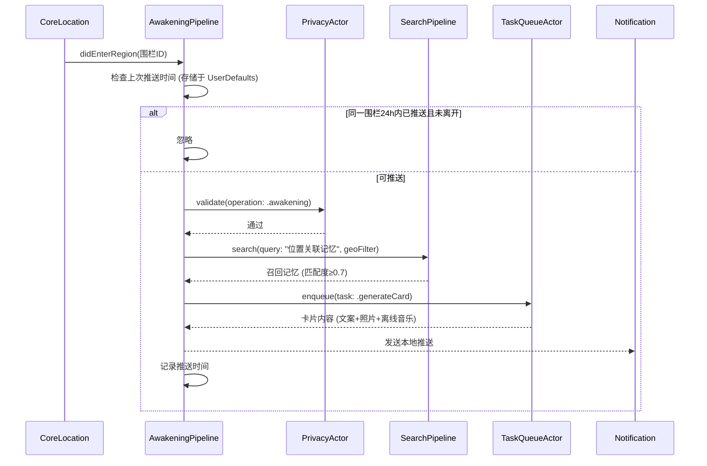

### 5.2 情绪唤醒（基于 HealthKit + 文本情感）

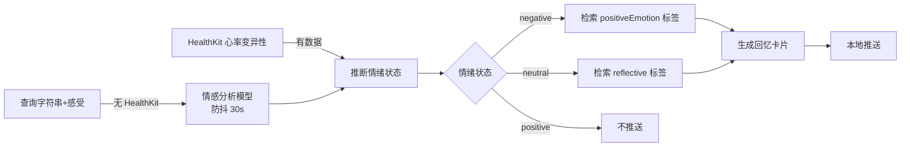

### 5.3 音乐推荐逻辑

- **优先**：Apple Music API（若授权）推荐基于记忆时间/地点/标签的歌单。
- **备选**：内置离线热门歌曲库（按年份分类，每年 20 首），随 App 版本更新。
- **无授权**：显示“需要 Apple Music 授权”提示。

------

## 6. 反馈学习数据流（FeedbackPipeline）

### 6.1 点赞/点踩流程

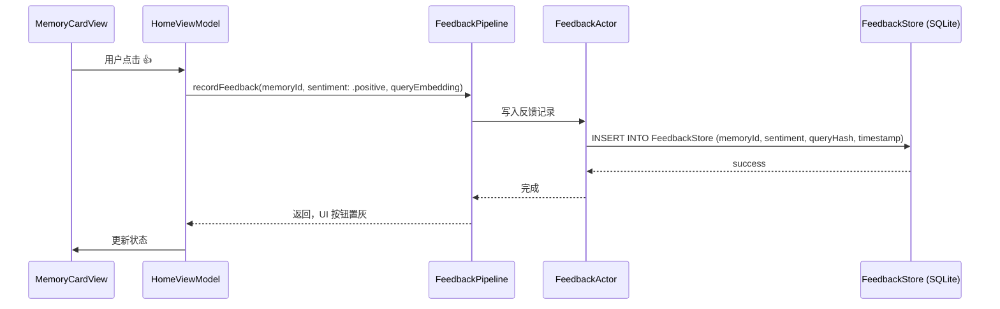

### 6.2 重排公式应用（已在 SearchPipeline 中说明）

### 6.3 重置/撤销流程

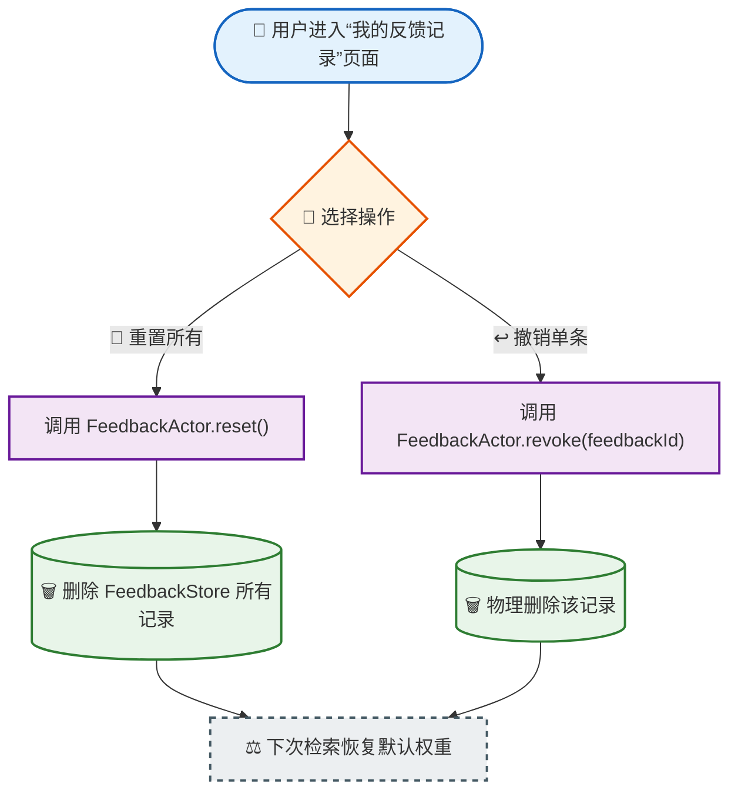

------

## 7. 统一错误处理与重试流程

### 7.1 错误处理架构

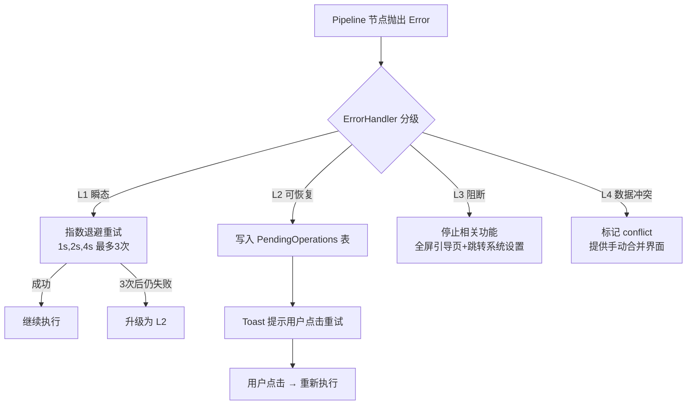

### 7.2 PendingOperations 表生命周期

| 阶段 | 操作                                                         |
| ---- | ------------------------------------------------------------ |
| 写入 | 当 L2 错误发生时，`PendingOpsActor.add(operation:)` 将操作序列化存入 SQLite（含重试计数、参数快照）。 |
| 重试 | 用户点击 UI 重试按钮 → ViewModel 调用 `PendingOpsActor.retry(operationId:)` → 反序列化参数，重新调用 Pipeline。 |
| 清理 | 重试成功则删除记录；若重试仍失败且达到上限（3次），则升级为 L3 阻断。表最大 1000 条，超出丢弃最旧记录。 |

------

## 8. 断点续传与进度管理流程

### 8.1 任务进度存储

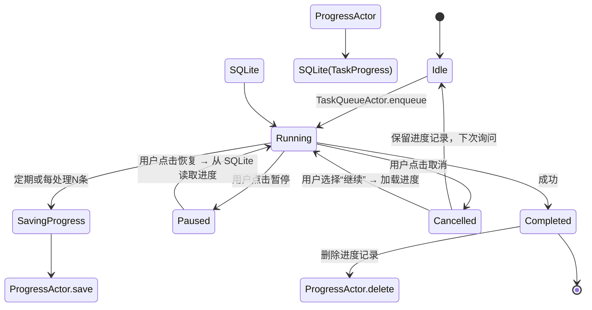

### 8.2 进度推送至 UI

`TaskQueueActor` 维护一个 `AsyncStream<ProgressEvent>`，ViewModel 通过 `for await` 订阅。每个 `ProgressEvent` 包含：

- `taskId`
- `taskType`
- `processedCount`
- `totalCount`
- `status` (running/paused/cancelled/completed)

ViewModel 收到事件后更新 `@Observable var progress: Double`，驱动进度条刷新。

------

## 9. 隐私校验与审计日志流

### 9.1 强制校验点注入

每个 Pipeline 节点的 `execute` 方法第一个语句必须是：

```swift
let checkpoint = await PrivacyActor.shared.validate(operation: .search, traceID: traceID)
```

若未包含，CI 静态扫描会阻断合并。

### 9.2 审计日志写入流程

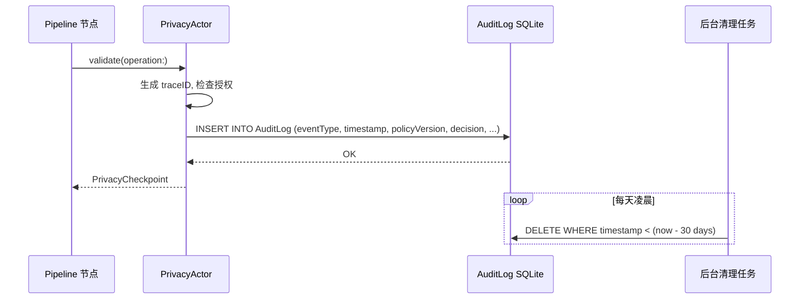

### 9.3 审计日志字段完整性

所有字段遵循规格书附录 15，包含 `traceID`、`policyVersion`、`sourceType`、`elapsedMs` 等。缺失字段的审计记录会被 CI 拒绝。

------

## 10. 低电量/过热降级流程

### 10.1 系统状态监控

`SystemMonitor Actor` 监听：

- `NSProcessInfoPowerStateDidChangeNotification` → 低电量模式变化
- `ProcessInfoThermalStateDidChangeNotification` → 热状态变化

### 10.2 降级处理流程

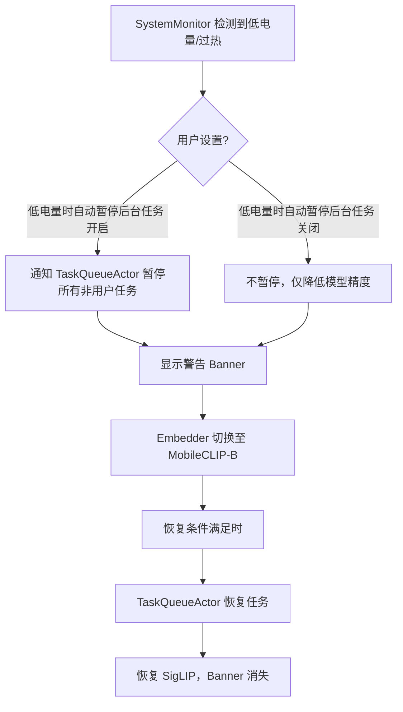

### 10.3 对用户体验的影响

- 低电量模式下检索精度可能降低，但 UI 会明确提示。
- 用户可随时手动触发后台任务（如手动导入），不受降级影响（尊重用户主动性）。

------

## 11. 全链路数据流总结

| 业务流程     | 入口               | 关键 Actor                                         | 存储依赖                 | 错误处理级别 | 是否支持断点续传 |
| ------------ | ------------------ | -------------------------------------------------- | ------------------------ | ------------ | ---------------- |
| **检索**     | 用户输入           | PrivacyActor, FeedbackActor                        | LanceDB, FeedbackStore   | L1/L2        | 否               |
| **摄入**     | 系统通知/手动      | ExcludedAssetsActor, ProgressActor, TaskQueueActor | LanceDB, SQLite (排除表) | L1/L2/L3     | 是（长任务）     |
| **同步**     | 系统通知/手动      | ExcludedAssetsActor, ProgressActor, IngestPipeline | LanceDB, SQLite          | L1/L2/L4     | 是               |
| **唤醒**     | 地理围栏/时间/情绪 | PrivacyActor, SearchPipeline                       | 无持久化（仅推送记录）   | L1           | 否               |
| **反馈**     | 用户点击           | FeedbackActor                                      | FeedbackStore            | L2           | 否               |
| **错误重试** | 用户手动           | PendingOpsActor                                    | PendingOperations 表     | L2           | 不适用           |
| **断点续传** | 任务取消后         | ProgressActor, TaskQueueActor                      | TaskProgress 表          | 不适用       | 是               |

------

## 12. 数据流安全与隐私保障

- **最小化数据暴露**：所有处理均在端侧，无网络上传。原始媒体文件仅引用 PHAsset，不复制。
- **排除表强制执行**：`ExcludedAssetsActor` 在所有导入/同步流程中被前置调用，确保用户排除的内容永不出现。
- **级联删除**：原始文件删除时，`cascadeDeleteFromOriginal` 同时清除向量、索引、排除表记录，并提示用户。
- **审计日志**：所有关键操作（授权变更、记忆删除、模型加载失败等）均有不可篡改的本地审计记录，保留 30 天。

------

**文档维护声明**

本文档与 Echo v4.6 规格书、技术选型 v4.6、架构设计 v1.0 严格对齐。任何数据流变更必须同步更新本文档并评审。

下次复审：2026-08-31。