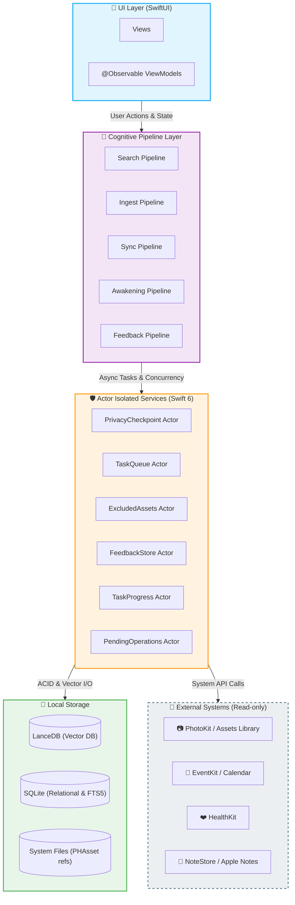
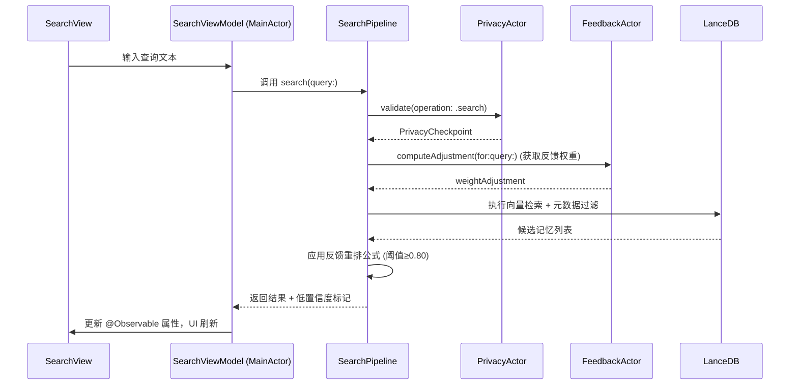
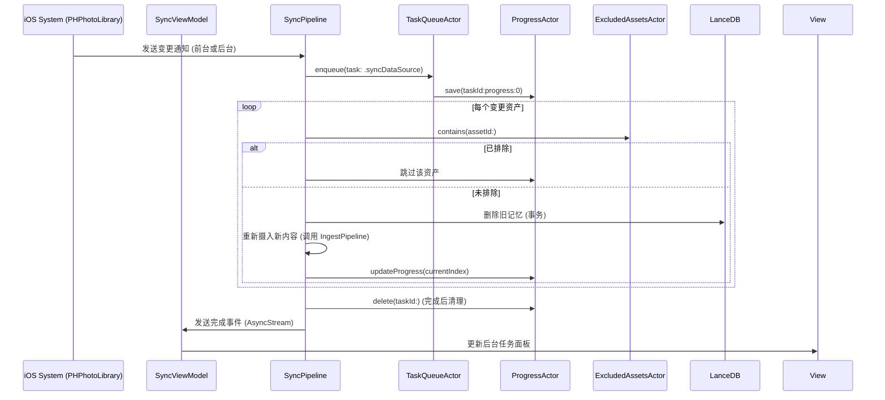
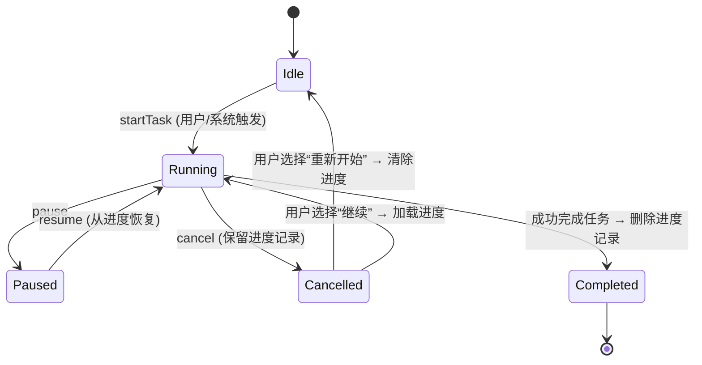
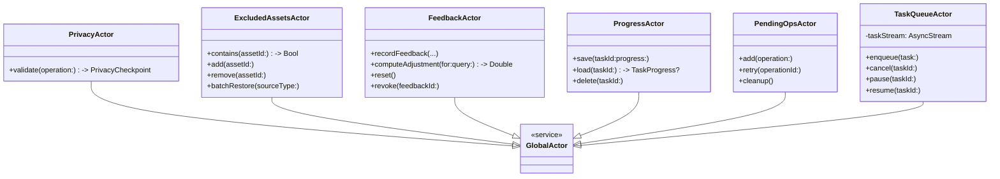
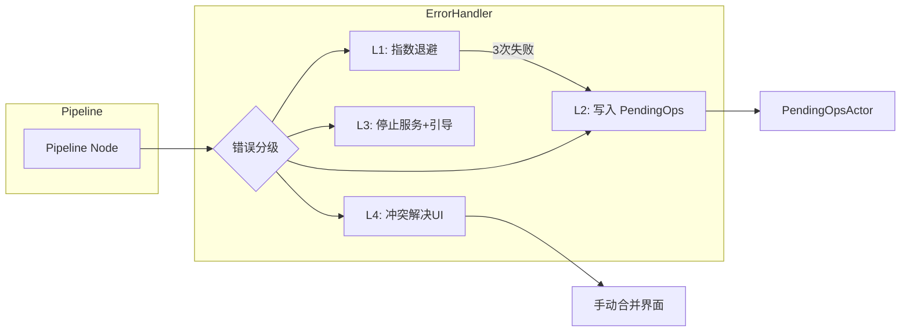
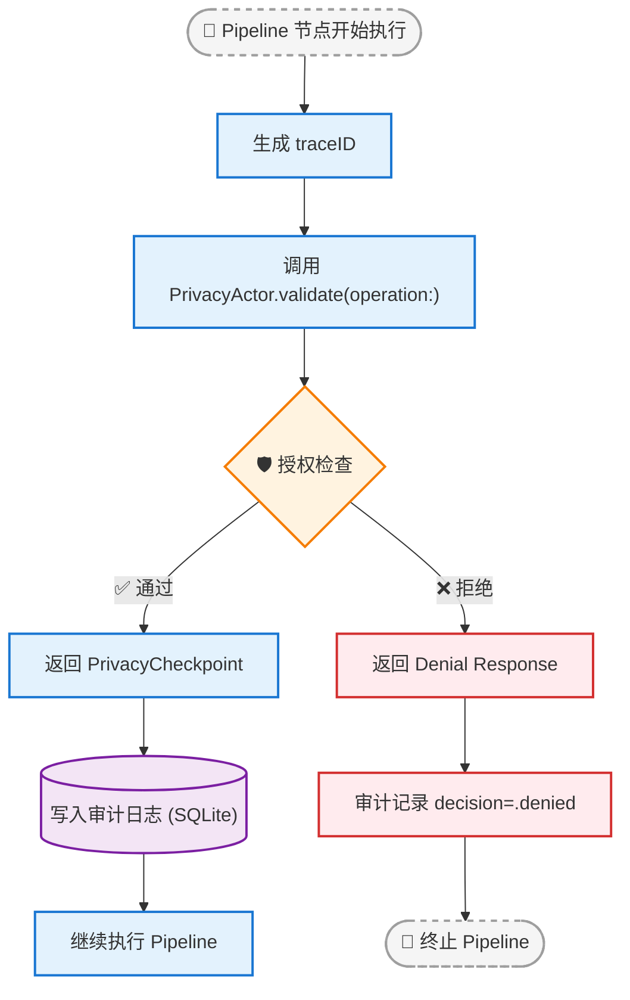

# Echo · 回响：Cognitive Pipeline + Observable ViewModel + Actor Isolation 架构设计文档

**版本**：v1.0

**生效日期**：2026-06-10

**适用规格**：Echo v4.6 全量用户故事与验收标准规格书

**技术基准**：iOS 18+，Swift 6, Swift Concurrency, Observation Framework

------

## 1. 架构总览

Echo 采用 **Cognitive Pipeline** 模式组织所有认知处理流程（检索、摄入、同步、唤醒、反馈学习），每个 Pipeline 节点封装在独立 `Actor` 中以保证线程安全。UI 层使用 `@Observable` 视图模型（ViewModel）监听 Pipeline 的进度流并驱动 SwiftUI 刷新。整体架构遵循 **本地优先、隐私可审计、任务可中断/续传** 的核心原则。

### 1.1 架构分层图



### 1.2 核心设计原则

| 原则                 | 描述                                                         | 实现方式                                                     |
| -------------------- | ------------------------------------------------------------ | ------------------------------------------------------------ |
| **Actor 隔离**       | 所有可变共享状态（数据库、任务队列、排除表等）必须封装在 Actor 中 | 使用 `actor` 关键字，禁止外部直接访问                        |
| **Pipeline 无状态**  | Pipeline 节点本身不持有可变状态，仅协调 Actor 调用           | 每个 Pipeline 节点是 `struct` 或 `class`，内部调用 Actor 方法 |
| **隐私校验强制执行** | 每个 Pipeline 入口必须调用 `PrivacyCheckpoint.validate()`    | 编译器/CI 强制，无校验则编译失败                             |
| **统一错误矩阵**     | 所有异步操作按 L1~L4 分级，L2 持久化到 `PendingOperations` 表 | 通过 `ErrorHandler` 协议统一处理                             |
| **断点续传**         | 长任务支持暂停/取消并保留进度                                | 进度存入 SQLite `TaskProgress` 表，由 `ProgressActor` 管理   |
| **反应式 UI**        | ViewModel 通过 `AsyncStream` 订阅 Pipeline 进度/结果         | 使用 `@Observable` 和 `@MainActor` 确保 UI 线程安全          |

------

## 2. 模块划分与职责

### 2.1 Cognitive Pipeline 节点

每个 Pipeline 对应一个认知处理流，由一系列步骤组成，步骤间通过 `AsyncSequence` 串联。

| Pipeline              | 职责                                               | 主要 Actor 依赖                                        | 对应规格故事   |
| --------------------- | -------------------------------------------------- | ------------------------------------------------------ | -------------- |
| **SearchPipeline**    | 处理用户查询，执行向量检索 + 元数据过滤 + 反馈重排 | `PrivacyActor`, `FeedbackActor`, `LanceDB`             | US-RET-001~008 |
| **IngestPipeline**    | 摄入新记忆（文本/图片/视频/语音）并向量化          | `PrivacyActor`, `ExcludedAssetsActor`, `LanceDB`       | US-ING-001~006 |
| **SyncPipeline**      | 监听数据源变更，执行增量替换（删除旧+摄入新）      | `PrivacyActor`, `ExcludedAssetsActor`, `ProgressActor` | US-SRC-012     |
| **AwakeningPipeline** | 地理围栏/日期/情绪唤醒，生成回忆卡片               | `PrivacyActor`, `SearchPipeline` (调用)                | US-AWK-001~005 |
| **FeedbackPipeline**  | 处理点赞/点踩，更新 `FeedbackStore` 并触发重排     | `FeedbackActor`                                        | US-FBK-001~002 |

### 2.2 Actor 隔离服务

| Actor                 | 封装资源                       | 主要方法                                                     | 并发策略                                               |
| --------------------- | ------------------------------ | ------------------------------------------------------------ | ------------------------------------------------------ |
| `PrivacyActor`        | `UserPolicy`（授权、排除策略） | `validate(operation:)` → `PrivacyCheckpoint`                 | 仅 `@MainActor`？实际是全局读多写少，采用 `actor` 串行 |
| `ExcludedAssetsActor` | `ExcludedAssets` SQLite 表     | `contains(assetId:)`, `add(assetId:)`, `remove(assetId:)`, `batchRestore(sourceType:)` | 串行队列（SQLite 写安全）                              |
| `FeedbackActor`       | `FeedbackStore` SQLite 表      | `recordFeedback(...)`, `computeAdjustment(for:query:)`, `reset()`, `revoke(feedbackId:)` | 串行，读取重排时需快速返回（使用 `actor` 隔离）        |
| `ProgressActor`       | `TaskProgress` SQLite 表       | `save(taskId:progress:)`, `load(taskId:)`, `delete(taskId:)` | 串行                                                   |
| `PendingOpsActor`     | `PendingOperations` SQLite 表  | `add(operation:)`, `retry(operationId:)`, `cleanup()`        | 串行                                                   |
| `TaskQueueActor`      | 任务队列（串行执行）           | `enqueue(task:)`, `cancel(taskId:)`, `pause(taskId:)`, `resume(taskId:)` | 内部 `AsyncStream` + 状态机                            |

### 2.3 ViewModel 层

每个主要 UI 屏幕对应一个 `@Observable` ViewModel，运行在 `@MainActor` 上。ViewModel 负责：

- 接收用户输入并调用对应 Pipeline（通过 `Task.detached` 或 `async let` 避免阻塞 UI）
- 订阅 Pipeline 的 `progressStream` 并更新 `@Published`（iOS 18 中 `@Observable` 自动属性观察）
- 处理 Pipeline 返回的结果或错误，展示 Toast/Alert

| ViewModel               | 关联 Pipeline                         | 管理状态                                   |
| ----------------------- | ------------------------------------- | ------------------------------------------ |
| `SearchViewModel`       | `SearchPipeline`                      | 查询文本、结果列表、加载状态、低置信度提示 |
| `HomeViewModel`         | `AwakeningPipeline`, `IngestPipeline` | 卡片列表、后台任务进度、今日回忆           |
| `SettingsViewModel`     | `SyncPipeline`, `ExcludedAssetsActor` | 数据源开关、排除项列表、缓存清理状态       |
| `MemoryDetailViewModel` | `IngestPipeline` (编辑)               | 记忆详情、编辑表单、冲突解决 UI            |

------

## 3. 数据流与交互时序

### 3.1 用户发起检索（SearchPipeline）



### 3.2 数据源变更自动同步（SyncPipeline）



### 3.3 断点续传流程（以全量索引构建为例）



------

## 4. 并发模型与线程安全

### 4.1 Actor 层次结构



### 4.2 线程调度规则

| 组件类型                         | 执行线程/队列                              | 说明                                                         |
| -------------------------------- | ------------------------------------------ | ------------------------------------------------------------ |
| **View / ViewModel**             | `@MainActor`                               | 所有 UI 更新必须在主线程                                     |
| **Pipeline 节点**                | 自定义 `Actor`（或非隔离函数但调用 Actor） | Pipeline 本身无状态，可运行在任意协程上下文；但调用 Actor 时必须切换 |
| **Actor 服务**                   | 各自串行执行器                             | Actor 保证内部状态串行访问                                   |
| **后台任务（BGAppRefreshTask）** | 系统后台队列                               | 通过 `Task.detached(priority: .background)` 创建，调用 Actor 方法需 `await` |

### 4.3 数据竞争防护

- 所有 SQLite 操作（ExcludedAssets, Feedback, TaskProgress, PendingOperations）封装在 Actor 中，避免多线程写冲突。
- LanceDB 写操作（向量删除/插入）通过 `IngestPipeline` 内部串行化，因为 LanceDB 不支持并发写入（由 `TaskQueueActor` 保证同一时间只有一个写任务）。
- 读取操作（向量检索）可并发，但检索结果不修改数据。

------

## 5. 统一错误处理矩阵的实现

### 5.1 错误分级与处理流程

| 等级            | 示例                       | ViewModel 行为                  | Actor 行为                                    | 持久化                     |
| --------------- | -------------------------- | ------------------------------- | --------------------------------------------- | -------------------------- |
| **L1 瞬态**     | 网络抖动，Apple Music 限流 | 无提示                          | 指数退避重试 3 次，失败后升级为 L2            | 无                         |
| **L2 可恢复**   | 磁盘不足，权限临时拒绝     | Toast + “重试”按钮              | 写入 `PendingOperations` 表，等待用户手动重试 | `PendingOperations` SQLite |
| **L3 阻断**     | 数据库损坏，模型加载失败   | 全屏引导页，跳转设置            | 停止相关功能，记录审计                        | 审计日志                   |
| **L4 数据冲突** | 外部删除 + 本地编辑        | Banner 提示，提供“解决冲突”入口 | 标记冲突，保留用户编辑，不覆盖                | `syncConflict` 审计        |

### 5.2 错误处理架构组件



### 5.3 重试策略

- **L1 重试**：由 `ErrorHandler` 内部闭包实现，使用 `Task.sleep` 进行 1s, 2s, 4s 间隔。重试代码需与 Pipeline 节点解耦，通过传入 `retryBlock` 实现。
- **L2 重试**：仅在用户点击 UI 上的“重试”按钮时触发。ViewModel 调用 `PendingOpsActor.retry(operationId:)` 重新执行原操作。

------

## 6. 断点续传与进度管理

### 6.1 数据结构

`TaskProgress` SQLite 表定义（由 `ProgressActor` 管理）：

| 字段                 | 类型          | 描述                                          |
| -------------------- | ------------- | --------------------------------------------- |
| `taskId`             | String (UUID) | 任务唯一标识                                  |
| `taskType`           | String        | 如 `fullIndex`, `dataSourceSync`, `modelLoad` |
| `lastProcessedId`    | String?       | 最后处理的资产 ID（可用于断点）               |
| `lastProcessedIndex` | Int           | 已处理的数量（如 50/128）                     |
| `totalCount`         | Int           | 总量                                          |
| `resumeData`         | Data?         | 额外状态（如 JSON）                           |
| `createdAt`          | Date          | 创建时间                                      |
| `updatedAt`          | Date          | 最后更新时间                                  |

### 6.2 恢复流程

当用户取消任务后再次启动相同类型任务时，ViewModel 检查 `ProgressActor.load(taskId:)`。若存在记录，显示弹窗：

> “检测到未完成的进度（已完成 X / Y），是否继续？”
>
> - **继续**：调用 Pipeline 的 `resume(taskId:)`，从保存的进度恢复
> - **重新开始**：调用 `ProgressActor.delete(taskId:)` 并启动新任务

### 6.3 进度推送

每个 Pipeline 节点在执行长任务时，通过 `AsyncStream<ProgressEvent>` 向订阅的 ViewModel 发送进度更新。ViewModel 收到后更新 `@Observable` 属性，驱动 UI 刷新。

------

## 7. 隐私校验与审计追踪

### 7.1 PrivacyCheckpoint 结构

每个 `PrivacyCheckpoint` 包含以下信息（自动生成）：

| 字段            | 来源                                           |
| --------------- | ---------------------------------------------- |
| `traceID`       | UUID，由 Pipeline 节点创建时生成               |
| `timestamp`     | 当前时间                                       |
| `operation`     | 枚举（.search, .ingest, .sync, .delete, etc.） |
| `policyVersion` | 从 `UserPolicy` 读取当前版本号                 |
| `sourceTypes`   | 涉及的数据源（如 photo, note）                 |
| `decision`      | `.allowed` 或 `.denied`（基于授权检查）        |

### 7.2 强制校验流程



### 7.3 审计日志存储

审计日志写入独立 SQLite 表 `AuditLog`，由 `PrivacyActor` 负责。字段遵循规格书附录 15，保留最近 30 天数据，超期自动清理（由后台任务每日执行）。

------

## 8. 反馈学习与重排集成

### 8.1 反馈流程

1. 用户在检索结果上点击 👍/👎 → ViewModel 调用 `FeedbackActor.recordFeedback(...)`
2. `FeedbackActor` 将记录写入 `FeedbackStore` SQLite，并返回成功。
3. 同时，`FeedbackActor` 触发一个异步任务，更新该记忆的反馈统计（用于未来重排），但不影响当前搜索结果（即时生效在下一次检索）。

### 8.2 重排计算

在 `SearchPipeline` 中，从 LanceDB 获取候选列表后，调用 `FeedbackActor.computeAdjustment(for:query:)`。该方法：

- 遍历所有反馈记录，筛选出 `cosineSim >= 0.80` 且记忆 ID 在候选列表中的反馈。
- 按每条反馈的年龄计算衰减系数，求和后截断到 [-0.5, 0.5]。
- 返回调整值，Pipeline 将其加到原始 `cosineSim` 上，重新排序。

### 8.3 重置与撤销

- **重置所有反馈**：ViewModel 调用 `FeedbackActor.reset()`，清空 `FeedbackStore` 表。
- **撤销单条反馈**：ViewModel 调用 `FeedbackActor.revoke(feedbackId:)`，物理删除记录。撤销后重排立即生效（下次检索）。

------

## 9. 后台任务与生命周期管理

### 9.1 后台任务类型

| 任务类型               | 触发时机           | 注册方式                | 超时时间 | 是否可暂停                           |
| ---------------------- | ------------------ | ----------------------- | -------- | ------------------------------------ |
| `BGAppRefreshTask`     | 系统周期性唤醒     | `BGTaskScheduler`       | 30 秒    | 否（系统控制）                       |
| `BGProcessingTask`     | 系统空闲且电量充足 | `BGTaskScheduler`       | 数分钟   | 否                                   |
| 前台长任务（用户手动） | 用户点击“立即扫描” | `Task` with `async let` | 无限制   | 可暂停/取消（通过 `TaskQueueActor`） |

### 9.2 任务队列管理

`TaskQueueActor` 维护一个 `AsyncStream` 队列，确保索引构建与数据同步串行执行。实现要点：

- 使用 `actor` 内部 `[TaskItem]` 数组，`enqueue` 时追加。
- 一个后台循环从队列中取出任务并执行，支持 `pause` / `cancel`。
- 任务状态保存在 `ProgressActor` 中，以便恢复。

### 9.3 低电量/过热响应

`SystemMonitor` Actor 监听 `ProcessInfo` 通知，当低电量或热状态变化时：

- 向 `TaskQueueActor` 发送 `pauseAllNonUserTasks` 信号（如果用户设置允许）。
- 发送 `degradationMode` 事件给所有运行中的 Pipeline，让它们切换轻量模型（如 MobileCLIP-B）。
- UI 层通过 ViewModel 订阅状态变化，显示警告 Banner。

------

## 10. 模块依赖与目录结构

```
Echo/
├── App/
│   ├── EchoApp.swift (入口，注册 BGTask)
│   └── AppDelegate.swift (后台任务配置)
├── Core/
│   ├── Actors/
│   │   ├── PrivacyActor.swift
│   │   ├── ExcludedAssetsActor.swift
│   │   ├── FeedbackActor.swift
│   │   ├── ProgressActor.swift
│   │   ├── PendingOpsActor.swift
│   │   └── TaskQueueActor.swift
│   ├── Pipelines/
│   │   ├── SearchPipeline.swift
│   │   ├── IngestPipeline.swift
│   │   ├── SyncPipeline.swift
│   │   ├── AwakeningPipeline.swift
│   │   └── FeedbackPipeline.swift
│   ├── Models/
│   │   ├── Memory.swift
│   │   ├── UserPolicy.swift
│   │   └── ErrorEnums.swift
│   ├── Services/
│   │   ├── VectorStore.swift (封装 LanceDB)
│   │   ├── ModelLoader.swift (加载 Core ML 模型，手动重试)
│   │   ├── Embedder.swift (调用视觉/文本模型)
│   │   └── ASREngine.swift (Whisper.cpp)
│   └── Utils/
│       ├── ErrorHandler.swift (统一错误矩阵)
│       ├── PrivacyCheckpoint.swift
│       └── SystemMonitor.swift
├── UI/
│   ├── ViewModels/
│   │   ├── SearchViewModel.swift
│   │   ├── HomeViewModel.swift
│   │   ├── SettingsViewModel.swift
│   │   └── MemoryDetailViewModel.swift
│   └── Views/
│       ├── SearchView.swift
│       ├── HomeView.swift
│       └── ...
└── Resources/
    ├── Models/ (SigLIP, MobileCLIP, GTE-Qwen2, Whisper)
    └── MusicOffline/ (热门歌曲 JSON)
```

------

## 11. 与规格书 v4.6 的对照检查

| 规格书要求                         | 架构实现                                             | 验证方法                |
| ---------------------------------- | ---------------------------------------------------- | ----------------------- |
| 所有记忆永不自动过期               | 无 TTL 定时任务，删除仅通过手动或级联                | 代码审查                |
| ExcludedAssets 写入规则            | 仅在用户主动“仅从 Echo 移除”时写入；级联删除会清理   | 单元测试覆盖写入条件    |
| 反馈学习阈值 ≥0.80 及权重上限 ±0.5 | 在 `FeedbackActor.computeAdjustment` 中实现截断      | 单元测试 Golden 用例    |
| 实时后台任务面板                   | `TaskQueueActor` 提供 progressStream，ViewModel 订阅 | UI 测试                 |
| 断点续传 (SQLite)                  | `ProgressActor` 管理 `TaskProgress` 表               | 集成测试模拟取消/恢复   |
| 模型加载仅手动重试，无网络下载     | `ModelLoader` 仅读取 Bundle，不发起网络请求          | 代码审查 + 网络拦截测试 |
| 地理围栏仅离开重置                 | `AwakeningPipeline` 记录上次推送时间，监听 `didExit` | 模拟位置测试            |
| 音乐推荐离线库                     | 内置 JSON 文件，不依赖网络                           | 检查资源包              |
| 统一错误矩阵                       | `ErrorHandler` 协议 + `PendingOpsActor`              | CI 强制错误处理覆盖率   |

------

## 12. 部署与测试策略

### 12.1 单元测试

- 每个 Actor 的核心方法必须有单元测试，使用 `XCTest` + `actor` 隔离测试。
- 使用 `XCTestExpectation` 测试异步 Pipeline。
- 对 `FeedbackActor.computeAdjustment` 提供大量 Golden 输入/输出样例，覆盖时间衰减、阈值、截断。

### 12.2 集成测试

- 使用 `XCTest` + `XCUITest` 模拟系统通知（`PHPhotoLibraryChangeObserver`）。
- 模拟低电量、过热状态，验证降级与警告 Banner。

### 12.3 性能测试

- Instruments: 内存泄漏检测 (Leaks), 时间分析 (Time Profiler)
- 向量检索 P95 延迟需 <200ms，索引构建速度 >50 条/秒。

### 12.4 隐私合规测试

- 使用 `AuditVerifier` 工具扫描所有 Pipeline 节点，确保 `PrivacyCheckpoint.validate()` 被调用。
- 审计日志完整性校验：每个关键操作都有对应记录。

------

## 13. 演进路线

| 阶段            | 目标                                         | 里程碑                 |
| --------------- | -------------------------------------------- | ---------------------- |
| **V1.0 (当前)** | 实现 Core 架构，支持所有 P0/P1 故事          | 完成单元测试 + CI 集成 |
| **V1.1**        | 引入 MLX 作为备选推理引擎，对比 Core ML 性能 | Benchmark 报告         |
| **V1.2**        | 支持更复杂的个性化 Prompt (私有模板)         | 用户测试反馈           |
| **V2.0**        | 全面迁移至 MLX（若性能更优），统一推理框架   | 决策评审               |

------

**文档维护声明**

本架构设计文档与 Echo v4.6 规格书及技术选型 v4.6 严格对齐。任何架构调整必须同步更新规格书并重新评审。

下次架构复审：2026-08-31。