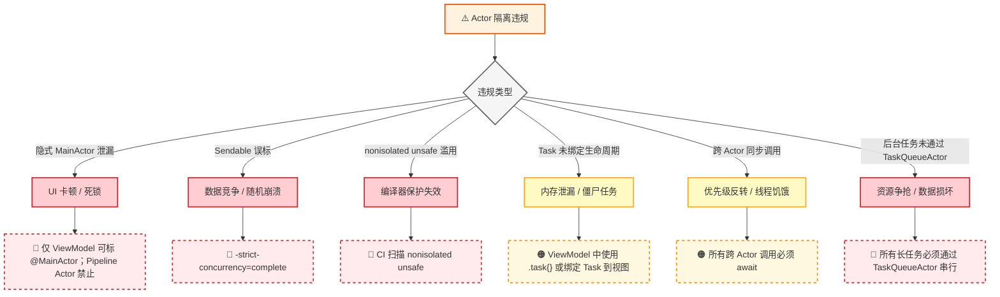
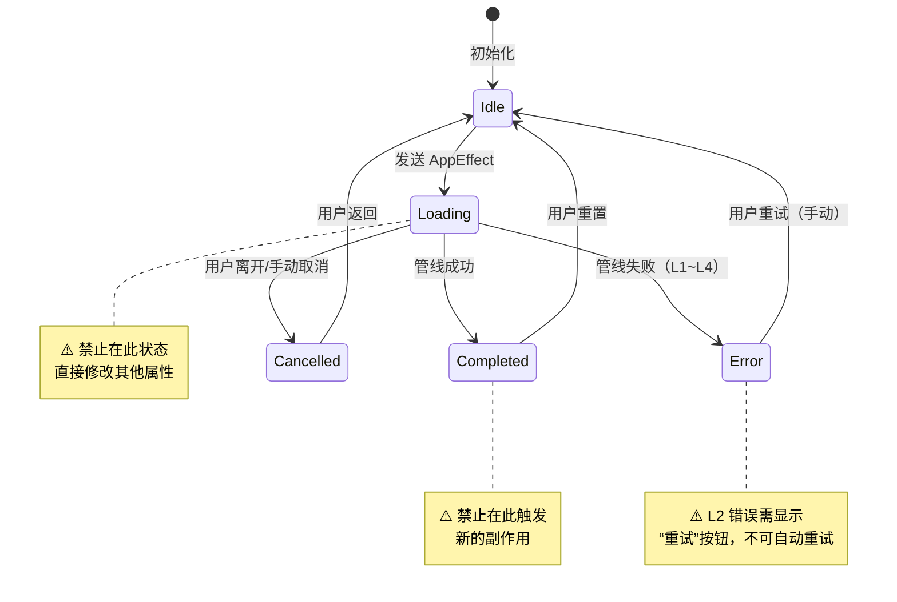
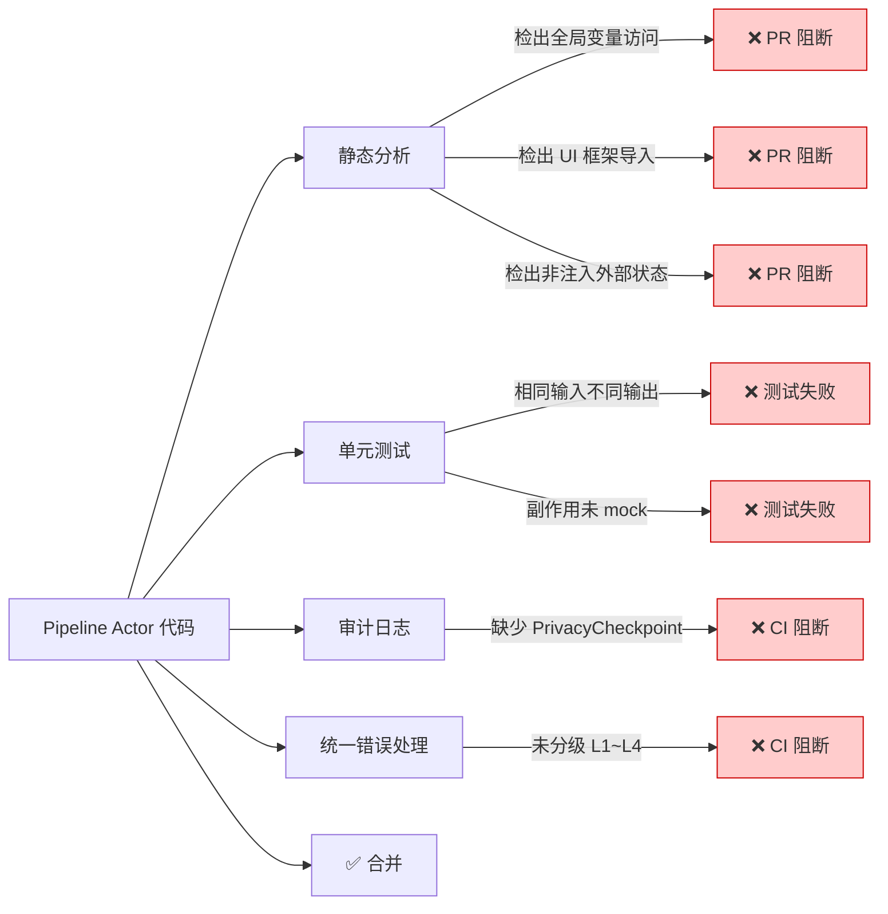
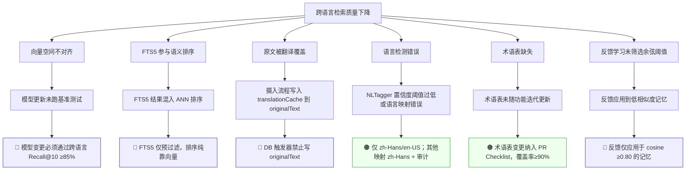
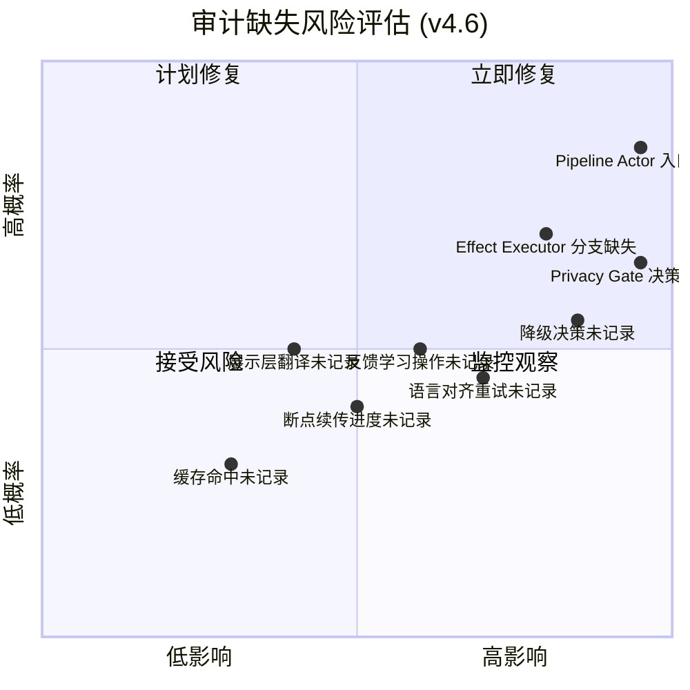
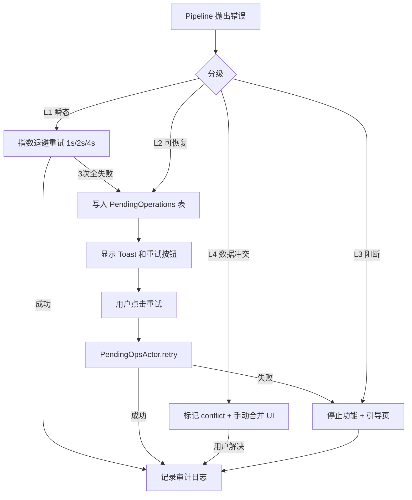
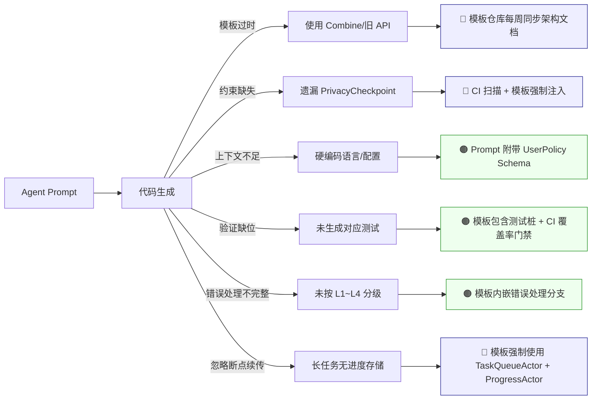

# Echo · 回响：开发避坑与关键注意点手册

**版本**：v4.6

**生效日期**：2026-06-10

**适用架构**：Cognitive Pipeline + Observable ViewModel + Actor Isolation

**对应规格**：Echo v4.6 全量用户故事与验收标准规格书

**核心定位**：将架构设计文档中的“禁止事项”转化为可执行的防御性开发检查清单

------

## 1. 手册使用指南与设计原则

### 1.1 为什么需要这份手册？

Echo 的架构在理论上高度自洽，但在工程落地时存在大量“看似正确实则致命”的陷阱。这些陷阱往往不会导致编译失败，而是表现为偶发崩溃、隐私泄漏、跨语言检索质量退化或 Agent 生成代码的隐性缺陷。本手册是架构文档的**负面空间映射**——它不告诉你“应该怎么做”，而是精确标注“绝对不能怎么做”以及“如果做了会怎样”。

### 1.2 核心防御原则

- **编译器是第一道防线**：所有可通过类型系统表达的约束，绝不依赖人工 Review。
- **审计是最后一道防线**：所有无法静态验证的行为，必须有运行时审计兜底。
- **默认不安全**：假设每一行新代码都可能破坏隐私、并发或跨语言契约，除非被证明安全。
- **Agent 是放大器**：Agent 不会犯人类的小错，只会系统性地放大架构盲区；所有规则必须对 Agent 显式可见。
- **降级优于沉默**：任何异常路径都必须产生可观测信号，禁止吞掉错误或静默回退。

### 1.3 手册结构说明

| 章节 | 覆盖领域                       | 风险等级   | 验证时机                  |
| ---- | ------------------------------ | ---------- | ------------------------- |
| 2    | Actor 隔离与并发安全           | 🔴 Critical | 编译期 + CI               |
| 3    | @Observable ViewModel 状态管理 | 🟠 High     | Code Review + 运行时      |
| 4    | Cognitive Pipeline 纯函数契约  | 🔴 Critical | 单元测试 + 审计           |
| 5    | 跨语言语义对齐与存储           | 🔴 Critical | 集成测试 + Golden Dataset |
| 6    | PrivacyCheckpoint 审计完整性   | 🔴 Critical | CI 阻断级                 |
| 7    | 数据持久化与断点续传           | 🟠 High     | 文件系统审计 + 故障注入   |
| 8    | 统一错误矩阵与重试机制         | 🟠 High     | 单元测试 + 手动重试验证   |
| 9    | ExcludedAssets 与排除表边界    | 🔴 Critical | 集成测试 + 边界场景       |
| 10   | 反馈学习与权重计算             | 🟡 Medium   | 单元测试 + Golden Dataset |
| 11   | 模型加载与降级                 | 🟠 High     | 故障注入 + 性能测试       |
| 12   | Agent 工程化特有风险           | 🟠 High     | 模板合规扫描              |
| 13   | 迁移与共存期风险               | 🟡 Medium   | Feature Flag 监控         |

------

## 2. Actor 隔离与并发安全避坑

### 2.1 高危陷阱拓扑图（v4.6 更新）

### 2.2 关键注意点清单（v4.6 新增 TaskQueueActor）

| 陷阱编号           | 描述                                                         | 后果                                          | 防御措施                                                     | 验证方式                              |
| ------------------ | ------------------------------------------------------------ | --------------------------------------------- | ------------------------------------------------------------ | ------------------------------------- |
| ACT-001            | Pipeline Actor 误标 `@MainActor`                             | UI 主线程阻塞，认知计算卡死界面               | 仅 ViewModel 允许 `@MainActor`；Pipeline Actor 禁止标注      | SwiftLint 自定义规则                  |
| ACT-002            | 将非 Sendable 类型标记为 `@unchecked Sendable`               | 运行时数据竞争，难以复现的崩溃                | 禁止 `@unchecked Sendable`；使用值类型或 actor-isolated 引用 | 编译器 `-strict-concurrency=complete` |
| ACT-003            | 在 `nonisolated(unsafe)` 中访问可变状态                      | 绕过编译器检查，等同于裸奔                    | 全局禁用 `nonisolated(unsafe)`；确有需求需首席工程师签字     | CI 正则扫描                           |
| ACT-004            | ViewModel 中创建未绑定 Task                                  | View 销毁后任务继续执行，更新已释放对象       | 使用 `Task { @MainActor in }` 或 `.task {}` 修饰符；禁止 `Task.detached` | Code Review                           |
| ACT-005            | 在 Actor 初始化器中调用异步方法                              | 初始化未完成即暴露 self，导致未定义行为       | 初始化器保持同步；异步初始化通过静态工厂方法完成             | 单元测试 + 编译器警告                 |
| ACT-006            | 跨 Actor 传递闭包作为参数                                    | 闭包捕获上下文可能违反隔离边界                | AppEffect 枚举禁止关联闭包；所有参数必须为 Sendable 值类型   | 编译器 + SwiftLint                    |
| ACT-007            | 在 Actor 方法内同步等待另一个 Actor                          | 优先级反转，高优先级任务被低优先级 Actor 阻塞 | 所有跨 Actor 调用必须 `await`；禁止 `sync` 跨 Actor 调用     | Instruments Concurrency Visualizer    |
| **ACT-008 (新增)** | 直接调用后台长任务（索引构建、同步）而未通过 `TaskQueueActor` | 并发执行导致数据损坏、LanceDB 写冲突          | 所有写入/构建任务必须入队；读取操作可并发                    | Code Review + 并发测试                |
| **ACT-009 (新增)** | 在 `TaskQueueActor` 任务中未支持暂停/取消                    | 用户无法中断长任务，断点续传失效              | 任务实现 `Cancellable` 协议；定期检查 `Task.isCancelled`     | 单元测试 + UI 交互测试                |

### 2.3 调试技巧

- **启用 Thread Sanitizer**：在 Debug/Test Scheme 中始终开启。
- **Concurrency Visualizer**：Xcode Instruments 中用于可视化 Actor 调度。
- **日志注入**：在关键 Actor 方法入口打印 `Thread.current` 与 `Actor isolation context`。

------

## 3. @Observable ViewModel 状态管理避坑

### 3.1 状态流转陷阱（v4.6 无变化）

### 3.2 关键注意点清单

| 陷阱编号           | 描述                               | 后果                          | 防御措施                                                     | 验证方式                 |
| ------------------ | ---------------------------------- | ----------------------------- | ------------------------------------------------------------ | ------------------------ |
| OBS-001            | 在状态更新回调中触发新副作用       | 无限循环、状态抖动            | 状态更新方法仅赋值；副作用仅在 action 方法中触发             | Code Review + 运行时断言 |
| OBS-002            | 手动调用 `objectWillChange.send()` | 冗余刷新、性能退化            | 删除所有手动 send；信任 `@Observable` 自动追踪               | SwiftLint 禁止该 API     |
| OBS-003            | 持有可变领域模型引用               | 外部修改绕过 @Observable 追踪 | 仅持有值类型副本或不可变快照；更新时整体替换                 | Code Review              |
| OBS-004            | 多个属性非原子更新                 | 中间状态被 View 读取，UI 闪烁 | 使用单一状态枚举或 struct 封装相关属性；一次性赋值           | UI 测试 + 视觉回归       |
| OBS-005            | 在 computed property 中执行副作用  | 每次读取都触发，性能灾难      | computed property 纯计算；副作用移至 action 或 Task          | SwiftLint + Instruments  |
| OBS-006            | 忘记设置加载态即发送 Effect        | 用户无反馈，感知延迟          | action 方法第一行必须设置 `.loading`；CI 扫描 action 模板    | Code Review + UI 测试    |
| **OBS-007 (新增)** | 后台任务进度未实时反映到 ViewModel | 用户看不到进度，体验差        | ViewModel 订阅 `TaskQueueActor` 的 `AsyncStream<ProgressEvent>` | UI 集成测试              |

------

## 4. Cognitive Pipeline 纯函数契约避坑

### 4.1 纯函数违规检测流程（v4.6 强化）

### 4.2 关键注意点清单（v4.6 新增错误处理）

| 陷阱编号            | 描述                                                   | 后果                                   | 防御措施                                                   | 验证方式                    |
| ------------------- | ------------------------------------------------------ | -------------------------------------- | ---------------------------------------------------------- | --------------------------- |
| PIPE-001            | Pipeline Actor 访问 UserDefaults/AppStorage            | 隐式依赖，测试不可控，隐私泄漏         | 所有配置通过参数注入；禁止导入 SwiftUI/Foundation 偏好 API | SwiftLint + 依赖注入容器    |
| PIPE-002            | 在 Retriever 中做语言翻译                              | 破坏存储语言无关性，索引污染           | 翻译仅限展示层；Retriever 仅返回源语言原文 + 标签          | Code Review + 跨语言测试    |
| PIPE-003            | Synthesizer Prompt 硬编码语言                          | 输出语言不受 UserPolicy 控制           | 语言指令从 UserPolicy 动态注入；Prompt 模板禁止字面量语言  | Golden Dataset + 运行时校验 |
| PIPE-004            | Embedder 缓存未区分模型版本                            | 模型升级后向量空间不一致               | 缓存键包含模型版本号 + 哈希；版本变更自动失效              | 集成测试 + 缓存审计         |
| PIPE-005            | Parser 推断意图时使用启发式阈值                        | 意图分类不稳定，跨语言表现差异         | 阈值从 UserPolicy/配置注入；禁止魔法数字                   | 单元测试 + A/B 测试         |
| PIPE-006            | Aligner 重试次数 >1                                    | 无限循环，延迟爆炸，违反规格书         | 严格限制重试 ≤1 次；超限即降级                             | 代码审查 + 超时测试         |
| PIPE-007            | 管线阶段间传递引用类型                                 | 共享可变状态，Actor 隔离失效           | 阶段间通信仅用 struct/enum；禁止 class 传递                | 编译器 Sendable 检查        |
| **PIPE-008 (新增)** | Pipeline 内部未按统一错误矩阵分级                      | 错误处理不一致，用户体验差             | 所有 `throws` 或错误结果必须映射到 L1~L4                   | CI 扫描 + 单元测试          |
| **PIPE-009 (新增)** | Pipeline 节点执行长任务时未向 `ProgressActor` 报告进度 | 断点续传不可用，后台任务面板无数据显示 | 初始化 `ProgressActor.save`，定期更新，完成后删除          | 集成测试 + UI 验证          |

------

## 5. 跨语言语义对齐与存储避坑（v4.6 更新）

### 5.1 跨语言质量退化路径

### 5.2 关键注意点清单

| 陷阱编号            | 描述                                | 后果                               | 防御措施                                                     | 验证方式                    |
| ------------------- | ----------------------------------- | ---------------------------------- | ------------------------------------------------------------ | --------------------------- |
| LANG-001            | 更换 Embedding 模型未验证跨语言对齐 | 中英互检召回率暴跌                 | 模型变更 PR 必须附带跨语言 Golden Dataset 报告（Recall@10 ≥85%） | CI 阻断级测试               |
| LANG-002            | FTS5 查询结果参与最终排序           | 英文关键词匹配压制中文语义相关结果 | FTS5 仅返回候选集 ID；排序完全由 Cross-Encoder 决定          | 检索单元测试 + NDCG 对比    |
| LANG-003            | 摄入时将翻译结果写入 originalText   | 源语言丢失，跨语言检索基础崩塌     | DB Schema 约束 + 触发器；写入接口仅接受源语言文本            | 数据库审计 + 集成测试       |
| LANG-004            | 语言检测置信度阈值设太低或未映射    | 错误标签导致跨语言匹配失效         | 仅输出 zh-Hans/en-US；其他语言映射 zh-Hans 并审计            | NLTagger vs 人工标注基准    |
| LANG-005            | 展示层翻译在管线中间阶段触发        | 污染检索上下文，审计链断裂         | 翻译仅在 View 或 TranslationService 中执行；管线内禁止翻译 API 调用 | 静态分析 + Trace 审计       |
| LANG-006            | AI 响应未校验语言即展示             | 用户收到非预期语言内容             | Language Aligner 为必经节点；禁止绕过                        | 运行时 NaturalLanguage 校验 |
| LANG-007            | 术语表更新未同步 String Catalog     | UI 与 AI 内容术语不一致            | 术语表变更 PR 必须同步更新 String Catalog + Golden Dataset   | CI 一致性检查               |
| **LANG-008 (新增)** | 反馈学习应用到低相似度记忆（<0.80） | 噪声权重污染，检索质量下降         | `FeedbackActor.computeAdjustment` 仅处理余弦≥0.80 的记忆     | 单元测试 + Golden Dataset   |
| **LANG-009 (新增)** | 用户主动输入的文本记忆（禁止）      | 违反规格书核心原则                 | UI 无“新建文本记忆”入口；后端摄入检查 `sourceType` 拒绝人工文本 | UI 测试 + 单元测试          |

------

## 6. PrivacyCheckpoint 审计完整性避坑

### 6.1 审计缺失风险矩阵（v4.6 更新）

### 6.2 关键注意点清单

| 陷阱编号           | 描述                                   | 后果                           | 防御措施                                       | 验证方式                    |
| ------------------ | -------------------------------------- | ------------------------------ | ---------------------------------------------- | --------------------------- |
| AUD-001            | Pipeline Actor 公开方法缺少 Checkpoint | 隐私操作不可追溯，合规审计失败 | CI 扫描覆盖率 <100% 阻断；模板强制注入         | SwiftLint + CI              |
| AUD-002            | Checkpoint 记录原始用户数据            | 审计日志本身成为隐私泄漏源     | 仅记录哈希摘要；禁止字符串原文                 | Code Review + 日志采样审查  |
| AUD-003            | Trace ID 未显式传递                    | 链路断裂，无法关联上下游       | Trace ID 作为函数参数；禁止 TaskLocal/全局变量 | 编译器 + 审计完整性测试     |
| AUD-004            | 审计写入同步阻塞业务流                 | 性能退化，用户体验下降         | 审计写入异步解耦；失败不阻断业务               | 性能测试 + 故障注入测试     |
| AUD-005            | 降级/重试决策未记录                    | 问题排查困难，质量改进无据     | 所有非正常路径必须有对应 Checkpoint            | Golden Dataset 异常用例覆盖 |
| AUD-006            | 审计日志未加密存储                     | 合规违规，敏感元数据泄漏       | NSFileProtectionComplete + Secure Enclave 密钥 | 文件系统审计 + 渗透测试     |
| AUD-007            | 审计日志保留周期不符合 Policy          | GDPR/PIPL 违规                 | 定时擦除任务 + UserPolicy 驱动保留策略         | 合规自动化测试              |
| **AUD-008 (新增)** | 反馈操作（点赞/点踩/重置/撤销）未记录  | 无法追溯用户反馈来源           | `FeedbackActor` 所有写操作必须审计             | 集成测试 + 审计检查         |

------

## 7. 数据持久化与断点续传避坑（v4.6 新增）

### 7.1 关键注意点清单

| 陷阱编号             | 描述                                          | 后果                         | 防御措施                                                 | 验证方式                 |
| -------------------- | --------------------------------------------- | ---------------------------- | -------------------------------------------------------- | ------------------------ |
| STORE-001            | 向量与原文写入非事务                          | 部分写入成功，数据不一致     | LanceDB + Memory Store 在同一事务中提交；失败整体回滚    | 故障注入测试             |
| STORE-002            | 加密密钥存储在 UserDefaults                   | 密钥泄漏，加密形同虚设       | 密钥由 Secure Enclave 生成与管理；禁止明文存储           | 安全审计 + Keychain 检查 |
| STORE-003            | 删除操作未清除所有副本                        | 残留数据违反用户删除权       | 删除事务覆盖向量、原文、索引、审计日志、translationCache | 删除完整性测试           |
| STORE-004            | 后台摄入未使用 Background Task                | App 挂起导致摄入中断         | 使用 BGAppRefreshTask；支持断点续传                      | 后台任务测试 + 日志验证  |
| STORE-005            | 缓存未设置 TTL                                | 过期数据长期驻留，隐私风险   | 所有缓存 TTL 由 UserPolicy 定义；定时清理任务            | 缓存审计 + 单元测试      |
| STORE-006            | 导出文件未加密                                | 导出内容在文件系统中明文暴露 | 导出文件同样应用 NSFileProtectionComplete                | 文件系统审计             |
| **STORE-007 (新增)** | 断点续传进度存储使用 UserDefaults 而非 SQLite | 并发冲突，进度丢失           | 使用 `ProgressActor` + SQLite `TaskProgress` 表          | 单元测试 + 并发测试      |
| **STORE-008 (新增)** | 任务完成后未删除 `TaskProgress` 记录          | 表无限增长，性能下降         | `ProgressActor.delete(taskId:)` 在任务完成/失败时调用    | 存储空间监控 + 单元测试  |
| **STORE-009 (新增)** | 取消任务后直接丢弃进度，未询问用户            | 用户体验差，丢失已完成工作   | 取消时保留进度；下次启动弹窗询问“是否继续”               | UI 集成测试              |

------

## 8. 统一错误矩阵与重试机制避坑（v4.6 新增）

### 8.1 错误处理流程

### 8.2 关键注意点清单

| 陷阱编号 | 描述                              | 后果                       | 防御措施                                             | 验证方式            |
| -------- | --------------------------------- | -------------------------- | ---------------------------------------------------- | ------------------- |
| ERR-001  | L1 重试成功或失败后未记录审计     | 无法追踪瞬态故障率         | 每次重试结果都写入审计日志                           | 单元测试 + 审计检查 |
| ERR-002  | L2 重试自动执行（无用户操作）     | 违反规格书“仅手动重试”原则 | `PendingOperations` 表无自动重放；仅用户点击重试按钮 | 集成测试 + 代码审查 |
| ERR-003  | L2 重试未携带原上下文             | 重试时丢失参数，执行错误   | `PendingOpsActor` 存储完整的操作闭包或序列化参数     | 单元测试            |
| ERR-004  | `PendingOperations` 表无限增长    | 存储膨胀，性能下降         | 表最大 1000 条；超出丢弃最旧记录并审计               | 存储监控 + 单元测试 |
| ERR-005  | L4 冲突解决后未清除 conflict 标记 | 永久阻塞后续同步           | 用户解决冲突后清除标记；选择“保留编辑”后锁定记忆     | 集成测试            |
| ERR-006  | 错误分级不一致                    | 同一错误有时 L1 有时 L2    | 定义统一错误枚举，每个 case 关联等级                 | 静态分析 + 单元测试 |
| ERR-007  | 模型加载失败未引导用户手动重试    | 用户无法恢复功能           | UI 提供“重试加载”按钮，无自动重试                    | UI 测试             |

------

## 9. ExcludedAssets 与排除表边界避坑（v4.6 新增）

### 9.1 关键注意点清单

| 陷阱编号 | 描述                                      | 后果                           | 防御措施                                                    | 验证方式                |
| -------- | ----------------------------------------- | ------------------------------ | ----------------------------------------------------------- | ----------------------- |
| EXCL-001 | 系统自动删除旧记忆时写入 `ExcludedAssets` | 排除表污染，用户无法恢复       | 仅在用户主动“仅从 Echo 移除”时写入；自动删除不写入          | 单元测试 + 审计         |
| EXCL-002 | 原始文件级联删除时写入 `ExcludedAssets`   | 无效排除记录永久残留           | 级联删除时检查排除表并自动清理无效记录                      | 集成测试 + 文件系统模拟 |
| EXCL-003 | 重新授权数据源后未提供一键恢复排除项      | 用户永久丢失数据               | 弹窗询问“是否一键恢复？”                                    | UI 测试                 |
| EXCL-004 | 已排除项目界面未校验原始文件存在性        | 用户尝试恢复已删除文件导致错误 | 恢复前调用 `PHAsset.fetch` 检查存在性，不存在则删除排除记录 | 单元测试                |
| EXCL-005 | 已排除项目界面无限轮询变更状态            | 性能开销大                     | 每次打开时查询一次，提供手动刷新按钮，不自动轮询            | 性能测试 + UI 验收      |

------

## 10. 反馈学习与权重计算避坑（v4.6 新增）

### 10.1 关键注意点清单

| 陷阱编号 | 描述                              | 后果                     | 防御措施                                       | 验证方式                  |
| -------- | --------------------------------- | ------------------------ | ---------------------------------------------- | ------------------------- |
| FBK-001  | 反馈应用到余弦相似度 <0.80 的记忆 | 低相关结果权重被错误调整 | `FeedbackActor` 筛选时检查 `cosineSim >= 0.80` | 单元测试 + Golden Dataset |
| FBK-002  | 未对单条记忆的累积权重做截断      | 极值权重破坏排序         | 调整值截断至 [-0.5, 0.5]                       | 单元测试                  |
| FBK-003  | 时间衰减未按单条反馈独立计算      | 老化策略失效             | 每条反馈根据其年龄计算 `decayFactor`           | 单元测试 + 边界用例       |
| FBK-004  | 重置所有反馈后未清空归档记录      | 重置不彻底               | `FeedbackActor.reset` 删除所有表记录（含归档） | 集成测试                  |
| FBK-005  | 撤销反馈后未立即生效              | 用户体验差               | 删除记录后在下一次检索时直接反映               | 集成测试                  |

------

## 11. 模型加载与降级避坑（v4.6 更新）

### 11.1 关键注意点清单

| 陷阱编号 | 描述                             | 后果                            | 防御措施                                                | 验证方式              |
| -------- | -------------------------------- | ------------------------------- | ------------------------------------------------------- | --------------------- |
| MDL-001  | 模型文件未随 App 安装包分发      | 依赖 ODR 或网络下载，违反规格书 | 所有模型放入 Bundle；禁止网络下载                       | 构建产物检查          |
| MDL-002  | 模型加载失败后自动定时重试       | 违反规格书“仅手动重试”          | 取消所有自动重试；仅提供手动按钮                        | 单元测试 + 故障注入   |
| MDL-003  | 低电量/过热时未切换降级模型      | 能耗高，设备发热                | 监听 `ProcessInfo`，自动切换 MobileCLIP-B 并显示 Banner | 集成测试 + 模拟状态   |
| MDL-004  | 降级模型与主力模型向量空间不一致 | 降级后跨语言检索质量下降        | 确保 MobileCLIP-B 也位于 CLIP 空间                      | 单元测试 + 召回率验证 |
| MDL-005  | 模型加载失败无兜底方案           | 用户完全无法使用检索            | 失败后使用 FTS5 关键词检索（不依赖向量）                | 故障注入测试          |

------

## 12. Agent 工程化特有风险避坑（v4.6 更新）

### 12.1 Agent 生成代码缺陷模式

### 12.2 关键注意点清单

| 陷阱编号           | 描述                                      | 后果                     | 防御措施                                        | 验证方式                 |
| ------------------ | ----------------------------------------- | ------------------------ | ----------------------------------------------- | ------------------------ |
| AGT-001            | Agent 使用已废弃模板生成代码              | 引入 Combine、旧并发模式 | 模板仓库与架构文档版本锁定；CI 检测模板版本     | 模板合规扫描             |
| AGT-002            | Agent 生成的 Actor 缺少隔离标注           | 并发安全问题             | 模板强制 `actor` 关键字 + `@MainActor` 条件注释 | SwiftLint + 编译器       |
| AGT-003            | Agent 未在新增 Effect 分支添加审计        | 审计覆盖率下降           | 模板包含 Checkpoint 占位符；CI 阻断未填充占位符 | CI 扫描                  |
| AGT-004            | Agent 硬编码 preferredLanguage            | 跨语言功能失效           | Prompt 附带 UserPolicy 示例；模板使用注入变量   | Code Review + 跨语言测试 |
| AGT-005            | Agent 生成代码未附带测试                  | 质量门禁失效             | 模板包含测试文件桩；PR 要求测试覆盖率 ≥95%      | CI 覆盖率门禁            |
| AGT-006            | Agent 修改了核心模板而未通知团队          | 模板漂移，后续生成不一致 | 模板变更需 ADR 审批 + 团队通知                  | Git Hook + PR 模板       |
| **AGT-007 (新增)** | Agent 生成长任务时未集成 `TaskQueueActor` | 并发执行风险             | 模板强制要求使用 `TaskQueueActor.enqueue`       | 代码审查 + CI 扫描       |
| **AGT-008 (新增)** | Agent 生成错误处理时未区分 L1~L4          | 违反统一错误矩阵         | 模板内嵌错误分级枚举和重试逻辑                  | 单元测试 + 故障注入      |

------

## 13. 迁移与共存期风险避坑（v4.6 更新）

### 13.1 关键注意点清单

| 陷阱编号 | 描述                               | 后果                     | 防御措施                                                  | 验证方式                     |
| -------- | ---------------------------------- | ------------------------ | --------------------------------------------------------- | ---------------------------- |
| MIG-001  | 新旧架构共享可变状态               | 状态不一致，双向污染     | Feature Flag 隔离；新旧模块通过协议适配，不共享实例       | 集成测试 + Flag 切换测试     |
| MIG-002  | 已弃用的 TCA Reducer 被新代码引用  | 迁移进度倒退             | 已迁移模块标记 `@available(*, deprecated)`；CI 禁止新引用 | SwiftLint + Deprecation 警告 |
| MIG-003  | Feature Flag 未清理                | 技术债累积，测试矩阵膨胀 | 迁移完成后 2 周内清理 Flag；Flag 列表纳入周会 Review      | Flag 清单 + PR Checklist     |
| MIG-004  | 迁移期间审计日志格式不兼容         | 链路断裂，合规风险       | 审计日志版本化；迁移期双格式写入，读取兼容旧版            | 审计兼容性测试               |
| MIG-005  | 跨语言 Golden Dataset 未覆盖旧模块 | 迁移后跨语言质量回归     | 迁移前补充旧模块跨语言用例；迁移后对比基准                | Golden Dataset 覆盖率        |

------

## 14. 附录：避坑检查清单（PR 提交前必查，v4.6）

### 14.1 通用检查项

- [ ]  所有新增 Actor 方法入口包含 `PrivacyCheckpoint.validate()`（CI 阻断）
- [ ]  无 `@unchecked Sendable`、`nonisolated(unsafe)`、Combine 业务代码
- [ ]  跨 Actor 传递均为 Sendable 值类型
- [ ]  ViewModel action 方法首行设置加载态
- [ ]  无硬编码语言、配置、魔法数字
- [ ]  新增 Effect case 附带 Executor 分支 + 测试
- [ ]  审计日志仅含哈希摘要，无原文
- [ ]  所有异步错误已按 L1~L4 分级，L2 写入 `PendingOperations` 表
- [ ]  长任务已通过 `TaskQueueActor` 入队，支持暂停/取消
- [ ]  断点续传进度已通过 `ProgressActor` 持久化
- [ ]  模型文件已在 Bundle 内，无网络下载代码

### 14.2 跨语言专项检查

- [ ]  向量模型变更附带跨语言 Recall@10 ≥85% 报告
- [ ]  FTS5 未参与语义排序
- [ ]  `originalText` 字段未被修改
- [ ]  Language Aligner 重试 ≤1 次
- [ ]  术语表变更同步 String Catalog + Golden Dataset（覆盖率≥90%）
- [ ]  展示层翻译未在管线内触发
- [ ]  反馈仅应用于余弦相似度 ≥0.80 的记忆
- [ ]  UI 无“新建文本记忆”入口

### 14.3 ExcludedAssets 专项检查

- [ ]  系统自动删除不写入 `ExcludedAssets`
- [ ]  级联删除时清理无效排除记录
- [ ]  重新授权数据源提供一键恢复排除项
- [ ]  已排除项目界面校验原始文件存在性 + 手动刷新

### 14.4 Agent 生成代码专项检查

- [ ]  使用最新模板生成（版本匹配 v4.6）
- [ ]  模板占位符已全部填充
- [ ]  附带测试且覆盖率 ≥95%
- [ ]  无 Combine、旧并发模式、硬编码
- [ ]  `PrivacyCheckpoint` 完整注入
- [ ]  错误处理按统一矩阵实现

------

## 15. 版本历史与维护声明

| 版本 | 日期       | 变更说明                                                     |
| ---- | ---------- | ------------------------------------------------------------ |
| v2.0 | 2026-06-06 | 初始版本，基于 TCA + Pipeline                                |
| v4.6 | 2026-06-10 | 全面更新：移除 TCA，强化 Actor 隔离；新增断点续传、统一错误矩阵、ExcludedAssets、反馈学习、模型手动重试、TaskQueueActor 等模块；对齐规格书 v4.6 |

> **手册维护声明**
>
> 本手册是 Echo 架构的防御性工程规范，每月根据线上事故、Code Review 发现、Agent 生成缺陷及合规审计结果更新。新增陷阱必须在 48 小时内录入本手册并同步至 CI 规则与 Agent 模板。
>
> 下次全面复审日期：2026-07-10（与规格书 v4.6 复审同步）。