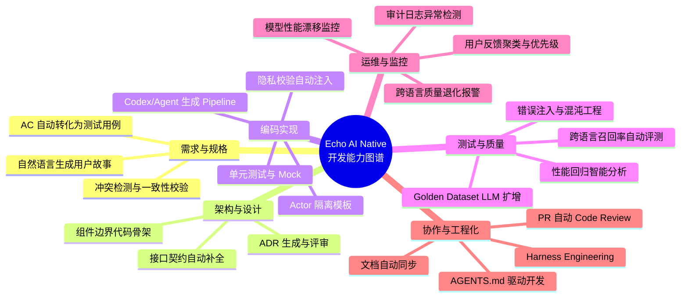

# Echo · 回响：AI Native开发理念与实战技巧手册

**版本**：v1.0

**生效日期**：2026-06-11

**适用对象**：产品经理、架构师、iOS 工程师、测试工程师、Agent 协作开发者

**对应规格**：Echo v4.6 全量用户故事与验收标准规格书、架构设计文档、数据流文档、避坑手册

------

## 1. AI Native 开发全景视图

Echo 是一款 **AI Native 端侧应用**：其核心能力（检索、合成、唤醒）由 AI 模型驱动，而其 **开发流程本身** 也深度融合了 AI 与大模型技术。本手册系统阐述在开发 Echo 的过程中，如何运用各类 AI、大模型、Agent 与 AI Native 理念，提升效率、质量与可维护性。

### 1.1 整体能力地图



### 1.2 核心 AI Native 理念

| 理念                    | 定义                                                         | 在 Echo 中的应用                                             |
| ----------------------- | ------------------------------------------------------------ | ------------------------------------------------------------ |
| **Harness Engineering** | 将开发流程中的人工决策点转化为可由 LLM/Agent 执行的“护栏”与“模板”，通过约束而非自由发挥来保证质量。 | 使用 `AGENTS.md` 分层约束 Codex；用模板强制注入 `PrivacyCheckpoint`；用 CI 阻断未分级的错误处理。 |
| **LLM 作为领域语言**    | 用自然语言编写需求、架构决策、测试用例，并通过 LLM 自动翻译为可执行产物。 | 用户故事 → Golden Dataset；ADR → 代码骨架；规格书 → 测试断言。 |
| **Agent 协作开发**      | 将不同 Agent 角色（架构师、编码员、测试员、评审员）组合，分工处理复杂任务。 | Codex 生成代码 → 另一个 Agent 做合规检查 → 第三个 Agent 生成测试。 |
| **持续对齐验证**        | 每次变更后自动运行“对齐测试”（如跨语言召回率），确保 AI 模型行为符合预期。 | CI 中运行跨语言 Recall@10 基准；模型更新时自动跑 Golden Dataset。 |
| **可观测性原生**        | 所有 AI 决策点（检索、合成、降级）都留有可读、可追溯的审计日志，方便调试与改进。 | `PrivacyCheckpoint` 记录 traceID、对齐分数、语言重试次数等。 |
| **人机协同门禁**        | 关键决策（模型切换、术语表变更、ADR）必须经过人类确认，Agent 不可自动通过。 | PR 要求人类 reviewer；模型更新必须附带人工评估报告。         |

------

## 2. 需求与规格阶段：LLM 辅助的规格工程

### 2.1 从产品意图到用户故事

**场景**：产品经理用自然语言描述新功能，需要生成符合 Echo 规范的用户故事与验收标准。

**技巧**：使用 LLM（如 GPT-4） + 自定义提示模板，将产品描述转化为结构化用户故事。

**具体操作**：

- 准备模板：包含 `优先级`、`用户故事描述`、`验收标准 AC-1~AC-N`。

- 提供 Echo 规格书 v4.6 作为上下文。

- 示例 Prompt：

  > 你是一位资深产品经理，专精 AI Native 端侧应用。请将以下需求转化为符合 Echo v4.6 规格书的用户故事，包含 P0/P1 优先级判断，并为每条 AC 添加可测试性标注：
  >
  > “用户希望能自动导入系统相册中新增的截图，并为截图自动添加‘截图’标签。”

**输出**：可直接粘贴到规格书中的故事。

**验证**：由产品经理与架构师共同确认，并添加到规格书仓库。

### 2.2 AC 自动生成 Golden Dataset 测试用例

**场景**：规格书中的 AC 需要转化为具体的测试数据（例如跨语言查询、反馈重排场景）。

**技巧**：用 LLM 生成大量边界用例，人工抽样审核后加入 Golden Dataset。

**具体操作**：

- 提取规格书中涉及检索、反馈、跨语言的故事。
- 为每个 AC 生成 5~10 条具体输入-预期输出对。
- 使用一致性校验（例如：同义查询应返回相似结果）过滤明显错误。
- 人工标注后加入版本库。

**示例**：

- AC：英文查询可匹配中文记忆。
   生成用例：`query="happy birthday"` → 预期召回中文“生日快乐”相关记忆。
- 覆盖变量：emoji、同义词、否定形式、混合语言。

**工具**：可编写 Python 脚本调用 OpenAI API，并对结果进行去重与相似度聚类。

### 2.3 规格一致性检查

**场景**：多人协作修改规格书时，可能出现矛盾或遗漏（如某故事要求“永不删除”，另一故事允许“自动过期”）。

**技巧**：将规格书全文作为 LLM 上下文，要求检测逻辑冲突。

**具体操作**：

- 定期（如每次 PR）将规格书 Markdown 发送给 LLM。
- Prompt 要求：输出冲突列表、涉及故事编号、建议修正。
- 人类决策后更新。

**注意**：由于上下文长度限制，可拆分为模块（如隐私模块、数据源模块）分别检查。

------

## 3. 架构与设计阶段：LLM 驱动的 ADR 与代码骨架

### 3.1 ADR（架构决策记录）自动生成

**场景**：技术选型或架构变更需要记录决策背景、备选方案、后果。

**技巧**：以会议纪要或设计讨论文本为输入，LLM 生成结构化 ADR。

**具体操作**：

- 提供 ADR 模板（包含标题、状态、背景、决策、后果、参考）。
- 输入讨论摘要（可录屏转文字）。
- LLM 输出初稿，人类补充技术细节后提交。

**示例**：决定使用 `TaskQueueActor` 串行长任务 → 生成 ADR-022。

### 3.2 从 ADR 生成代码骨架

**场景**：ADR 批准后，需要快速创建对应的 Actor、Pipeline 或 ViewModel 的脚手架代码。

**技巧**：让 Agent 读取 ADR，按照项目模板生成代码文件。

**具体操作**：

- 将 ADR 的“决策”部分发送给 Codex，附带模板路径。
- 要求生成：Actor 定义、公开方法签名、单元测试桩、`AGENTS.md` 更新。
- 人类调整命名与业务逻辑。

**示例**：ADR 决定引入 `MusicSuggestionActor` → Agent 生成 `MusicSuggestionActor.swift`，包含 `recommend(memory:)->[Song]` 方法，内置离线歌单查询。

### 3.3 接口契约自动补全

**场景**：定义跨 Actor 调用协议时，容易遗漏错误处理或隐私校验。

**技巧**：利用 LLM 分析已有 Actor 的调用模式，自动建议新增方法的契约。

**具体操作**：

- 提供同模块其他 Actor 的代码作为示例。
- 描述需要的新方法功能（自然语言）。
- LLM 输出：方法签名、`Sendable` 约束、L1~L4 错误映射、审计日志字段。

------

## 4. 编码实现阶段：Agent 协作开发

### 4.1 Codex（GitHub Copilot / Cursor）高级用法

**原则**：将 Echo 的架构约束转化为 `.cursorrules` 和 `AGENTS.md`，使 Codex 成为“知情助手”。

**具体配置**：

- 在项目根目录创建 `AGENTS.md`，内容参考 Echo 避坑手册第 12 节。
- 为每个子目录（`Core/Pipelines/`, `UI/ViewModels/`）添加更具体的规范。
- 设置 `.cursorrules` 指向 `AGENTS.md`。

**示例指令**（融入自然语言注释）：

```swift
// AGENTS.md 中要求：所有 Pipeline Actor 方法必须包含 PrivacyCheckpoint
// 以下代码由 Codex 生成，已自动注入
func search(query: String) async -> SearchResult {
    let checkpoint = await PrivacyActor.shared.validate(operation: .search, traceID: traceID)
    // ... rest
}
```

### 4.2 多 Agent 协作：Spec → Code → Test → Review

**流程**：

1. **架构 Agent**：根据规格书 AC 生成任务分解（如“需要实现 `SyncPipeline`，依赖 `ExcludedAssetsActor`”）。
2. **编码 Agent**：基于模板生成代码，并调用 `TaskQueueActor`。
3. **测试 Agent**：为生成的代码补充单元测试，覆盖正常路径与 L1~L4 错误。
4. **评审 Agent**：运行 SwiftLint、并发检查、隐私校验扫描，输出问题清单。
5. **人类**：最终审核并合并。

**工具链**：可使用 LangChain 或自定义脚本串联 OpenAI API，或在 PR 描述中 @codex 指令。

### 4.3 代码审查中的 LLM 增强

**场景**：PR 规模较大，人类 reviewer 时间有限。

**技巧**：使用 LLM 进行预审，标注可疑点（如遗漏的 `await`、可能的 Actor 死锁、隐私校验缺失）。

**具体操作**：

- 将 PR diff 作为输入，附带项目 [AGENTS.md](http://agents.md/)。
- 要求 LLM 输出风险列表，并给出修改建议。
- 人类 reviewer 只聚焦 LLM 无法判断的业务逻辑。

**注意**：不能完全依赖 LLM，需结合静态分析工具（SwiftLint、TSan）。

------

## 5. 测试与质量阶段：AI 增强的质量工程

### 5.1 Golden Dataset 的 LLM 扩增与变异

**场景**：Golden Dataset 需要覆盖大量跨语言、情感、主观查询用例，人工编写耗时。

**技巧**：使用 LLM 对少量种子用例进行变异（同义词替换、语言混合、结构变换）。

**具体操作**：

- 提供 20 个种子查询-预期召回对。
- Prompt：请基于这些样例，生成 200 个类似的跨语言检索测试用例，注意覆盖边界条件（如空结果、长度超限）。
- 自动去重（向量余弦相似度 <0.9 视为不同）。
- 人工抽样验证。

### 5.2 跨语言召回率自动化评测

**场景**：每次模型或检索策略变更后，需要验证跨语言 Recall@10 是否 ≥85%。

**技巧**：编写 CI 流水线，自动运行 Golden Dataset，计算召回率并生成报告。

**具体操作**：

- Golden Dataset 以 JSON 格式存储。
- 编写 Swift 测试（`CrossLingualRecallTests.swift`）加载数据集，调用 `SearchPipeline` 计算 Recall。
- CI 中若低于 85%，阻断合并并通知模型团队。

**与 LLM 结合**：当召回率下降时，LLM 分析失败的用例，猜测可能的原因（如“中英文同义词未对齐”），辅助快速定位。

### 5.3 错误注入与混沌工程

**场景**：需要测试 L1~L4 错误处理逻辑，例如磁盘满、模型加载失败、数据冲突。

**技巧**：使用 Agent 自动生成故障注入测试，模拟系统异常。

**具体操作**：

- 定义故障类型枚举（如 `MockDiskFullError`、`MockModelCorruption`）。
- Agent 生成测试代码，在 `setUp` 中替换正常 Actor 为故障 Actor。
- 断言：UI 应显示正确的提示（Toast/引导页），审计日志包含预期字段。

### 5.4 性能回归智能分析

**场景**：每次 PR 可能导致检索延迟或内存峰值变化，需要快速发现异常。

**技巧**：在 Nightly Build 中运行性能测试，并将结果上传至数据库。使用 LLM 分析趋势，标记“可疑 PR”。

**具体操作**：

- 收集指标：`search_p95_latency`, `ingest_memory_peak`, `feedback_compute_time`。
- 当某指标较基线变化 >15% 时，LLM 提取该时间段内的 PR 描述，判断是否与性能相关。
- 自动给对应 PR 添加标签 `performance-regression`。

------

## 6. 运维与监控阶段：AI 辅助的可观测性

### 6.1 审计日志异常检测

**场景**：审计日志记录了所有隐私操作、降级事件、重试等。需要识别异常模式（如频繁的 L2 写入）。

**技巧**：使用 LLM 分析日志摘要，生成周报，并标记异常峰值。

**具体操作**：

- 每日凌晨汇总审计日志，按事件类型聚合。
- 将异常计数（如 L2 写入 >1000 次）输入 LLM，并附带最近 10 条详细日志。
- LLM 输出可能原因（例如“磁盘空间不足导致大量 L2”）和建议措施。
- 系统自动创建 Jira 任务。

### 6.2 用户反馈聚类与优先级排序

**场景**：用户通过 App 内反馈（点赞/点踩、Bad Case 标记）产生大量非结构化文本。

**技巧**：使用 LLM 对反馈进行聚类、情感分析、主题提取，并推荐优先级。

**具体操作**：

- 每周运行一次脚本，收集 `FeedbackStore` 中的文本（查询、原因）。
- 调用 LLM：将相似反馈合并为主题，估算影响范围，给出处理优先级。
- 产品经理可据此驱动 Golden Dataset 更新或 Prompt 优化。

### 6.3 模型性能漂移监控

**场景**：端侧模型随 iOS 版本升级或设备碎片化，可能产生精度漂移。

**技巧**：定期抽样真实用户查询与模型输出，与 Golden Dataset 对比，使用 LLM 评估质量。

**具体操作**：

- 从生产环境随机抽取 100 条查询（经过脱敏）。
- 让 LLM 作为“裁判”，对比当前模型输出与某版本基线，输出一致性评分。
- 若评分低于 0.9，触发重新评估流程。

------

## 7. 协作与工程化：Harness Engineering 深度实践

### 7.1 Harness Engineering 的核心机制

在 Echo 项目中，Harness Engineering 体现为：

- **模板化**：所有 Agent 生成代码必须基于 `/docs/agent/templates/` 中的模板，避免自由发挥。
- **护栏检查**：CI 中运行脚本验证模板合规性（例如检查是否包含 `PrivacyCheckpoint`、是否使用 `TaskQueueActor`）。
- **版本锁定**：`AGENTS.md` 与架构文档版本严格同步，Codex 每次读取最新版本。

### 7.2 [AGENTS.md](http://agents.md/) 分层与动态更新

- 根目录 `AGENTS.md`：全局规则（隐私、并发、错误矩阵）。
- `Core/Pipelines/AGENTS.md`：Pipeline 专属规则（必须纯函数、禁止 UI 导入）。
- `UI/ViewModels/AGENTS.md`：ViewModel 规则（必须 @MainActor、无直接持久化）。

**自动更新**：当架构文档或避坑手册更新时，使用 LLM 自动同步 `AGENTS.md`。Prompt：请根据以下文档差异，更新 [AGENTS.md](http://agents.md/) 中的规则编号和描述。

### 7.3 PR 描述模板与 Agent 自检

在 PR 模板中强制要求 Agent（或人类）填写自检清单（参考避坑手册附录），由 CI 自动验证部分项（如覆盖率、无 `nonisolated(unsafe)`）。LLM 可辅助判断“硬编码语言”等非静态项。

**示例**：PR 描述中包含 `## Agent 自检` 部分，Agent 必须逐项回答 ✅/❌。CI 会检查这些标记，如发现 ❌ 则阻止合并。

------

## 8. 案例：用 AI Native 方式实现一个完整功能（地理围栏唤醒）

### 8.1 需求输入（产品经理）

> “用户走进咖啡店附近时，Echo 推送过去在这里写过的日记或拍过的照片，每天最多一次。”

### 8.2 LLM 生成用户故事与 AC

输入上述需求 + 规格书上下文 → 输出：

```
US-AWK-001：地理围栏唤醒（咖啡店场景）
优先级：P1
AC-1：进入围栏后检索与位置关联的记忆，匹配度≥0.7
AC-2：同一围栏24h内不重复推送（基于 didExit 重置）
AC-3：无位置权限时静默禁用
```

### 8.3 Agent 生成代码骨架

基于 `AwakeningPipeline` 模板，Agent 生成：

- `AwakeningPipeline` Actor（含 `monitorRegion()` 方法）
- 调用 `SearchPipeline` 的 `search(geoFilter:)`
- 调用 `TaskQueueActor` 生成卡片
- 自动注入 `PrivacyCheckpoint.validate()`

### 8.4 Agent 生成单元测试

- 模拟 `CLLocationManager`，触发 `didEnter`
- 断言：`SearchPipeline` 被调用，`TaskQueueActor.enqueue` 被调用
- 模拟 `didExit` + 再次 `didEnter`，验证第二次允许推送

### 8.5 持续对齐测试

Golden Dataset 中添加地理位置相关跨语言用例：`query="coffee shop memories"` 预期召回中文“星巴克”日记。

### 8.6 运维监控

上线后，审计日志分析：`contextualAwakening` 事件频率，若发现某围栏 24h 内触发多次（超过 2 次），自动报警。

------

## 9. 工具链推荐

| 阶段 | 工具                                                 | 用途                 |
| ---- | ---------------------------------------------------- | -------------------- |
| 需求 | ChatGPT / 企业版 LLM                                 | 生成用户故事、AC     |
| 设计 | Cursor / Codex                                       | ADR 生成、代码骨架   |
| 编码 | GitHub Copilot + 本地 [AGENTS.md](http://agents.md/) | 实时辅助             |
| 测试 | 自研 Golden Dataset Runner + LLM 扩增                | 生成/验证测试集      |
| CI   | GitHub Actions + Danger + SwiftLint + 自研脚本       | 合规检查、召回率测试 |
| 运维 | 审计日志分析器 + LLM 聚类                            | 异常检测、反馈分析   |
| 协作 | PR Agent（如 CodeRabbit）+ 自定义 Prompt             | 预审 PR              |

------

## 10. 风险与对策

| 风险                             | 缓解措施                                                     |
| -------------------------------- | ------------------------------------------------------------ |
| LLM 生成不一致代码               | 模板化 + CI 强制检查；人类审查关键路径                       |
| 过度依赖 Agent 导致架构腐化      | 定期架构复审（每月）；ADR 必须人工批准                       |
| 测试用例质量不足                 | 人工抽样 + 变异测试；Golden Dataset 持续维护                 |
| 隐私泄漏（LLM 处理真实用户数据） | 所有发给 LLM 的数据必须脱敏；禁止发送原文                    |
| 成本失控                         | 仅在关键路径使用 LLM；使用本地小模型（如 CodeLlama）辅助简单任务 |

------

## 11. 总结

在 Echo 开发中运用 AI Native 理念，并非简单地在代码中使用 LLM，而是**将 LLM 和 Agent 融入整个软件开发生命周期**，从需求到运维形成闭环。Harness Engineering 确保了 Agent 输出的可控性与一致性，而模板、护栏、持续对齐测试则让 AI 成为可靠的生产力伙伴。

**下一步行动**：

1. 在团队内培训本手册内容。
2. 将 [AGENTS.md](http://agents.md/) 与 CI 规则升级至 v4.6。
3. 选择一个小功能（如反馈学习）完整走一遍 AI Native 流程，积累最佳实践。

> **文档维护声明**
>
> 本文档随 Echo 规格书与架构演进同步更新。重大 AI Native 实践变革需通过 ADR 记录。
>
> 下次复审：2026-09-11。