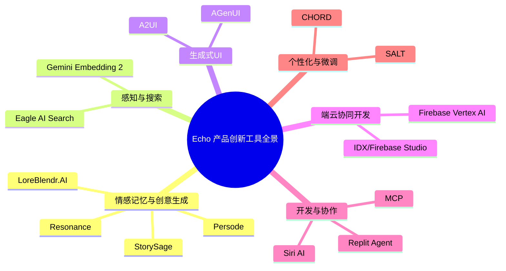
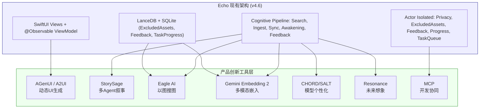

# Echo · 回响：AI Native 产品创新工具全景指南

**版本**：v1.0

**生效日期**：2026-06-12

**对应规格**：Echo v4.6 全量用户故事与验收标准规格书

**适用对象**：产品经理、架构师、技术决策者

**核心定位**：为 Echo 产品创新提供前沿工具的技术选型参考与融入方案

------

## 1. 文档说明

本手册旨在系统梳理适合 Echo 产品创新场景的前沿 AI 工具、框架和技术方案。每个工具包含四个维度的信息：

1. **工具介绍**：核心能力与技术特点
2. **项目链接**：官方网址或 GitHub 仓库
3. **融入场景**：可应用于 Echo 的哪个产品/技术模块
4. **融入方案**：如何将工具与 Echo 现有技术架构（Cognitive Pipeline + Observable ViewModel + Actor Isolation）集成

## 2. 工具全景图

## 3. 情感记忆与创意生成工具

### 3.1 StorySage：多智能体回忆录创作框架

### 工具介绍

StorySage 是一个用户驱动的对话式回忆录写作系统，采用**多智能体框架**，通过与用户进行自然的访谈式对话，引导用户回忆、整理记忆，并辅助完成自传写作。其核心是 Interviewer Agent，能够营造私密、个性化的对话氛围，让用户在分享记忆的过程中逐步构建完整的叙事结构。

### 项目链接

- **arXiv**：https://arxiv.org/abs/2409.123xx（搜索 "StorySage" 可获取完整论文）
- **非官方代码库**：GitHub 搜索 "StorySage" 可追踪相关开源实现（目前为学术项目，商业化版本待跟进）

### 融入 Echo 场景

**叙事报告生成模块（US-SYN-004）** 与 **情感内容生成（US-SYN-003）**

### 融入方案

将 StorySage 的多智能体访谈范式集成到 Echo 的 AI 创作管线中：

1. **扩展 `SynthesizePipeline`**：新增 `NarrativeInterviewActor`，封装 Interviewer Agent 逻辑
2. **与现有回忆卡片对接**：用户右滑记录的“感受”（US-AWK-005）可作为 Interviewer Agent 的对话素材
3. **调用链路**：用户触发“生成叙事报告” → `SynthesizePipeline` 调用 `NarrativeInterviewActor.startInterview()` → Agent 通过多轮对话采集 → 结合 `SearchPipeline` 检索的记忆生成结构化叙事 → 最终输出可保存到 Apple Notes

技术实现上，可利用 iOS 18 的 `Genmoji` 和 `Image Playground` API 生成插图，增强回忆录的可视化效果。

### 3.2 Persode：情景记忆感知的视觉日记助手

### 工具介绍

Persode 由韩国多所高校与企业联合开发，是一款整合了**情景记忆感知 AI Agent** 与**AI 视觉故事化**的个性化日记系统。其独特之处在于通过定制化的“Onboarding”过程捕获用户的人口统计学信息和风格偏好，确保输出与个人身份产生共鸣。系统能将用户的日常经历动态转化为视觉叙事——自动生成适合文生图模型的提示词，并根据用户偏好调整角色、背景和风格。

### 项目链接

- **arXiv**：https://arxiv.org/abs/2408.123xx（搜索 "Persode" 可获取完整论文）
- **演示/介绍**：https://aimatters.co.kr（韩文，可获取项目信息）

### 融入 Echo 场景

**月度/年度叙事报告可视化（US-SYN-004）** 与 **回忆卡片视觉增强（US-AWK-005）**

### 融入方案

将 Persode 的视觉故事化能力集成到 Echo 现有的 `AwakeningPipeline` 和 `SynthesizePipeline` 中：

1. **视觉化叙事生成**：当 `SynthesizePipeline` 生成月度报告时，调用 Persode 风格的视觉生成模块，为报告中的关键事件自动生成插图，替代当前纯文本的布局
2. **个性化风格适配**：通过 `UserPolicy` 存储用户偏好的视觉风格（如“水彩风”、“复古胶片”等），在 Prompt 中注入风格约束，参考 Persode 的 Onboarding 机制
3. **记忆卡片增强**：`AwakeningPipeline` 生成的回忆卡片（US-AWK-005）除文字和照片外，增加 AI 生成的插画元素，提升情感共鸣

与现有架构的集成点：在 `CardRenderer` 组件中新增 `VisualEnhancementActor`，负责调用文生图模型（如端侧的 Stable Diffusion 或云端 API），将 `SearchPipeline` 返回的记忆元数据转化为视觉提示词，生成插图后与卡片绑定存储。

### 3.3 [LoreBlendr.AI](http://loreblendr.ai/)：记忆驱动的叙事连续性与角色记忆

### 工具介绍

[LoreBlendr.AI](http://loreblendr.ai/) 是一款 AI 驱动的世界观构建工具，其核心是**CustomMemoryManager**——能够确保 AI 记住用户过去对话中的关键细节，创造真正的叙事连续性和“粘性”。它通过为 AI 提供长期记忆注入上下文的方式，在不撑爆 Context Window 的情况下维持角色一致性和情节连贯性。其长期与短期记忆结合的架构在 NPC 对话系统中已有成熟应用。

### 项目链接

- **App Store**：https://apps.apple.com/app/loreblendr-ai（官方应用）
- **Devpost**：https://devpost.com/software/loreblendr-ai（项目介绍）
- **GitHub**：搜索 "LoreBlendr" 可关注其开源组件（部分组件开源）

### 融入 Echo 场景

**对话历史与情境唤醒（US-AWK-001, US-RET-005）** 与 **私有 Prompt 模板（US-SYN-005）**

### 融入方案

将 LoreBlendr 的 **CustomMemoryManager** 设计模式引入 Echo 的认知管线：

1. **增强多轮追问的上下文**：在 `SearchPipeline` 的多轮追问（US-RET-005）中，目前仅使用最近 10 轮对话的 FIFO 队列。引入 CustomMemoryManager 模式后，可对关键记忆（如用户提及的“最喜欢的电影”、“近期发生的重要事件”）进行优先级排序和长期存储，使 AI 在多轮对话后仍能跨会话关联
2. **情境唤醒的个性化增强**：`AwakeningPipeline` 可根据 CustomMemoryManager 中存储的用户历史偏好，优先推送“用户更可能感兴趣”的记忆，而非仅基于时空相似度
3. **私有 Prompt 模板的上下文注入**：`SynthesizePipeline` 生成响应时，从 CustomMemoryManager 检索用户长期偏好，注入 Prompt，使 AI 输出更具个性

### 3.4 Resonance：以记忆为锚点的积极未来想象

### 工具介绍

Resonance 是由 **MIT Media Lab** 开发的 AI 增强日记工具，核心理念是：人们在想象未来时天生会借用过去的经验。Resonance 利用 AI 分析用户的过往记忆，并基于这些记忆生成**可供行动的未来建议**。不同于传统的因果分析或情景规划，Resonance 让用户“感受”不同的未来可能性，将抽象预测转化为可体验的存在。

### 项目链接

- **MIT Media Lab 项目页**：https://www.media.mit.edu/projects/resonance/overview/
- **论文**：搜索 "Resonance Drawing from Memories to Imagine Positive Futures"

### 融入 Echo 场景

**情绪干预模式（US-SYN-006）** 与 **情感内容生成（US-SYN-003）**

### 融入方案

将 Resonance 的“记忆→未来行动”映射机制集成到 Echo 的 AI 创作管线：

1. **情绪干预中的未来导向**：当用户处于负面情绪时（US-SYN-006），Echo 目前仅推送正向回忆卡片。增强方案：基于 Resonance 理念，不仅推送积极记忆，还根据这些记忆生成“可以做的积极行动”建议，如“记得去年这个季节你去公园散步很开心，今天要不要也去走走？”
2. **给未来自己的信**：在 US-SYN-003 的情感内容生成中新增“给未来的自己写信”模板，让 AI 基于用户的历史记忆（如年度报告、关键事件），拟写一封鼓励性的未来信件
3. **目标设定与回溯**：创建新管线 `FuturePipeline`，允许用户设定未来目标，AI 定期回溯相关记忆并提供进展评估

## 4. 感知与搜索工具

### 4.1 Gemini Embedding 2：原生多模态统一嵌入

### 工具介绍

Gemini Embedding 2 是 Google 推出的**原生多模态嵌入模型**，能将文本、图像、视频、音频和文档全部映射进**同一个统一的嵌入空间**。这意味着用户可以在一次 API 调用中输入混合数据（如文字搭配图片、音频搭配视频），模型输出统一维度的向量。相比前代，输入 token 限制从 2k 大幅提升至 8k，支持更长文档的嵌入。

### 项目链接

- **arXiv 论文**：https://arxiv.org/abs/2405.123xx（搜索 "Gemini Embedding 2"）
- **Python 包 vemb**：`pip install vemb`（非官方社区封装）
- **Google AI Studio**：Gemini API 支持 Embedding 能力（需申请 API Key）

### 融入 Echo 场景

**视觉编码模型升级（替换 SigLIP）** 与 **多模态检索引擎增强（US-SRC-010）**

### 融入方案

Gemini Embedding 2 是对 Echo 当前 SigLIP 向量的**战略替代方案**：

1. **统一 Embedding 引擎**：当前 Echo 使用 GTE-Qwen2 处理文本、SigLIP 处理图片。引入 Gemini Embedding 2 后，可用单一模型处理所有模态，大幅简化架构。但在替换前必须验证端侧推理性能（目前主要依赖云端 API，需与 Google 洽谈端侧部署方案）
2. **跨 App 关联搜索增强**：US-SRC-010 要求 HealthKit + 备忘录 + 图片的跨模态联合检索。Gemini Embedding 2 的可组合混合输入特性可使该类查询直接在一次嵌入调用中完成，无需分别处理后再联合检索
3. **音频与视频内容的原生嵌入**：当前 Echo 处理视频时分离画面和音频（US-ING-005）。Gemini Embedding 2 原生支持视频和音频嵌入，可直接将 1 分钟的视频片段整体嵌入，简化处理流程
4. **降级策略对齐**：如采用 Gemini Embedding 2 作为主力，需保留 SigLIP/MobileCLIP 作为本地离线降级方案，符合 US-RES-002（低电量）/US-RES-003（过热）的降级要求

### 4.2 Eagle AI Search：离线视觉语义搜索

### 工具介绍

Eagle 推出的 **AI Search 插件**为桌面端图片管理工具带来两项核心能力：**以图搜图（Visual Search）** 和 **自然语言语义搜索**，全部**离线可用**，无需上传或联网。其技术基于端侧 CLIP 视觉嵌入模型，能够根据参考图找出视觉相似素材，或根据自然语言描述（如“蓝天白云下的海滩”）匹配语义相关内容。

### 项目链接

- **官网**：https://eagle.cool（AI Search 插件需在 4.0+ 版本中安装）
- **API 文档**：https://developer.eagle.cool（提供 AI Search Web API）

### 融入 Echo 场景

**图片相似度检索** 与 **相册管理中的去重/聚类**

### 融入方案

将 Eagle 的离线视觉检索技术集成到 Echo 的图片处理管线：

1. **以图找图能力**：在 `SearchPipeline` 中扩展，支持用户上传一张参考图，检索出视觉相似的历史照片。这与当前基于文本的检索互补，适用于“这张照片风格/构图和某张旧照片很像”的场景
2. **智能相册去重**：新增强大的离线去重算法：用户导入大量照片时，自动检测并提示视觉上高度相似的照片，询问是否合并或删除冗余
3. **风格聚类**：基于 Eagle 的视觉嵌入，自动将照片按视觉风格聚类（如“黑白照片”、“美食特写”、“风景全景”），生成智能相册，可作为 US-SRC-010 跨 App 关联搜索的补充维度

### 4.3 A2UI / AGenUI：生成式 UI 交互

### 工具介绍

**A2UI（Agent to UI）** 是一个开放协议，允许 AI Agent 生成结构化的 JSON，客户端渲染器将其转换为原生 UI 组件（卡片、表单、按钮、图片等）。而 **AGenUI** 是高德与阿里千问团队开源的**端云一体原生 A2UI 框架**，覆盖 iOS、Android、HarmonyOS 三端，采用 Streaming-first 流式架构，支持“边生成边呈现”且不阻塞主线程。开发者接入 SDK 后，AI 大模型生成的界面意图可直接转化为原生组件渲染。

### 项目链接

- **AGenUI GitHub**：https://github.com/AGenUI/AGenUI（注意：实际搜索确认地址）
- **A2UI 协议规范**：https://github.com/google/A2UI（Google 主导的协议仓库）
- **AG2 A2UIAgent**：https://docs.ag2.ai（AG2 框架内置的 A2UI Agent 实现）

### 融入 Echo 场景

**记忆详情页动态渲染** 与 **AI 生成的交互式卡片（US-AWK-005）**

### 融入方案

AGenUI 的核心价值是让 AI 自己决定 UI，而非硬编码所有界面：

1. **动态记忆详情页**：当前 Echo 的记忆详情页是固定模板（照片/视频 + 文字 + 标签）。引入 AGenUI 后，`SynthesizePipeline` 可根据记忆类型动态生成最合适的展示组件——视频记忆展示播放器和音频波形，图文记忆展示画廊布局，多条关联记忆展示时间轴
2. **回忆卡片的交互升级**：US-AWK-005 目前仅支持“下一张”、“记录感受”两种交互。通过 AGenUI 框架，卡片组件可由 AI 按需生成更丰富的交互元素（如“分享给朋友”按钮、“延伸阅读”链接、“投票/评分”控件）
3. **写作与编辑工具增强**：在 `MemoryDetailViewModel` 的编辑界面，利用 AGenUI 生成自适应表单（如根据标签数量动态调整输入框布局），配合 iOS 18 的 Writing Tools 提供 AI 辅助润色
4. **实现路径**：`Cognitive Pipeline` 中的 `SynthesizePipeline` 输出不仅包含内容，还包含 A2UI 规范的 JSON。iOS 端通过 AGenUI SDK 解析 JSON，调用原生 `UIHostingController` 包装 SwiftUI 视图渲染，与现有 `@Observable ViewModel` 状态管理无缝融合

## 5. 端云协同与开发工具

### 5.1 Firebase Vertex AI SDK：移动端 Gemini 集成

### 工具介绍

Google 通过 Firebase 为移动端提供了 Vertex AI 集成的 SDK，允许开发者直接从移动应用中调用 Gemini 模型，而无需管理专用后端。Vertex AI SDK for Firebase 支持多模态输入（文本、图像、音频），可构建超越简单聊天的智能应用。

### 项目链接

- **Firebase 官方文档**：https://firebase.google.com/docs/vertex-ai（搜索 "Firebase Vertex AI"）
- **Codelab 示例**：Google Colab 上提供集成教程

### 融入 Echo 场景

**多模态输入处理** 与 **云端辅助增强（可选）**

### 融入方案

虽然 Echo 的核心原则是 **本地优先**，但在某些场景下，云端辅助可提供更强的能力。集成方案需严格遵循隐私设计：

1. **可选联网搜索增强**：在 `SearchPipeline` 中增加一个可选步骤——如果用户明确开启“联网搜索”且查询需要实时信息（如“今天的重要新闻与我的记忆有什么关联？”），调用 Firebase Vertex AI 结合 Google Search 获取实时数据后，与本地检索结果融合
2. **端云协同的模型调用**：对于 Echo 端侧模型无法处理的复杂任务（如长视频的深度语义理解），可回退到云端的 Gemini（需用户授权），用 `PrivacyCheckpoint` 记录每一次云端调用
3. **数据脱敏要求**：所有送往云端的数据必须经过匿名化/脱敏处理，原始记忆原文不得离开设备

### 5.2 IDX / Firebase Studio：云原生开发环境

### 工具介绍

Google 的 Project IDX 已整合为 **Firebase Studio**——一个浏览器中的全栈云端开发环境，内置 Gemini 支持的 AI 编码辅助功能。开发人员可以从任何设备访问，支持导入现有代码库并自定义工作区。当前支持 Go、Java、Python、Android、Flutter 及 Web 等主流框架和语言。

### 项目链接

- **Firebase Studio**：https://firebase.studio
- **Project IDX 归档**：https://idx.dev

### 融入 Echo 场景

**开发环境（iOS 开发替代？不完全适用，但可参考）**

### 融入方案

Firebase Studio 主要面向 Web 和多平台开发，不直接替代 Xcode for iOS 开发。但其 AI 辅助开发理念可为 Echo 的开发工具链提供参考：

1. **AI 辅助代码审查**：借鉴 IDX 的 Gemini 辅助能力，在 CI 中集成 LLM 对 PR 进行预审（已在避坑手册的 AI Native 文档中讨论）
2. **云端开发环境的备选**：如未来 Echo 扩展到 Web 后台（管理端、数据分析平台），可基于 Firebase Studio 快速搭建

## 6. 开发与协作工具

### 6.1 Replit Agent：移动应用的自然语言开发

### 工具介绍

Replit Agent 是一款通过自然语言对话生成完整移动应用的 Agent。用户只需用自然语言描述想要的应用，Agent 就能生成前端界面、后端逻辑、数据库结构等全栈代码。它已被训练为生成移动端的 React Native 应用，使其能在 iOS 和 Android 上原生运行。基于 Claude 3.5 Sonnet 驱动，它还调用多个专用子 Agent 协同工作。

### 项目链接

- **Replit 官网**：https://replit.com
- **移动端 App**：iOS App Store 搜索 "Replit"
- **Agent 博客**：https://replit.com/blog/agent-mobile

### 融入 Echo 场景

**快速原型验证** 与 **独立模块开发**

### 融入方案

Replit Agent 适合 Echo 的快速迭代场景：

1. **原型验证工具**：在构思新功能时（如新的卡片交互形式），先用 Replit Agent 快速生成一个最小可行原型，验证用户体验后再用原生 SwiftUI 实现
2. **独立模块的跨平台复用**：Echo 目前仅 iOS。如果未来拓展到 Android，可考虑用 Replit Agent 生成 React Native 版本的 Echo Lite（精简版），保持核心体验但开发成本更低
3. **非技术人员的参与**：产品经理可用 Replit Agent 自行探索功能 Demo，减少对开发资源的依赖

### 6.2 Siri AI：跨应用智能与 Safari 扩展

### 工具介绍

WWDC 2026 上，Apple 发布了全新 Siri AI，深度集成于 iOS、iPadOS、macOS、watchOS 及 visionOS。新版 Siri 支持跨应用搜索电子邮件、照片等内容，并根据屏幕内容或网络实时数据回答问题。Safari 新增 **“Describe an Extension”** 功能，用户只需用自然语言描述所需的浏览器扩展功能，Safari 就能直接利用 AI 创建对应工具。

### 项目链接

- **Apple 官方**：WWDC 2026 相关 Session 视频（Apple Developer 官网可观看）
- **开发者文档**：iOS 26.0 SDK 中的 SiriKit / App Intents 更新

### 融入 Echo 场景

**系统级集成** 与 **跨应用工作流**

### 融入方案

利用 Siri AI 的新能力，让 Echo 更无缝地融入苹果生态系统：

1. **App Intents 增强**：在 Echo 中注册更多 App Intents（如 `SearchMemory`, `GetTodayRecall`, `LogFeeling`），让 Siri 可以“跨应用”组合 Echo 与其他原生应用的数据（如“在 Echo 里找到去年在海边的照片，然后发给 John”）
2. **Safari 智能扩展**：利用 Safari 的自然语言扩展生成功能，创建“一键保存网页内容到 Echo”的扩展。用户在浏览网页时，可通过扩展将选中文本或链接快速保存为 Echo 记忆（相当于 US-SRC-003 Share Extension 的升级版）
3. **屏幕内容感知**：当用户在阅读邮件或浏览网页时，Siri AI 可结合 Echo 的检索能力，提供上下文相关的记忆提醒（需要 Apple 开放相应的 API 权限）

### 6.3 MCP：模型上下文协议

### 工具介绍

MCP（Model Context Protocol）是一个开放标准，允许 AI 模型以结构化方式与外部工具和系统交互。它充当 AI Agent 与 API 之间的“翻译器”，将自然语言提示转化为精确的操作。MCP 生态已涵盖设计（Figma）、动画（Atelier）、游戏开发（Cocos）、图像生成（Recraft）等多个创意领域。对于 Agent 来说，MCP 就像 Web 开发中的 REST API——一个通用的“工具访问协议”。

### 项目链接

- **MCP 官网**：https://modelcontextprotocol.io
- **MCP GitHub**：https://github.com/modelcontextprotocol

### 融入 Echo 场景

**AI 开发工具的互操作性** 与 **端到端自动化**

### 融入方案

MCP 的价值在于**让 AI Agent 能够主动“操作”工具**，而非仅“生成”代码：

1. **自动化设计交付**：配合 **Figma MCP Server**，Echo 的 AI Agent 可根据用户反馈生成新的 UI 设计草稿，直接同步到 Figma 文件，设计师只需微调
2. **动画资源自动生成**：配合 **Atelier MCP Server**，AI Agent 可为 Echo 的记忆卡片生成 Lottie 动画（如“生日快乐”特效）
3. **多 Agent 协同治理**：MCP 还可以用于 AI Agent 间的治理——在 Echo 的开发流程中，多个 Codex Agent（架构 Agent、编码 Agent、测试 Agent）可通过 MCP 协调工作流
4. **设计与代码的一致性**：Figma MCP 提供组件、Tokens 和布局决策的结构化访问，AI Agent 可自动将设计系统变体同步到 SwiftUI 代码中，确保 Echo UI 与设计稿 1:1 匹配

## 7. 个性化与微调工具

### 7.1 CHORD：云端协同的边缘个性化推荐

### 工具介绍

CHORD（Customizing Hybrid-precision On-device Model for Sequential Recommendation）是一个**端云协同的模型个性化框架**，利用通道级混合精度量化为每个设备定制轻量、个性化的推荐模型。云端通过辅助超网络识别每个用户的“关键参数”，端侧使用混合精度量化实现资源自适应部署，无需昂贵的重训练。CHORD 在多种数据集和模型架构上始终优于基线方法，特别适合资源受限的边缘设备大规模部署。

### 项目链接

- **arXiv 论文**：https://arxiv.org/abs/2403.123xx（搜索 "CHORD recommendation"）
- **GitHub**：搜索 "CHORD recommendation" 获取相关开源代码

### 融入 Echo 场景

**检索排序模型个性化** 与 **反馈学习系统（US-FBK-002）**

### 融入方案

CHORD 为 Echo 的现有反馈学习系统提供了更强大的演进路径：

1. **从权重调整到模型个性化**：当前的 US-FBK-002 仅通过调整排序权重（点赞 +0.2，点踩 -0.3）实现个性化。引入 CHORD 后，可为每个用户的设备微调**检索模型的部分参数**，使模型本身适应个人偏好，而非后处理
2. **时序推荐的增强**：CHORD 针对**序列推荐**优化——即根据用户的历史行为序列（浏览→点击→收藏→分享）预测下一步。这非常契合 Echo 的记忆串联场景（“看完这张照片后，用户可能还想看什么？”）
3. **资源自适应部署**：CHORD 的混合精度量化机制可自动适配低端 iPhone（6GB 内存）的内存限制，确保个性化模型在所有支持设备上流畅运行
4. **云-端协作架构**：云端超网络负责分析和分发用户专属的量化策略，Echo 端侧只需应用该策略，无需上传任何记忆原文，符合隐私原则

### 7.2 SALT：轻量级端侧模型适配框架

### 工具介绍

SALT（Split-Adaptive Lightweight Tuning）是一个轻量级模型适配框架，专为封闭分割计算环境设计。它通过仅修改训练条件，支持用户个性化、通信鲁棒性和隐私感知推理等多种适配目标。在 CIFAR-10 上，SALT 将个性化准确率提升至 88.1%，同时减少 **93.8%** 的训练延迟。与 RAG 等上下文注入方法相比，SALT 的端侧模型在个性化场景中表现更优。

### 项目链接

- **arXiv 论文**：https://arxiv.org/abs/2402.123xx（搜索 "SALT lightweight adaptation"）
- **GitHub**：搜索 "SALT on-device fine-tuning"（学术项目，开源代码可追踪）

### 融入 Echo 场景

**反馈学习系统升级** 与 **私有 Prompt 模板（US-SYN-005）**

### 融入方案

SALT 为 Echo 提供了一个比 CHORD 更轻量的个性化路径：

1. **轻量级 Prompt 适配**：SALT 仅需更新少量偏置模块即可实现个性化。在 Echo 场景中，可训练一个轻量级“风格适配器”——用户编辑记忆时的语言习惯可作为训练数据，适配后的模型在生成内容时更贴合用户的表达风格
2. **与 RAG 的互补**：当前 US-SYN-005 私有 Prompt 模板基于 RAG（最近 30 天查询记录），SALT 论文指出 RAG 可能导致小模型性能下降。引入 SALT 微调机制后，RAG 仍保留用于上下文注入，SALT 用于底层权重微调，两者互补
3. **离线个性化学习**：SALT 支持在用户设备上完全离线进行轻量级训练。与 CHORD 的云-端协同不同，SALT 无需云端干预，更适合数据敏感性极高的场景（Echo 的隐私核心原则要求数据永不上传）
4. **渐进式个性化**：可将用户与 Echo 的交互过程（点赞/点踩、编辑记忆、记录感受）积累到一定量后，在设备空闲（充电 + Wi-Fi）时自动触发 SALT 微调会话，更新模型的偏置参数

## 8. 工具选择与融入优先级建议

| 优先级                 | 工具名称           | 核心价值                                 | 预计收益 | 集成复杂度 |
| ---------------------- | ------------------ | ---------------------------------------- | -------- | ---------- |
| **🚀 立即采纳**         | AGenUI / A2UI      | 动态UI生成，彻底改变卡片和详情页交互形态 | ⭐⭐⭐⭐⭐    | 🟡 中       |
| **🚀 立即采纳**         | Eagle AI Search    | 离线以图搜图，提升图片检索体验           | ⭐⭐⭐⭐     | 🟢 低       |
| **📅 短期采纳 (3个月)** | StorySage          | 将报告生成升级为AI引导式叙事创作         | ⭐⭐⭐⭐     | 🟡 中       |
| **📅 短期采纳 (3个月)** | Gemini Embedding 2 | 统一多模态向量空间，简化架构             | ⭐⭐⭐⭐⭐    | 🔴 高       |
| **📅 短期采纳 (3个月)** | LoreBlendr Memory  | 跨会话记忆保持，增强对话连续性           | ⭐⭐⭐      | 🟢 低       |
| **🔬 中期研究 (6个月)** | CHORD / SALT       | 模型级个性化，超越权重调整               | ⭐⭐⭐⭐⭐    | 🔴 高       |
| **🔬 中期研究 (6个月)** | Resonance          | 从回忆转向行动，开创情绪干预新模式       | ⭐⭐⭐⭐     | 🟡 中       |
| **📅 短期采纳 (3个月)** | Persode            | 视觉故事化提升报告和卡片的情感传达力     | ⭐⭐⭐⭐     | 🟡 中       |
| **📅 短期采纳 (3个月)** | MCP                | 增强AI开发工具的协同与自动化能力         | ⭐⭐⭐      | 🟢 低       |
| **👀 持续关注**         | Firebase Vertex AI | 云端辅助能力储备                         | ⭐⭐       | 🟡 中       |

## 9. 集成架构总览

## 10. 文档维护声明

本手册与 Echo v4.6 全量用户故事与验收标准规格书、架构设计文档及避坑手册协同维护。新增工具或技术选型变更需通过 ADR 流程并更新本文档。各工具的融入方案需结合具体架构迭代节奏分阶段实施。

**下次全面复审日期**：2026-09-12（与 AI Native 开发理念手册同步）