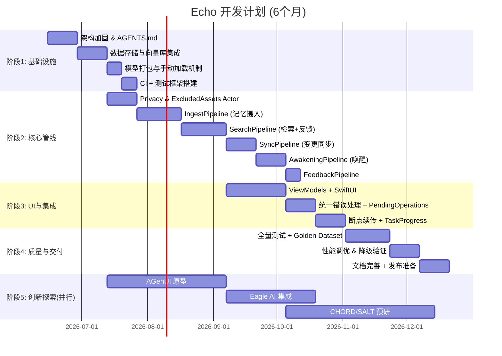
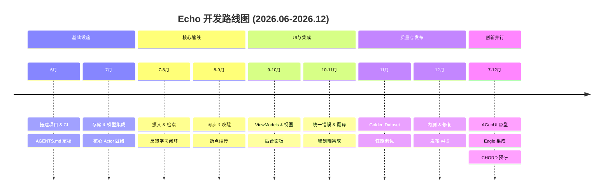
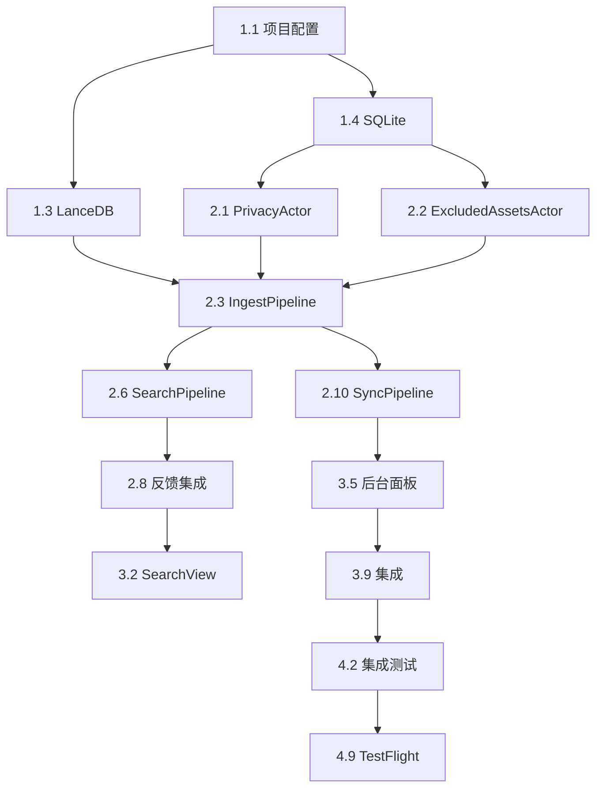

# Echo · 回响：开发计划安排文档

**版本**：v1.0

**生效日期**：2026-06-15

**对应规格**：Echo v4.6 全量用户故事与验收标准规格书

**项目代号**：Echo v4.6 实现 + 创新探索

**目标周期**：6 个月（2026-06-15 至 2026-12-15）

------

## 1. 项目目标与范围

### 1.1 核心目标

基于 Echo v4.6 规格书，实现一个 **本地优先、隐私可审计、认知管线驱动、完全离线可用** 的端侧 AI 记忆助手，并完成从规格到代码的完整落地。同时预留 20% 资源用于创新工具的技术预研与原型探索。

### 1.2 范围限定

- **包含**：全部 66 个用户故事中的 P0/P1 功能；核心架构（Cognitive Pipeline + Actor + Observable ViewModel）；CI/CD 与自动化测试；Agent 协作开发流程；至少两个创新工具的集成 Demo。
- **不包含**：P2 故事中的无障碍适配、私有 Prompt 模板高级优化；第三方 API 接入（已删除）；Android 或其他平台移植；商业化部署。

------

## 2. 总体时间线与里程碑

### 2.1 里程碑清单

| 里程碑             | 日期       | 可交付成果                                                   |
| ------------------ | ---------- | ------------------------------------------------------------ |
| M0: 架构定型       | 2026-06-28 | `AGENTS.md` v1.0，核心 Actor 设计评审通过                    |
| M1: 核心存储可用   | 2026-07-11 | LanceDB + SQLite 集成，`ExcludedAssets` 表就绪，模型手动加载验证 |
| M2: 隐私与摄入完成 | 2026-08-01 | `PrivacyActor`, `ExcludedAssetsActor`，`IngestPipeline` 支持图片/视频/备忘录/语音 |
| M3: 检索与反馈闭环 | 2026-08-22 | `SearchPipeline` 支持跨语言检索 + 反馈重排，`FeedbackPipeline` 可写 SQLite |
| M4: 同步与唤醒就绪 | 2026-09-19 | `SyncPipeline` 监听变更，`AwakeningPipeline` 支持地理/日期/情绪唤醒 |
| M5: UI 完整可用    | 2026-10-10 | 所有 ViewModel + SwiftUI 视图完成，后台任务面板实时更新      |
| M6: 全功能稳定版   | 2026-11-20 | 通过全部 Golden Dataset 测试，性能达标，崩溃率 <0.1%         |
| M7: 发布候选       | 2026-12-08 | 完成文档、Demo 视频、TestFlight 分发                         |
| M8: 创新原型 Demo  | 2026-12-15 | 至少两个创新工具集成（AGenUI + Eagle）的功能演示             |

------

## 3. 阶段详细任务分解

### 阶段1：基础设施搭建（4周，6月15日-7月12日）

| 任务ID | 任务名称                                                     | 产出                                    | 负责人角色      | 预估工时(人日) | 依赖 |
| ------ | ------------------------------------------------------------ | --------------------------------------- | --------------- | -------------- | ---- |
| 1.1    | 创建 Xcode 项目，配置 Swift 6 并发严格模式                   | `-strict-concurrency=complete` 编译通过 | iOS 架构师      | 2              | 无   |
| 1.2    | 编写根目录 `AGENTS.md`，整合避坑手册核心规则                 | `AGENTS.md` 被 Codex 识别               | 技术负责人 + AI | 3              | 无   |
| 1.3    | 集成 LanceDB Mobile，封装 `VectorStoreActor`                 | 向量增删改查 API                        | 后端/存储工程师 | 5              | 1.1  |
| 1.4    | 集成 SQLite，创建 `ExcludedAssets`, `Feedback`, `TaskProgress`, `PendingOperations` 表 | SQLite 封装 Actor                       | 后端工程师      | 4              | 1.1  |
| 1.5    | 将 SigLIP, MobileCLIP, GTE-Qwen2, Whisper 模型打包到 Bundle  | 模型文件存在于 App 资源目录             | 模型工程        | 3              | 无   |
| 1.6    | 实现 `ModelLoaderActor` 手动加载/重试机制                    | 加载失败不自动重试，提供手动按钮接口    | iOS 工程师      | 3              | 1.5  |
| 1.7    | 搭建 CI（GitHub Actions）：SwiftLint, 单元测试, 覆盖率       | 每次 PR 自动检查                        | DevOps          | 3              | 1.1  |
| 1.8    | 搭建单元测试框架，编写第一个 Actor 测试用例                  | `PrivacyActor` 测试通过                 | 测试工程师      | 2              | 1.2  |

**阶段交付**：可运行的空 App，基础 Actor 可注入，模型可手动加载，CI 通过。

### 阶段2：核心认知管线（10周，7月13日-9月20日）

| 任务ID | 任务名称                                                 | 产出                                     | 负责人     | 工时 | 依赖     |
| ------ | -------------------------------------------------------- | ---------------------------------------- | ---------- | ---- | -------- |
| 2.1    | `PrivacyActor` + `UserPolicy` 实现                       | 授权校验、审计 checkpoint                | iOS 工程师 | 4    | 1.4      |
| 2.2    | `ExcludedAssetsActor` 实现（含恢复、一键恢复、变更监测） | 符合 US-SRC-008                          | iOS 工程师 | 5    | 1.4      |
| 2.3    | `IngestPipeline`：图片摄入（US-ING-004）                 | 向量化 + 存储                            | AI 工程师  | 6    | 2.1, 1.3 |
| 2.4    | `IngestPipeline`：视频摄入（US-ING-005）                 | 帧采样 + 音频转写                        | AI 工程师  | 6    | 2.3, 1.6 |
| 2.5    | `IngestPipeline`：备忘录 + 语音转写（US-ING-001~003）    | 文本摄入                                 | AI 工程师  | 5    | 2.3      |
| 2.6    | `SearchPipeline`：向量检索 + FTS5 过滤                   | 基础检索能力                             | AI 工程师  | 6    | 2.3      |
| 2.7    | `FeedbackActor` + 重排公式                               | 反馈写入，权重计算（阈值0.80，截断±0.5） | iOS 工程师 | 5    | 1.4      |
| 2.8    | 集成反馈到 `SearchPipeline`                              | 动态排序                                 | AI 工程师  | 4    | 2.6, 2.7 |
| 2.9    | 跨语言低置信度降级（US-RET-006）                         | `.lowConfidence` 标记 + UI 提示          | AI 工程师  | 3    | 2.6      |
| 2.10   | `SyncPipeline`：相册变更监听 + 增量替换                  | 符合 US-SRC-012                          | iOS 工程师 | 8    | 2.3, 2.2 |
| 2.11   | `AwakeningPipeline`：地理围栏（US-AWK-001）              | 监听进入/离开，推送卡片                  | iOS 工程师 | 6    | 2.6      |
| 2.12   | `AwakeningPipeline`：情绪唤醒（US-AWK-003）              | HealthKit + 文本情感，防抖缓存           | AI 工程师  | 6    | 2.6, 1.2 |
| 2.13   | `FeedbackPipeline`：点赞/点踩/Bad Case 记录              | 完整反馈闭环                             | iOS 工程师 | 4    | 2.7      |

**阶段交付**：所有 P0/P1 Pipeline 单元测试通过，可通过 CLI 或临时 UI 验证检索、摄入、同步、唤醒流程。

### 阶段3：UI 与集成（8周，9月21日-11月15日）

| 任务ID | 任务名称                                  | 产出                                                       | 负责人     | 工时 | 依赖      |
| ------ | ----------------------------------------- | ---------------------------------------------------------- | ---------- | ---- | --------- |
| 3.1    | 主视图 `HomeView` + `HomeViewModel`       | 卡片列表、今日回忆                                         | iOS 工程师 | 5    | 2.11      |
| 3.2    | 检索视图 `SearchView` + `SearchViewModel` | 查询输入、结果展示、低置信度提示                           | iOS 工程师 | 5    | 2.6       |
| 3.3    | 记忆详情页 `MemoryDetailView` + ViewModel | 展示原文/翻译，编辑功能（US-AWK-007）                      | iOS 工程师 | 6    | 2.3, 3.1  |
| 3.4    | 设置页面 `SettingsView` + ViewModel       | 数据源开关、排除项管理、缓存清理                           | iOS 工程师 | 8    | 2.2, 1.4  |
| 3.5    | 实时后台任务面板                          | 订阅 `TaskQueueActor` 进度，显示任务列表，支持暂停/取消    | iOS 工程师 | 6    | 3.4, 2.10 |
| 3.6    | 统一错误处理 UI                           | L1 无提示，L2 Toast+重试按钮，L3 全屏引导，L4 冲突解决界面 | iOS 工程师 | 5    | 2.1, 2.7  |
| 3.7    | 断点续传集成到长任务                      | `TaskProgress` 与 UI 联动，取消后询问                      | iOS 工程师 | 5    | 3.5, 1.4  |
| 3.8    | 跨语言翻译层集成                          | 按需翻译，术语表，String Catalog                           | iOS 工程师 | 4    | 3.1, 3.2  |
| 3.9    | 整合所有 ViewModel 与 Pipeline            | 端到端业务流完整                                           | 全栈工程师 | 5    | 3.1~3.8   |

**阶段交付**：完整 Echo 应用，所有用户交互可用，后台任务透明，错误处理符合矩阵。

### 阶段4：质量保障与发布准备（7周，11月16日-12月15日）

| 任务ID | 任务名称                                     | 产出                                 | 负责人          | 工时 | 依赖 |
| ------ | -------------------------------------------- | ------------------------------------ | --------------- | ---- | ---- |
| 4.1    | 扩展 Golden Dataset 至 800+ 跨语言用例       | 覆盖全部检索 AC                      | 测试工程师 + AI | 5    | 2.6  |
| 4.2    | 编写集成测试：每个 Pipeline 端到端           | 测试通过率 100%                      | 测试工程师      | 8    | 3.9  |
| 4.3    | 性能基准测试（检索延迟、内存峰值、存储大小） | 报告，优化至达标                     | 性能工程师      | 5    | 3.9  |
| 4.4    | 低电量/过热降级模拟测试                      | 验证 US-RES-002/003                  | 测试工程师      | 3    | 2.11 |
| 4.5    | 模型加载失败手动重试测试                     | 验证 US-RES-004                      | 测试工程师      | 2    | 1.6  |
| 4.6    | ExcludedAssets 边界场景测试                  | 恢复失败、级联清理、重新授权一键恢复 | 测试工程师      | 4    | 2.2  |
| 4.7    | 反馈重排准确性验证                           | Golden 用例覆盖                      | AI 工程师       | 3    | 2.7  |
| 4.8    | 完成项目文档更新                             | 架构、API、部署指南                  | 技术写作        | 4    | 3.9  |
| 4.9    | TestFlight 内测（内部 50 人）                | 收集 crash 和反馈                    | 运维            | 2    | 4.2  |
| 4.10   | 修复 P0/P1 bug                               | 零 P0 残留                           | 全体            | 4    | 4.9  |

**阶段交付**：稳定可发布的 v4.6 版本，所有规格验收标准通过，性能达标。

### 阶段5：创新工具预研与原型（并行，不阻塞主版本）

| 任务ID | 任务名称                       | 产出                                        | 负责人      | 工时   | 时间窗口   |
| ------ | ------------------------------ | ------------------------------------------- | ----------- | ------ | ---------- |
| 5.1    | AGenUI 原型：动态生成回忆卡片  | 在 Demo 分支中，卡片由 JSON 驱动            | 创新工程师  | 6人日  | 7.13-9.7   |
| 5.2    | Eagle AI 集成：以图搜图功能    | 在设置中增加“相似图片”入口                  | AI 工程师   | 5人日  | 9.7-10.19  |
| 5.3    | CHORD 预研：端侧重排模型个性化 | 可行性报告 + Demo 分支                      | AI 研究员   | 10人日 | 10.5-12.15 |
| 5.4    | MCP + Notion 工作流验证        | 实现 Codex 读取 Notion 生成代码的端到端示例 | 架构师 + AI | 4人日  | 10.5-11.2  |

**阶段交付**：至少两个创新工具的功能演示视频 + 技术可行性评估报告，供 v5.0 版本决策。

------

## 4. 资源安排与团队结构

### 4.1 核心团队角色与投入

| 角色            | 人数 | 全职占比 | 主要职责                         |
| --------------- | ---- | -------- | -------------------------------- |
| iOS 架构师      | 1    | 100%     | Actor 设计，并发模型，CI，协调   |
| iOS 工程师      | 2    | 100%     | UI + ViewModel，Pipeline 集成    |
| AI 工程师       | 2    | 100%     | 模型推理，Embedding，检索管线    |
| 后端/存储工程师 | 1    | 50%      | LanceDB + SQLite 优化，断点续传  |
| 测试工程师      | 1    | 100%     | Golden Dataset，自动化测试，性能 |
| 创新研究员      | 1    | 50%      | 工具预研，原型开发               |
| DevOps          | 1    | 30%      | CI/CD，TestFlight                |
| 技术写作        | 1    | 20%      | 文档同步                         |

**总人力**：约 8 核心成员 + 外协支撑，总人月约 36 人月（6个月）。

### 4.2 外部依赖与风险缓冲

- 预留 **15%** 时间用于解决模型转换、iOS 系统兼容性问题。
- 每周五下午为“自由探索/技术债偿还”时段。
- 关键依赖：Apple 审核时间（TestFlight 分发）、GitHub Actions 配额。

------

## 5. 风险管理与应对

| 风险编号 | 风险描述                             | 概率 | 影响 | 缓解措施                                                     | 责任人     |
| -------- | ------------------------------------ | ---- | ---- | ------------------------------------------------------------ | ---------- |
| R1       | Core ML 模型转换失败导致精度下降     | 中   | 高   | 提前验证转换 Pipeline，准备 MobileCLIP 降级，与 HuggingFace 社区同步 | AI 工程师  |
| R2       | LanceDB iOS 版本出现未预料的性能瓶颈 | 低   | 中   | 定期跑 Benchmark，准备 Chroma Lite 备选方案                  | 存储工程师 |
| R3       | 并发模型复杂导致难以调试的 crash     | 高   | 高   | 强制 Thread Sanitizer，单元测试覆盖所有 Actor，CI 阻断并发警告 | 架构师     |
| R4       | 跨语言召回率不达标（<85%）           | 中   | 高   | 提前建立 Golden Dataset，每周跑回归，可回退模型版本          | AI 工程师  |
| R5       | Apple 审核因隐私描述不充分被拒       | 低   | 高   | 提前准备隐私清单，使用 `NSPrivacyAccessedAPITypes` 等合规文档 | 合规负责人 |
| R6       | 创新工具预研耗费超出预期影响主线     | 中   | 中   | 创新任务独立分支，不阻塞主线发布，可延期至下一个版本         | 项目经理   |
| R7       | 团队成员对 Agent 协作工作流不熟练    | 中   | 中   | 前三周每周一次 Workshop，强制 PR 使用 Codex 预审             | 技术负责人 |

------

## 6. 交付清单与验收标准

### 6.1 代码与制品

- GitHub 仓库：`Echo-iOS`，包含完整源码，`main` 分支始终可构建。
- 所有 66 个用户故事对应的 Swift 实现，并有对应的单元/集成测试。
- 预置模型文件（SigLIP, MobileCLIP, GTE, Whisper）随 App 打包。
- 自动化脚本：Golden Dataset 运行器、性能测试套件、CI 流水线配置。

### 6.2 文档

- 更新后的架构设计文档（v4.6）。
- 更新后的数据流全链路文档。
- 更新后的避坑手册（v4.6）。
- API 参考（自动生成）。
- 开发者 Onboarding 指南（含 Notion + Codex 工作流）。

### 6.3 测试报告

- Golden Dataset 跨语言召回率报告（≥85%）。
- 性能基准报告（P95 检索延迟 <200ms，内存峰值 <1.5GB on iPhone 15）。
- 低电量/过热降级验证报告。
- 隐私校验覆盖率 100% 报告（CI 输出）。

### 6.4 发布包

- 通过 TestFlight 内测的 `.ipa` 文件。
- 发布说明（CHANGELOG）。
- 产品演示视频（5分钟）。

### 6.5 创新产出

- 至少两个创新工具的技术原型 + 演示视频 + 评估报告。
- MCP + Notion + Codex 工作流 Demo（可选）。

------

## 7. 沟通与协作机制

- **每日站会**：同步进度与障碍（15分钟，线上）。
- **每周评审**：周五下午展示本周成果，决策下周优先级。
- **双周架构讨论**：针对技术债务和重大设计调整。
- **Notion 看板**：任务状态（待办 → 进行中 → 审查 → 完成），与 GitHub Issues 同步。
- **Codex 会话日志**：关键决策记录在 `docs/decisions/`，便于回溯。

------

## 8. 开发计划路线图总览

------

## 9. 附录：关键任务依赖图

------

**文档维护声明**

本开发计划与 Echo v4.6 全量规格书、架构设计及工具指南协同。任何重大里程碑调整需经过变更控制流程。计划每月复盘一次，根据实际进展微调。

**下次复盘日期**：2026-07-13（阶段1结束后）。